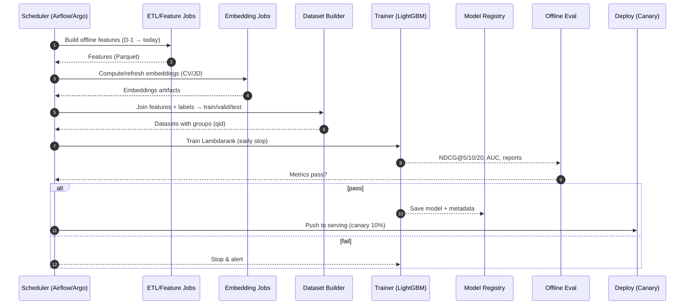

```mermaid
sequenceDiagram
  autonumber
  participant S as Scheduler (Airflow/Argo)
  participant ETL as ETL/Feature Jobs
  participant E as Embedding Jobs
  participant DS as Dataset Builder
  participant TR as Trainer (LightGBM)
  participant REG as Model Registry
  participant VAL as Offline Eval
  participant DEP as Deploy (Canary)

  S->>ETL: Build offline features (D-1 → today)
  ETL-->>S: Features (Parquet)
  S->>E: Compute/refresh embeddings (CV/JD)
  E-->>S: Embeddings artifacts
  S->>DS: Join features + labels → train/valid/test
  DS-->>S: Datasets with groups (qid)
  S->>TR: Train Lambdarank (early stop)
  TR-->>VAL: NDCG@5/10/20, AUC, reports
  VAL-->>S: Metrics pass?
  alt pass
    TR-->>REG: Save model + metadata
    S->>DEP: Push to serving (canary 10%)
  else fail
    S-->>TR: Stop & alert
  end
```
