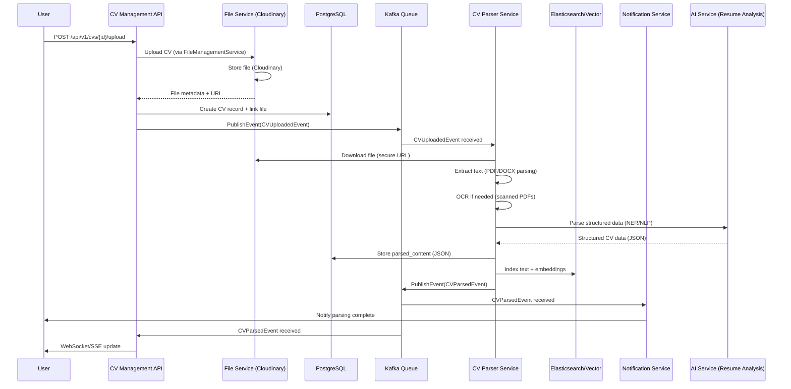

## Clarify requirements

CV upload/ create sequence diagram

## Back of the envelop estimation

## API design

## Data model design

## High level design

## Detailed design

## Identify and discuss bottlenecks
