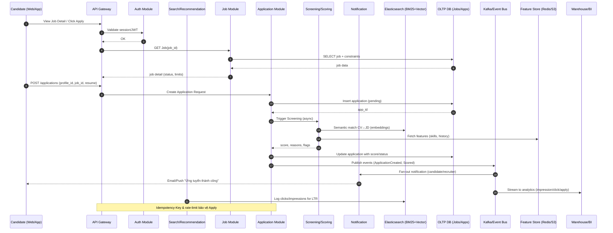

```mermaid
sequenceDiagram
autonumber
participant C as Candidate (Web/App)
participant GW as API Gateway
participant AUTH as Auth Module
participant SRCH as Search/Recommendation
participant JOB as Job Module
participant APP as Application Module
participant SCR as Screening/Scoring
participant NOTI as Notification
participant ES as Elasticsearch (BM25+Vector)
participant DB as OLTP DB (Jobs/Apps)
participant Q as Kafka/Event Bus
participant FS as Feature Store (Redis/S3)
participant WH as Warehouse/BI


C->>GW: View Job Detail / Click Apply
GW->>AUTH: Validate session/JWT
AUTH-->>GW: OK
GW->>JOB: GET Job(job_id)
JOB->>DB: SELECT job + constraints
DB-->>JOB: job data
JOB-->>GW: job detail (status, limits)
C->>GW: POST /applications (profile_id, job_id, resume)
GW->>APP: Create Application Request
APP->>DB: Insert application (pending)
DB-->>APP: app_id
APP->>SCR: Trigger Screening (async)
SCR->>ES: Semantic match CV↔JD (embeddings)
SCR->>FS: Fetch features (skills, history)
SCR-->>APP: score, reasons, flags
APP->>DB: Update application with score/status
APP->>Q: Publish events (ApplicationCreated, Scored)
Q->>NOTI: Fan-out notification (candidate/recruiter)
NOTI-->>C: Email/Push "Ứng tuyển thành công"
Q->>WH: Stream to analytics (impression/click/apply)
SRCH->>ES: Log clicks/impressions for LTR
Note over GW,APP: Idempotency-Key & rate-limit bảo vệ Apply
```