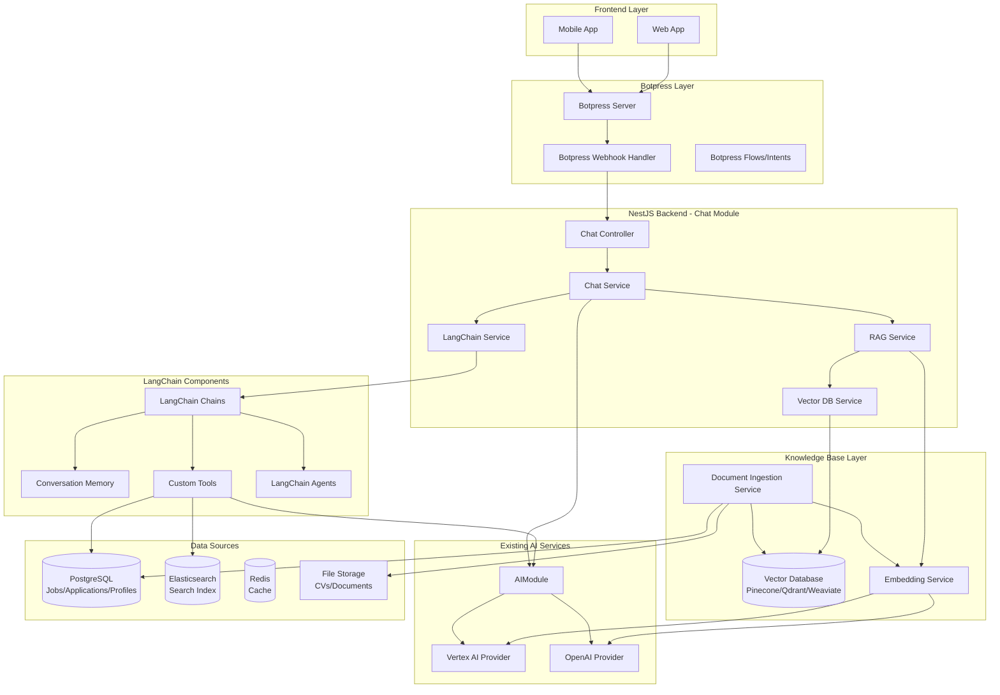
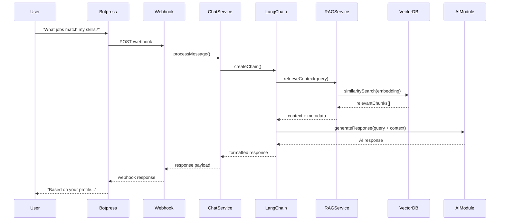

Exploring the codebase to understand the current architecture, then proposing an architecture for integrating a vector database and LangChain with Botpress.

[13 tools called]

Architecture overview for integrating a vector database, LangChain, and Botpress into your NestJS career platform.

## Architecture overview: Vector database + LangChain + Botpress integration

### System architecture diagram



### Component architecture

#### 1. Botpress integration layer

```
services/connect-career-be/src/modules/chat/
├── api/
│   ├── controllers/
│   │   └── botpress-webhook.controller.ts    # Receives webhooks from Botpress
│   └── dtos/
│       └── botpress-message.dto.ts
├── domain/
│   ├── entities/
│   │   ├── conversation.entity.ts            # Conversation history
│   │   ├── knowledge-chunk.entity.ts         # Vector chunks metadata
│   │   └── chat-session.entity.ts
│   └── repositories/
│       ├── conversation.repository.interface.ts
│       └── knowledge-chunk.repository.interface.ts
├── infrastructure/
│   ├── botpress/
│   │   ├── botpress-client.service.ts        # Botpress API client
│   │   └── botpress-config.service.ts
│   ├── vector-db/
│   │   ├── providers/
│   │   │   ├── pinecone.provider.ts
│   │   │   ├── qdrant.provider.ts
│   │   │   └── weaviate.provider.ts
│   │   └── vector-db.interface.ts
│   └── langchain/
│       ├── langchain-chains.service.ts
│       ├── langchain-memory.service.ts
│       ├── langchain-tools.service.ts
│       └── langchain-agents.service.ts
└── services/
    ├── chat.service.ts                        # Main orchestration
    ├── rag.service.ts                         # RAG pipeline
    ├── embedding.service.ts                   # Text embeddings
    ├── document-ingestion.service.ts          # Knowledge base ingestion
    └── knowledge-retrieval.service.ts         # Vector search
```

#### 2. Vector database layer

Purpose: Store and retrieve knowledge embeddings

Recommended options:

- Pinecone: Managed, easy setup
- Qdrant: Self-hosted, good performance
- Weaviate: GraphQL, built-in vectorization

Knowledge sources to index:

- Job descriptions
- Company profiles
- Candidate CVs (anonymized)
- Interview questions/answers
- Hiring pipeline documentation
- FAQ documents
- Industry knowledge base

#### 3. LangChain integration

Purpose: Orchestrate AI workflows and tool usage

Key components:

- Chains: Sequential AI operations
- Memory: Conversation context management
- Tools: Custom functions for database queries, API calls
- Agents: Autonomous decision-making

### Data flow: RAG-powered chatbot



### Implementation plan

#### Phase 1: Foundation (Week 1-2)

1. Vector database setup

   ```typescript
   // Install dependencies
   npm install @pinecone-database/pinecone
   // or
   npm install @qdrant/js-client-rest
   ```

2. LangChain integration

   ```typescript
   npm install langchain @langchain/core @langchain/openai
   npm install @langchain/community
   ```

3. Botpress webhook handler
   ```typescript
   // botpress-webhook.controller.ts
   @Controller('webhooks/botpress')
   export class BotpressWebhookController {
     @Post()
     async handleWebhook(@Body() payload: BotpressWebhookDto) {
       // Process incoming message
     }
   }
   ```

#### Phase 2: Core services (Week 3-4)

1. Embedding service
   - Use existing Vertex AI or OpenAI for embeddings
   - Batch processing for document ingestion

2. RAG service
   - Chunking strategy (semantic + fixed-size)
   - Hybrid search (vector + keyword)
   - Re-ranking

3. LangChain chains
   - Conversational retrieval chain
   - Custom tools for database queries
   - Memory management

#### Phase 3: Knowledge base population (Week 5-6)

1. Document ingestion pipeline
   - Extract from PostgreSQL
   - Process PDFs/CVs
   - Generate embeddings
   - Store in vector DB

2. Indexing strategy
   - Jobs → vector index
   - Profiles → vector index
   - FAQs → vector index
   - Separate namespaces/collections

#### Phase 4: Botpress integration (Week 7-8)

1. Botpress configuration
   - Webhook setup
   - Flow design
   - Intent recognition

2. Custom actions
   - LangChain integration actions
   - Database query actions
   - RAG retrieval actions

### Module structure

```typescript
// chat.module.ts
@Module({
  imports: [
    TypeOrmModule.forFeature([Conversation, KnowledgeChunk, ChatSession]),
    AIModule, // Reuse existing AI services
    ConfigModule,
  ],
  controllers: [BotpressWebhookController],
  providers: [
    ChatService,
    RAGService,
    EmbeddingService,
    DocumentIngestionService,
    KnowledgeRetrievalService,
    LangChainChainsService,
    LangChainMemoryService,
    LangChainToolsService,
    LangChainAgentsService,
    BotpressClientService,
    {
      provide: 'VectorDB',
      useFactory: (config: ConfigService) => {
        const provider = config.get('VECTOR_DB_PROVIDER'); // 'pinecone' | 'qdrant' | 'weaviate'
        return VectorDBFactory.create(provider);
      },
    },
  ],
  exports: [ChatService, RAGService],
})
export class ChatModule {}
```

### Environment configuration

```env
# Vector Database
VECTOR_DB_PROVIDER=pinecone
PINECONE_API_KEY=your_key
PINECONE_ENVIRONMENT=us-west1-gcp
PINECONE_INDEX_NAME=connect-career-knowledge

# Or Qdrant
QDRANT_URL=http://localhost:6333
QDRANT_API_KEY=your_key
QDRANT_COLLECTION_NAME=knowledge_base

# LangChain
LANGCHAIN_TRACING_V2=true
LANGCHAIN_API_KEY=your_key
LANGCHAIN_PROJECT=connect-career-chat

# Botpress
BOTPRESS_URL=http://localhost:3000
BOTPRESS_BOT_ID=connect-career-bot
BOTPRESS_API_KEY=your_key
BOTPRESS_WEBHOOK_SECRET=your_secret

# Embedding Model
EMBEDDING_MODEL=text-embedding-004  # Vertex AI
# or
EMBEDDING_MODEL=text-embedding-3-large  # OpenAI
```

### Use cases

1. Candidate chatbot
   - "What jobs match my skills?"
   - "How's my application status?"
   - "What skills do I need for this role?"

2. Recruiter chatbot
   - "Show top 5 candidates for this job"
   - "What's the status of applications this week?"
   - "Generate interview questions for this candidate"

3. Knowledge hub
   - Company information
   - Industry insights
   - Hiring best practices

### Benefits

1. Reuses existing AI infrastructure (Vertex AI, OpenAI)
2. Modular design fits NestJS patterns
3. Scalable vector search
4. LangChain enables complex workflows
5. Botpress handles conversation management
6. RAG provides context-aware responses

### Next steps

1. Choose vector database (Pinecone recommended for managed)
2. Set up Botpress instance
3. Implement embedding service
4. Build RAG pipeline
5. Create LangChain chains
6. Integrate with Botpress webhooks
7. Populate knowledge base
8. Test end-to-end flow

Should I start with a specific component (vector DB service, RAG service, or Botpress webhook handler)?
