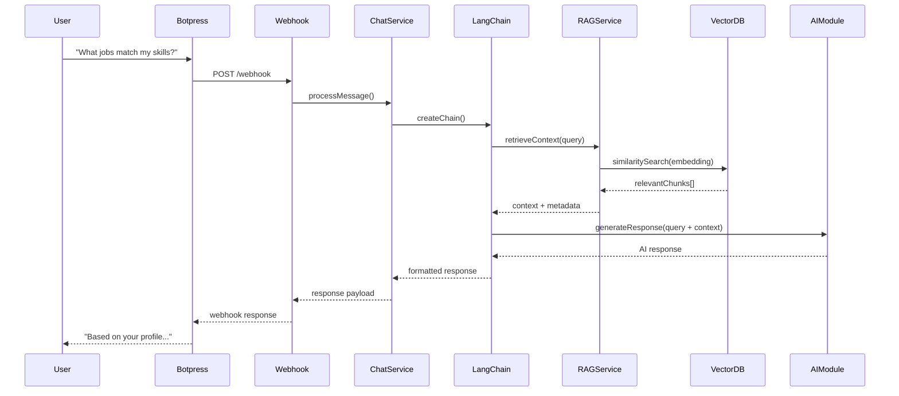

```mermaid
sequenceDiagram
    participant User
    participant Botpress
    participant Webhook
    participant ChatService
    participant LangChain
    participant RAGService
    participant VectorDB
    participant AIModule

    User->>Botpress: "What jobs match my skills?"
    Botpress->>Webhook: POST /webhook
    Webhook->>ChatService: processMessage()
    ChatService->>LangChain: createChain()
    LangChain->>RAGService: retrieveContext(query)
    RAGService->>VectorDB: similaritySearch(embedding)
    VectorDB-->>RAGService: relevantChunks[]
    RAGService-->>LangChain: context + metadata
    LangChain->>AIModule: generateResponse(query + context)
    AIModule-->>LangChain: AI response
    LangChain-->>ChatService: formatted response
    ChatService-->>Webhook: response payload
    Webhook-->>Botpress: webhook response
    Botpress-->>User: "Based on your profile..."
```
