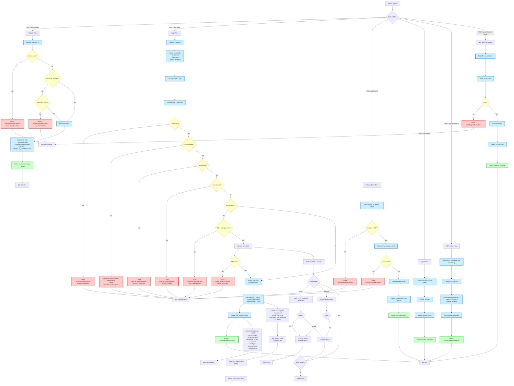

```mermaid
flowchart TD

%% ---------- Style definitions ----------
classDef errorNode fill:#ffcccc,stroke:#ff0000,stroke-width:2px
classDef successNode fill:#ccffcc,stroke:#00aa00,stroke-width:2px
classDef processNode fill:#cceeff,stroke:#0066cc,stroke-width:2px
classDef decisionNode fill:#ffffcc,stroke:#ffcc00,stroke-width:2px

%% ---------- Entry ----------
A[Client Request] --> B{Endpoint Type}

%% ---------- Registration Flow ----------
B -->|POST /auth/register| C[Register Flow]
C --> C1[Validate RegisterDto]
C1 --> C2{Email exists?}
C2 -->|Yes| C3[Throw BadRequestException<br/>User already exists]
C2 -->|No| C4{Username provided?}
C4 -->|Yes| C5{Username taken?}
C5 -->|Yes| C6[Throw BadRequestException<br/>Username taken]
C5 -->|No| C7[Hash Password]
C4 -->|No| C7
C7 --> C8[Create User with:<br/>- passwordHash<br/>- emailVerificationToken<br/>- status: PENDING_VERIFICATION]
C8 --> C9[Return success message<br/>+ userId]

%% ---------- Login Flow ----------
B -->|POST /auth/login| D[Login Flow]
D --> D1[Validate LoginDto]
D1 --> D2[Extract device info:<br/>- IP address<br/>- User Agent<br/>- Device ID/Name]
D2 --> D3[Call authService.login]
D3 --> D4[Validate User Credentials]
D4 --> D5{User found?}
D5 -->|No| D6[Throw UnauthorizedException<br/>Invalid credentials]
D5 -->|Yes| D7{Password valid?}
D7 -->|No| D8[Increment failed attempts<br/>Update user<br/>Throw UnauthorizedException]
D7 -->|Yes| D9{User active?}
D9 -->|No| D10[Throw UnauthorizedException<br/>Account not active]
D9 -->|Yes| D11{User locked?}
D11 -->|Yes| D12[Throw UnauthorizedException<br/>Account locked]
D11 -->|No| D13{MFA enabled?}
D13 -->|Yes| D14{MFA code provided?}
D14 -->|No| D15[Throw UnauthorizedException<br/>MFA code required]
D14 -->|Yes| D16[Validate MFA Code]
D16 --> D17{MFA valid?}
D17 -->|No| D18[Throw UnauthorizedException<br/>Invalid MFA code]
D17 -->|Yes| D19[Update last login<br/>Create session]
D13 -->|No| D19
D19 --> D20[Generate JWT tokens:<br/>- Access Token 15min <br/>- Refresh Token 7 days]
D20 --> D21[Create UserSession record]
D21 --> D22[Return AuthTokensResponseDto]

%% ---------- MFA Validation Details ----------
D16 --> M1[Find active MFA devices]
M1 --> M2{Device type?}
M2 -->|TOTP| M3[Verify TOTP code with speakeasy]
M2 -->|Backup| M4[Check backup codes]
M3 --> M5{Valid?}
M4 --> M6{Valid?}
M5 -->|Yes| M7[Record usage<br/>Update device]
M5 -->|No| M8[Try next device]
M6 -->|Yes| M7
M6 -->|No| M8
M8 --> M9{More devices?}
M9 -->|Yes| M2
M9 -->|No| M10[Return false]
M7 --> M11[Return true]

%% ---------- Token Generation Details ----------
D20 --> T1[Create JWT payload:<br/>- sub: user.id<br/>- email: user.email<br/>- username: user.username<br/>- jti: uuidv4]
T1 --> T2[Sign access token<br/>expiresIn: 15m]
T2 --> T3[Generate refresh token<br/>uuidv4]
T3 --> T4[Return AuthTokens object]

%% ---------- Session Creation Details ----------
D21 --> S1[Create UserSession:<br/>- userId<br/>- refreshToken<br/>- accessTokenJti<br/>- expiresAt: 7 days<br/>- ipAddress<br/>- userAgent<br/>- deviceId/Name<br/>- lastActivityAt]
S1 --> S2[Save to database]

%% ---------- Refresh Token Flow ----------
B -->|POST /auth/refresh| E[Refresh Token Flow]
E --> E1[Find session by refresh token]
E1 --> E2{Session valid?}
E2 -->|No| E3[Throw UnauthorizedException]
E2 -->|Yes| E4[Find user by session.userId]
E4 --> E5{User active?}
E5 -->|No| E6[Throw UnauthorizedException]
E5 -->|Yes| E7[Generate new tokens]
E7 --> E8[Update session with new tokens]
E8 --> E9[Return new AuthTokens]

%% ---------- Logout Flow ----------
B -->|POST /auth/logout| F[Logout Flow]
F --> F1[Find session by refresh token]
F1 --> F2[Revoke session]
F2 --> F3[Update session in DB]
F3 --> F4[Return success message]

%% ---------- MFA Setup Flow ----------
B -->|POST /auth/mfa/setup| G[MFA Setup Flow]
G --> G1[Generate TOTP secret with speakeasy]
G1 --> G2[Create QR code URL]
G2 --> G3[Create MfaDevice record:<br/>- status: PENDING<br/>- secret: base32]
G3 --> G4[Generate backup codes]
G4 --> G5[Return MfaSetupResponseDto]

B -->|POST /auth/mfa/verify-setup| H[MFA Verification Flow]
H --> H1[Find MFA device by ID]
H1 --> H2[Verify TOTP code]
H2 --> H3{Valid?}
H3 -->|No| H4[Throw BadRequestException]
H3 -->|Yes| H5[Activate device]
H5 --> H6[Enable MFA for user]
H6 --> H7[Return success message]

%% ---------- Error/Success ----------
C3 --> ERR1[400 Bad Request]
C6 --> ERR1
D6 --> ERR2[401 Unauthorized]
D8 --> ERR2
D10 --> ERR2
D12 --> ERR2
D15 --> ERR2
D18 --> ERR2
E3 --> ERR2
E6 --> ERR2
H4 --> ERR1

C9 --> SUCC1[201 Created]
D22 --> SUCC2[200 OK]
E9 --> SUCC2
F4 --> SUCC2
G5 --> SUCC2
H7 --> SUCC2

%% ---------- Class assignments ----------
class C3,C6,D6,D8,D10,D12,D15,D18,E3,E6,H4 errorNode
class C9,D22,E9,F4,G5,H7 successNode
class C1,C7,C8,D1,D2,D3,D4,D19,D20,D21,E1,E4,E7,E8,F1,F2,F3,G1,G2,G3,G4,H1,H2,H5,H6 processNode
class C2,C4,C5,D5,D7,D9,D11,D13,D14,D17,E2,E5,H3 decisionNode
```
