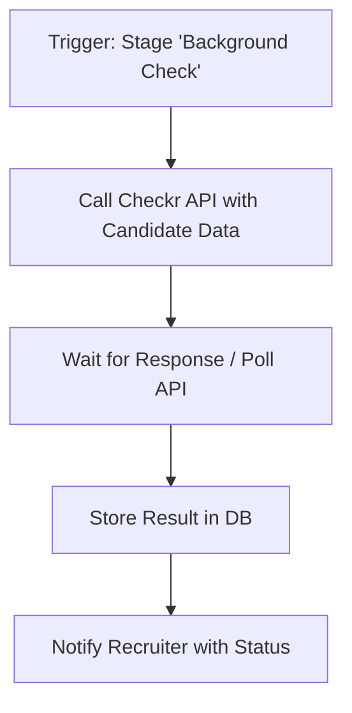
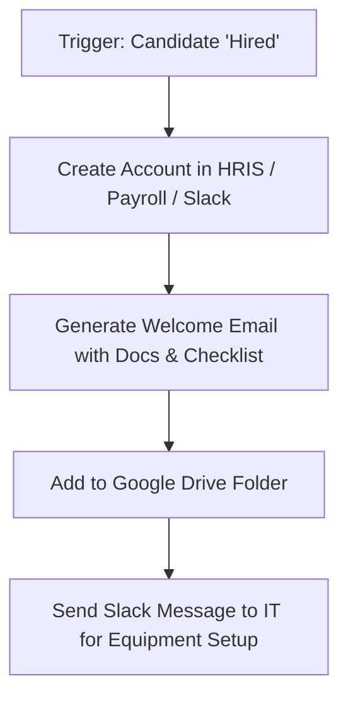

Excellent — N8n is a _perfect_ choice for automating HR & recruiting workflows 👏

Let’s brainstorm **real, practical automation flows** for an **ATS or HR system** built around N8n — covering sourcing, screening, scheduling, and post-hire processes.

---

## 🚀 1. Job Application Ingestion Flow

**Goal:** Automatically collect applications from multiple channels and store them in your ATS database.

### Flow

```mermaid
graph TD
A[Trigger: New Application Submitted] --> B[Parse Resume with PDF Parser / AI Parser]
B --> C[Extract Candidate Info: Name, Email, Skills, Experience]
C --> D[Insert into DB (PostgreSQL / MongoDB)]
D --> E[Send Acknowledgment Email via Gmail]
E --> F[Notify Recruiter via Slack]
```

### N8n nodes

- **Webhook / Gmail / Typeform Trigger** – new application arrives
- **AI Parser (OpenAI / Custom Function)** – extract entities
- **PostgreSQL / Notion / Airtable Node** – insert record
- **Slack / Discord Node** – alert HR
- **Email Send Node** – auto-confirm receipt

🧠 _Extension:_ Add a “duplicate candidate check” (query DB before insert).

---

## 🤖 2. AI Resume Screening & Scoring Flow

**Goal:** Automatically score resumes based on job description matching.

### Flow

```mermaid
graph TD
A[Trigger: New Candidate Added] --> B[Fetch Job Description from DB]
B --> C[Send CV + JD to AI Scoring Model (OpenAI / Vertex AI)]
C --> D[Get Match Score + Extract Skills Gap]
D --> E[Update Candidate Record with Score]
E --> F[Notify Recruiter if Score > 80%]
```

### N8n nodes

- Trigger: DB (Postgres) “new row”
- HTTP Request → your **AI scoring microservice**
- Function Node → compute skill gap logic
- Slack / Email → “Top candidate found” notification

🧩 Integration tip: use **N8n Code Node** to normalize skills into canonical form before scoring.

---

## 📅 3. Interview Scheduling Flow

**Goal:** Automate scheduling and calendar invites.

### Flow

```mermaid
graph TD
A[Trigger: Candidate moved to 'Interview'] --> B[Fetch Interviewer Availability (Google Calendar)]
B --> C[Suggest Time Slots via AI or Rule]
C --> D[Send Options to Candidate via Email / Chatbot]
D --> E[When Candidate Confirms → Create Calendar Event]
E --> F[Notify Interviewer + Update ATS]
```

### N8n nodes

- Trigger: Webhook from ATS (“stage changed”)
- Google Calendar → list availability
- Gmail → send email with proposed times
- Google Calendar → create event
- Slack → notify interviewer

💡 _Pro tip:_ you can use **Wait node** + **Webhook** to pause flow until candidate replies.

---

## 🧾 4. Offer Letter Generation Flow

**Goal:** Auto-generate and send offer letters with dynamic data.

### Flow

```mermaid
graph TD
A[Trigger: Candidate marked as 'Offer'] --> B[Fetch Candidate & Salary Info from DB]
B --> C[Fill Offer Letter Template (Google Docs API)]
C --> D[Export PDF]
D --> E[Send Email with Offer Letter Attached]
E --> F[Update ATS status to 'Offer Sent']
```

### N8n nodes

- Trigger: DB / webhook
- Google Docs API (template fill)
- Google Drive → export PDF
- Gmail → send
- PostgreSQL → update status

---

## 💬 5. Candidate Rejection Automation

**Goal:** Politely inform candidates and clean up pipeline.

### Flow

```mermaid
graph TD
A[Trigger: Candidate rejected] --> B[Send Rejection Email]
B --> C[Add Candidate to Talent Pool Sheet]
C --> D[Archive Candidate in ATS]
D --> E[Slack HR summary: "3 rejections today"]
```

### N8n nodes

- Trigger: Webhook from ATS
- Gmail Node
- Google Sheets Node (Talent Pool)
- Slack Node

✨ Add conditionals:

- If “Good Fit but Not Now” → add to CRM
- Else → archive

---

## 🔍 6. Background Check Automation

**Goal:** Send candidate info to external API (e.g., Certn, Checkr) and store result.

### Flow



### N8n nodes

- HTTP Request → external API
- Wait Node / Polling
- PostgreSQL Update
- Slack / Email Notification

---

## 📈 7. Weekly Hiring Report Automation

**Goal:** Send team performance summary every week.

### Flow

```mermaid
graph TD
A[Trigger: Every Monday 9 AM] --> B[Query ATS DB for Metrics]
B --> C[Generate Summary (Function Node)]
C --> D[Format into Table or Chart (Markdown)]
D --> E[Send to Slack / Email]
```

### Metrics example

- # of new candidates
- # of interviews
- Time-to-hire per role
- Offers accepted

### N8n nodes

- Cron Trigger
- PostgreSQL Query
- Function Node (aggregate data)
- Slack / Email

---

## 🧠 8. Talent Pool Nurturing Flow

**Goal:** Re-engage past candidates automatically.

### Flow

```mermaid
graph TD
A[Trigger: Monthly Cron] --> B[Query Candidates Not Contacted for 6 Months]
B --> C[Generate Personalized Email (AI Node)]
C --> D[Send Email / LinkedIn Message]
D --> E[Log Activity in ATS]
```

### N8n nodes

- Cron
- DB Query
- OpenAI Node (generate personalized text)
- Gmail / LinkedIn API
- PostgreSQL Update

---

## 🧩 9. Employee Onboarding Flow

**Goal:** After hire, create accounts and send welcome package.

### Flow



### N8n nodes

- Webhook trigger
- Slack, Google Workspace, Notion APIs
- Drive File creation
- Email send

---

## 💼 10. Integration with ATS / CRM (Example Stack)

| Integration                       | Purpose                          |
| --------------------------------- | -------------------------------- |
| **Google Workspace**              | Calendar, Docs, Sheets           |
| **Slack / Discord**               | Recruiter alerts                 |
| **PostgreSQL / MongoDB**          | Candidate data store             |
| **OpenAI / Vertex AI**            | Resume scoring, email generation |
| **Typeform / Webflow / Airtable** | Job applications                 |
| **Cloudinary / S3**               | Resume uploads                   |
| **HubSpot / Pipedrive**           | Talent CRM follow-up             |

---

Would you like me to create a **visual N8n workflow diagram** (in Mermaid syntax or N8n node sequence JSON) for one of these — for example, _“AI Resume Screening & Scoring Flow”_ or _“Interview Scheduling Automation”_?
