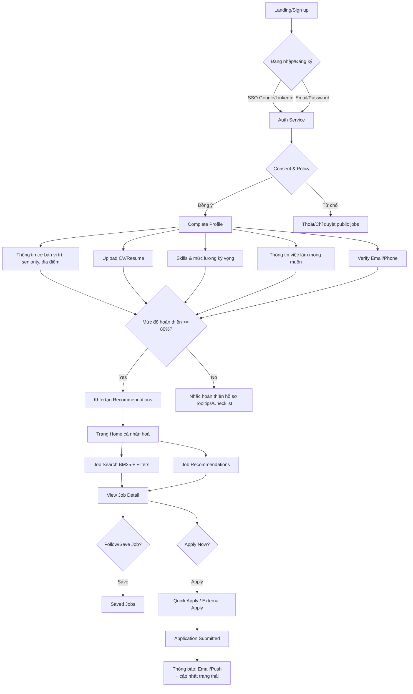
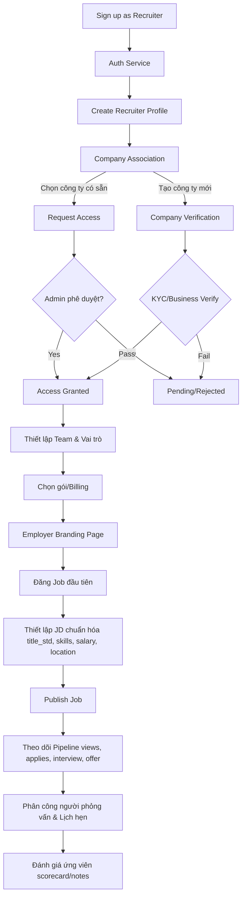

```mermaid
flowchart TD
A[Landing/Sign up] --> B{Đăng nhập/Đăng ký}
B -->|SSO Google/LinkedIn| C[Auth Service]
B -->|Email/Password| C
C --> D{Consent & Policy}
D -->|Đồng ý| E[Complete Profile]
D -->|Từ chối| X[Thoát/Chỉ duyệt public jobs]


E --> E1[Thông tin cơ bản vị trí, seniority, địa điểm]
E --> E2[Upload CV/Resume]
E --> E3[Skills & mức lương kỳ vọng]
E --> E4[Thông tin việc làm mong muốn]
E --> E5[Verify Email/Phone]


E1 --> F{Mức độ hoàn thiện >= 80%?}
E2 --> F
E3 --> F
E4 --> F
E5 --> F


F -->|Yes| G[Khởi tạo Recommendations]
F -->|No| H[Nhắc hoàn thiện hồ sơ Tooltips/Checklist]


G --> I[Trang Home cá nhân hoá]
I --> J[Job Search BM25 + Filters]
I --> K[Job Recommendations]
J --> L[View Job Detail]
K --> L
L --> M{Follow/Save Job?}
M -->|Save| N[Saved Jobs]
L --> O{Apply Now?}
O -->|Apply| P[Quick Apply / External Apply]
P --> Q[Application Submitted]
Q --> R[Thông báo: Email/Push\n+ cập nhật trạng thái]

```

---

```mermaid
flowchart TD
A[Sign up as Recruiter] --> B[Auth Service]
B --> C[Create Recruiter Profile]
C --> D[Company Association]
D -->|Chọn công ty có sẵn| E[Request Access]
D -->|Tạo công ty mới| F[Company Verification]
E --> G{Admin phê duyệt?}
G -->|Yes| H[Access Granted]
G -->|No| I[Pending/Rejected]
F --> J{KYC/Business Verify}
J -->|Pass| H
J -->|Fail| I


H --> K[Thiết lập Team & Vai trò]
K --> L[Chọn gói/Billing]
L --> M[Employer Branding Page]
M --> N[Đăng Job đầu tiên]
N --> O[Thiết lập JD chuẩn hóa title_std, skills, salary, location]
O --> P[Publish Job]
P --> Q[Theo dõi Pipeline views, applies, interview, offer]
Q --> R[Phân công người phỏng vấn & Lịch hẹn]
R --> S[Đánh giá ứng viên scorecard/notes]
```
