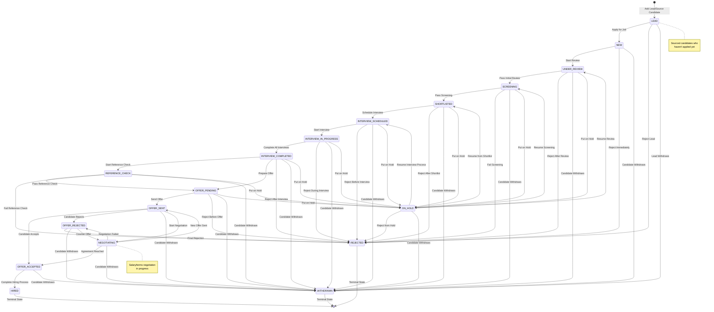

```mermaid
stateDiagram-v2
    [*] --> LEAD : Add Lead/Source Candidate

    LEAD --> NEW : Apply for Job
    LEAD --> REJECTED : Reject Lead
    LEAD --> WITHDRAWN : Lead Withdraws

    NEW --> UNDER_REVIEW : Start Review
    NEW --> REJECTED : Reject Immediately
    NEW --> WITHDRAWN : Candidate Withdraws

    UNDER_REVIEW --> SCREENING : Pass Initial Review
    UNDER_REVIEW --> REJECTED : Reject After Review
    UNDER_REVIEW --> WITHDRAWN : Candidate Withdraws
    UNDER_REVIEW --> ON_HOLD : Put on Hold

    SCREENING --> SHORTLISTED : Pass Screening
    SCREENING --> REJECTED : Fail Screening
    SCREENING --> WITHDRAWN : Candidate Withdraws
    SCREENING --> ON_HOLD : Put on Hold

    SHORTLISTED --> INTERVIEW_SCHEDULED : Schedule Interview
    SHORTLISTED --> REJECTED : Reject After Shortlist
    SHORTLISTED --> WITHDRAWN : Candidate Withdraws
    SHORTLISTED --> ON_HOLD : Put on Hold

    INTERVIEW_SCHEDULED --> INTERVIEW_IN_PROGRESS : Start Interview
    INTERVIEW_SCHEDULED --> REJECTED : Reject Before Interview
    INTERVIEW_SCHEDULED --> WITHDRAWN : Candidate Withdraws
    INTERVIEW_SCHEDULED --> ON_HOLD : Put on Hold

    INTERVIEW_IN_PROGRESS --> INTERVIEW_COMPLETED : Complete All Interviews
    INTERVIEW_IN_PROGRESS --> REJECTED : Reject During Interview
    INTERVIEW_IN_PROGRESS --> WITHDRAWN : Candidate Withdraws
    INTERVIEW_IN_PROGRESS --> ON_HOLD : Put on Hold

    INTERVIEW_COMPLETED --> REFERENCE_CHECK : Start Reference Check
    INTERVIEW_COMPLETED --> OFFER_PENDING : Prepare Offer
    INTERVIEW_COMPLETED --> REJECTED : Reject After Interview
    INTERVIEW_COMPLETED --> WITHDRAWN : Candidate Withdraws
    INTERVIEW_COMPLETED --> ON_HOLD : Put on Hold

    REFERENCE_CHECK --> OFFER_PENDING : Pass Reference Check
    REFERENCE_CHECK --> REJECTED : Fail Reference Check
    REFERENCE_CHECK --> WITHDRAWN : Candidate Withdraws
    REFERENCE_CHECK --> ON_HOLD : Put on Hold

    OFFER_PENDING --> OFFER_SENT : Send Offer
    OFFER_PENDING --> REJECTED : Reject Before Offer
    OFFER_PENDING --> WITHDRAWN : Candidate Withdraws
    OFFER_PENDING --> ON_HOLD : Put on Hold

    OFFER_SENT --> OFFER_ACCEPTED : Candidate Accepts
    OFFER_SENT --> OFFER_REJECTED : Candidate Rejects
    OFFER_SENT --> WITHDRAWN : Candidate Withdraws
    OFFER_SENT --> NEGOTIATING : Start Negotiation

    OFFER_ACCEPTED --> HIRED : Complete Hiring Process
    OFFER_ACCEPTED --> WITHDRAWN : Candidate Withdraws

    OFFER_REJECTED --> REJECTED : Final Rejection
    OFFER_REJECTED --> WITHDRAWN : Candidate Withdraws
    OFFER_REJECTED --> NEGOTIATING : Counter Offer

    NEGOTIATING --> OFFER_SENT : New Offer Sent
    NEGOTIATING --> OFFER_ACCEPTED : Agreement Reached
    NEGOTIATING --> OFFER_REJECTED : Negotiation Failed
    NEGOTIATING --> WITHDRAWN : Candidate Withdraws

    ON_HOLD --> UNDER_REVIEW : Resume Review
    ON_HOLD --> SCREENING : Resume Screening
    ON_HOLD --> SHORTLISTED : Resume from Shortlist
    ON_HOLD --> INTERVIEW_SCHEDULED : Resume Interview Process
    ON_HOLD --> REJECTED : Reject from Hold
    ON_HOLD --> WITHDRAWN : Candidate Withdraws

    HIRED --> [*] : Terminal State
    REJECTED --> [*] : Terminal State
    WITHDRAWN --> [*] : Terminal State

    note right of LEAD
        Sourced candidates who
        haven't applied yet
    end note

    note right of NEGOTIATING
        Salary/terms negotiation
        in progress
    end note
```
