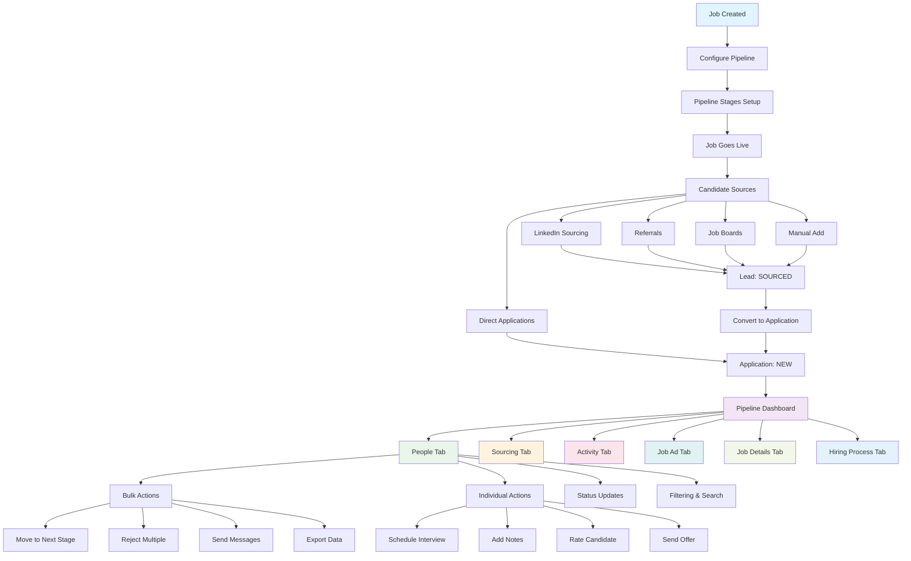

```mermaid
graph TD
    A[Job Created] --> B[Configure Pipeline]
    B --> C[Pipeline Stages Setup]
    C --> D[Job Goes Live]

    D --> E[Candidate Sources]
    E --> F[Direct Applications]
    E --> G[LinkedIn Sourcing]
    E --> H[Referrals]
    E --> I[Job Boards]
    E --> J[Manual Add]

    F --> K[Application: NEW]
    G --> L[Lead: SOURCED]
    H --> L
    I --> L
    J --> L

    L --> M[Convert to Application]
    M --> K

    K --> N[Pipeline Dashboard]
    N --> O[People Tab]
    N --> P[Sourcing Tab]
    N --> Q[Activity Tab]
    N --> R[Job Ad Tab]
    N --> S[Job Details Tab]
    N --> T[Hiring Process Tab]

    O --> U[Bulk Actions]
    O --> V[Individual Actions]
    O --> W[Status Updates]
    O --> X[Filtering & Search]

    U --> Y[Move to Next Stage]
    U --> Z[Reject Multiple]
    U --> AA[Send Messages]
    U --> BB[Export Data]

    V --> CC[Schedule Interview]
    V --> DD[Add Notes]
    V --> EE[Rate Candidate]
    V --> FF[Send Offer]

    style A fill:#e1f5fe
    style N fill:#f3e5f5
    style O fill:#e8f5e8
    style P fill:#fff3e0
    style Q fill:#fce4ec
    style R fill:#e0f2f1
    style S fill:#f1f8e9
    style T fill:#e3f2fd
```
