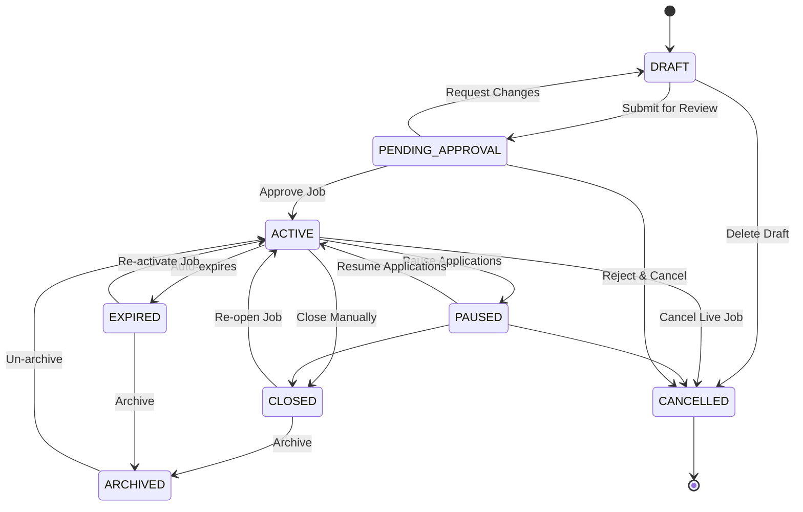

Auto-transitions: Your model mentions EXPIRED, which is a great automated transition. You could also implement other triggers. For instance, when an Application status becomes HIRED, automatically transition the associated Job status to FILLED.
