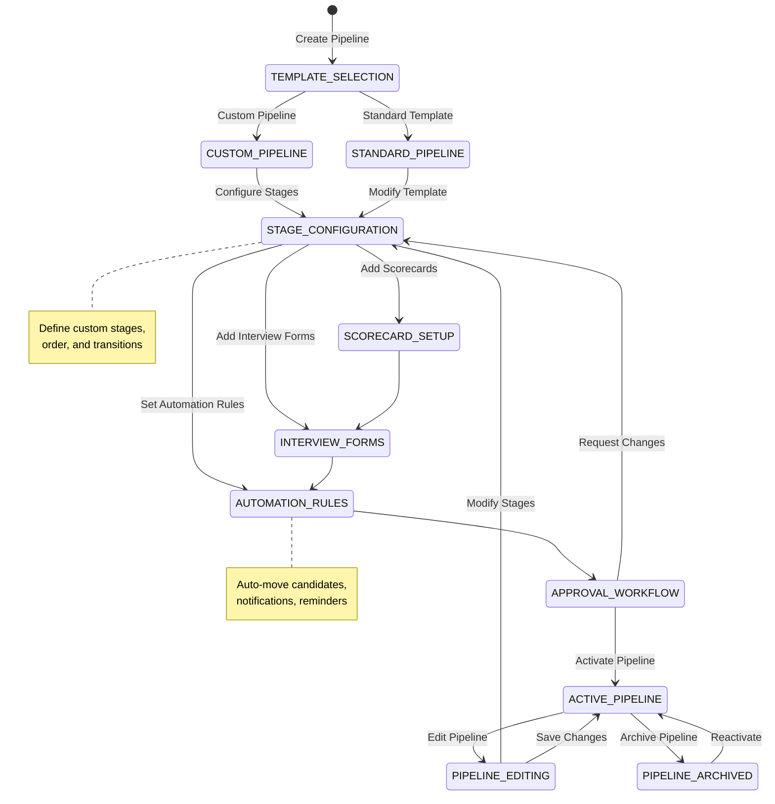

```mermaid
stateDiagram-v2
    [*] --> TEMPLATE_SELECTION : Create Pipeline

    TEMPLATE_SELECTION --> CUSTOM_PIPELINE : Custom Pipeline
    TEMPLATE_SELECTION --> STANDARD_PIPELINE : Standard Template

    CUSTOM_PIPELINE --> STAGE_CONFIGURATION : Configure Stages
    STANDARD_PIPELINE --> STAGE_CONFIGURATION : Modify Template

    STAGE_CONFIGURATION --> SCORECARD_SETUP : Add Scorecards
    STAGE_CONFIGURATION --> INTERVIEW_FORMS : Add Interview Forms
    STAGE_CONFIGURATION --> AUTOMATION_RULES : Set Automation Rules

    SCORECARD_SETUP --> INTERVIEW_FORMS
    INTERVIEW_FORMS --> AUTOMATION_RULES
    AUTOMATION_RULES --> APPROVAL_WORKFLOW

    APPROVAL_WORKFLOW --> ACTIVE_PIPELINE : Activate Pipeline
    APPROVAL_WORKFLOW --> STAGE_CONFIGURATION : Request Changes

    ACTIVE_PIPELINE --> PIPELINE_EDITING : Edit Pipeline
    ACTIVE_PIPELINE --> PIPELINE_ARCHIVED : Archive Pipeline

    PIPELINE_EDITING --> STAGE_CONFIGURATION : Modify Stages
    PIPELINE_EDITING --> ACTIVE_PIPELINE : Save Changes

    PIPELINE_ARCHIVED --> ACTIVE_PIPELINE : Reactivate

    note right of STAGE_CONFIGURATION
        Define custom stages,
        order, and transitions
    end note

    note right of AUTOMATION_RULES
        Auto-move candidates,
        notifications, reminders
    end note
```
