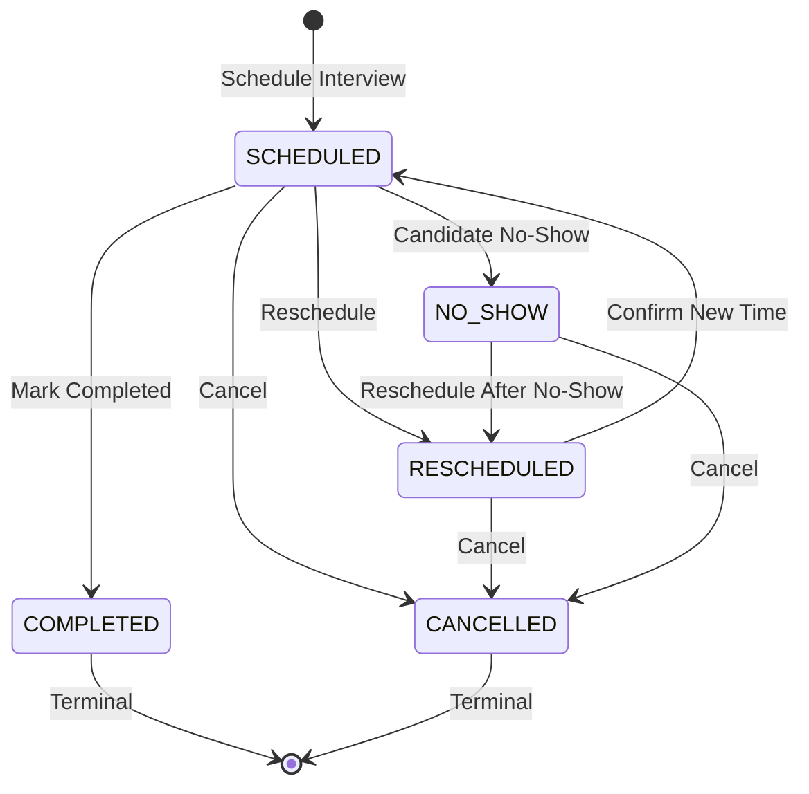

```mermaid
stateDiagram-v2
    [*] --> SCHEDULED : Schedule Interview

    SCHEDULED --> COMPLETED : Mark Completed
    SCHEDULED --> CANCELLED : Cancel
    SCHEDULED --> RESCHEDULED : Reschedule
    SCHEDULED --> NO_SHOW : Candidate No-Show

    RESCHEDULED --> SCHEDULED : Confirm New Time
    RESCHEDULED --> CANCELLED : Cancel

    NO_SHOW --> RESCHEDULED : Reschedule After No-Show
    NO_SHOW --> CANCELLED : Cancel

    COMPLETED --> [*] : Terminal
    CANCELLED --> [*] : Terminal
```
