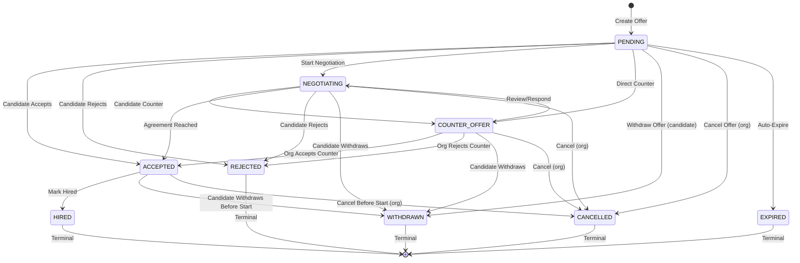

```mermaid
stateDiagram-v2
    [*] --> PENDING : Create Offer

    PENDING --> ACCEPTED : Candidate Accepts
    PENDING --> REJECTED : Candidate Rejects
    PENDING --> NEGOTIATING : Start Negotiation
    PENDING --> COUNTER_OFFER : Direct Counter
    PENDING --> WITHDRAWN : Withdraw Offer (candidate)
    PENDING --> CANCELLED : Cancel Offer (org)
    PENDING --> EXPIRED : Auto-Expire

    NEGOTIATING --> COUNTER_OFFER : Candidate Counter
    NEGOTIATING --> ACCEPTED : Agreement Reached
    NEGOTIATING --> REJECTED : Candidate Rejects
    NEGOTIATING --> WITHDRAWN : Candidate Withdraws
    NEGOTIATING --> CANCELLED : Cancel (org)

    COUNTER_OFFER --> NEGOTIATING : Review/Respond
    COUNTER_OFFER --> ACCEPTED : Org Accepts Counter
    COUNTER_OFFER --> REJECTED : Org Rejects Counter
    COUNTER_OFFER --> WITHDRAWN : Candidate Withdraws
    COUNTER_OFFER --> CANCELLED : Cancel (org)

    ACCEPTED --> HIRED : Mark Hired
    ACCEPTED --> WITHDRAWN : Candidate Withdraws Before Start
    ACCEPTED --> CANCELLED : Cancel Before Start (org)

    REJECTED --> [*] : Terminal
    EXPIRED --> [*] : Terminal
    WITHDRAWN --> [*] : Terminal
    CANCELLED --> [*] : Terminal
    HIRED --> [*] : Terminal
```
