Reviewing the existing documentation, then providing ERD, sequence diagrams, and architecture diagrams:

[2 tools called]

Adding ERD, sequence diagrams, and architecture diagrams to the documentation:

````markdown:services/connect-career-be/docs/report.flow.md
# Report System Documentation

## Table of Contents
1. [ERD - Entity Relationship Diagram](#erd)
2. [Sequence Diagrams](#sequence-diagrams)
3. [Architecture Diagrams](#architecture-diagrams)
4. [Use Cases](#use-cases)
5. [Activity Diagrams](#activity-diagrams)

---

## ERD - Entity Relationship Diagram

### Complete Database Schema

```mermaid
erDiagram
    User ||--o{ Report : "reports"
    User ||--o{ Report : "assigned_to"
    Report }o--|| ReportableEntity : "references"

    User {
        uuid id PK
        string email
        string fullName
        enum status
        timestamp createdAt
    }

    Report {
        uuid id PK
        uuid reporterId FK
        uuid assignedToId FK
        enum entityType
        uuid entityId
        string subject
        text description
        string reason
        enum status
        enum priority
        text adminNotes
        text resolution
        timestamp resolvedAt
        jsonb metadata
        timestamp createdAt
        timestamp updatedAt
    }

    Organization {
        uuid id PK
        uuid userId FK
        string name
        enum organizationType
    }

    Job {
        uuid id PK
        uuid organizationId FK
        uuid userId FK
        string title
        enum status
    }

    OrganizationReview {
        uuid id PK
        uuid organizationId FK
        uuid candidateId FK
        int overallRating
    }

    RecruiterFeedback {
        uuid id PK
        uuid recruiterUserId FK
        uuid candidateId FK
        text feedback
    }

    Application {
        uuid id PK
        uuid jobId FK
        uuid candidateId FK
        enum status
    }

    Interview {
        uuid id PK
        uuid applicationId FK
        enum status
    }

    Offer {
        uuid id PK
        uuid applicationId FK
        enum status
    }

    CV {
        uuid id PK
        uuid userId FK
        string fileName
    }

    Report ||--o{ User : "reporter"
    Report ||--o{ User : "assigned_admin"
    Report }o--|| Organization : "can_report"
    Report }o--|| Job : "can_report"
    Report }o--|| OrganizationReview : "can_report"
    Report }o--|| RecruiterFeedback : "can_report"
    Report }o--|| Application : "can_report"
    Report }o--|| Interview : "can_report"
    Report }o--|| Offer : "can_report"
    Report }o--|| CV : "can_report"
````

### Report Entity Detailed Structure

```mermaid
erDiagram
    Report {
        uuid id PK "Primary Key"
        uuid reporterId FK "Foreign Key to User"
        uuid assignedToId FK "Foreign Key to User (Admin)"
        enum entityType "USER, ORGANIZATION, JOB, etc."
        uuid entityId "ID of reported entity"
        varchar subject "Report subject (5-200 chars)"
        text description "Report description (min 10 chars)"
        varchar reason "Report reason code"
        enum status "PENDING, UNDER_REVIEW, RESOLVED, DISMISSED, CLOSED"
        enum priority "LOW, MEDIUM, HIGH, URGENT"
        text adminNotes "Internal admin notes"
        text resolution "Resolution details"
        timestamptz resolvedAt "When resolved"
        jsonb metadata "Additional context data"
        timestamptz createdAt "Creation timestamp"
        timestamptz updatedAt "Last update timestamp"
    }

    User {
        uuid id PK
        string email
        string fullName
    }

    Report ||--|| User : "reporter"
    Report ||--o| User : "assigned_admin"
```

---

## Sequence Diagrams

### 1. User Creates Report - Complete Flow

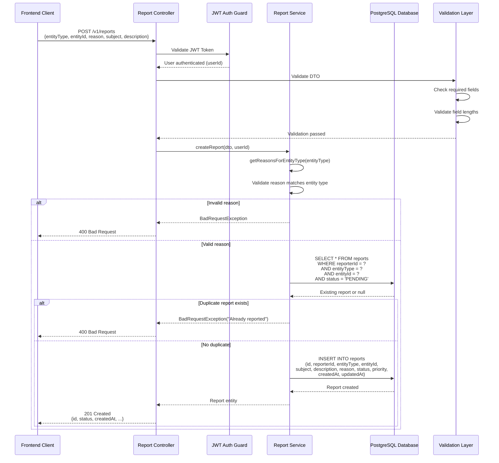

### 2. User Views Their Reports

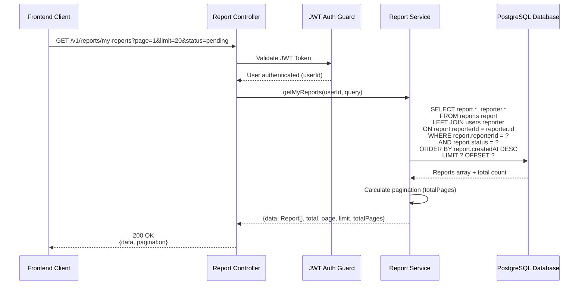

### 3. Admin Views All Reports with Filters

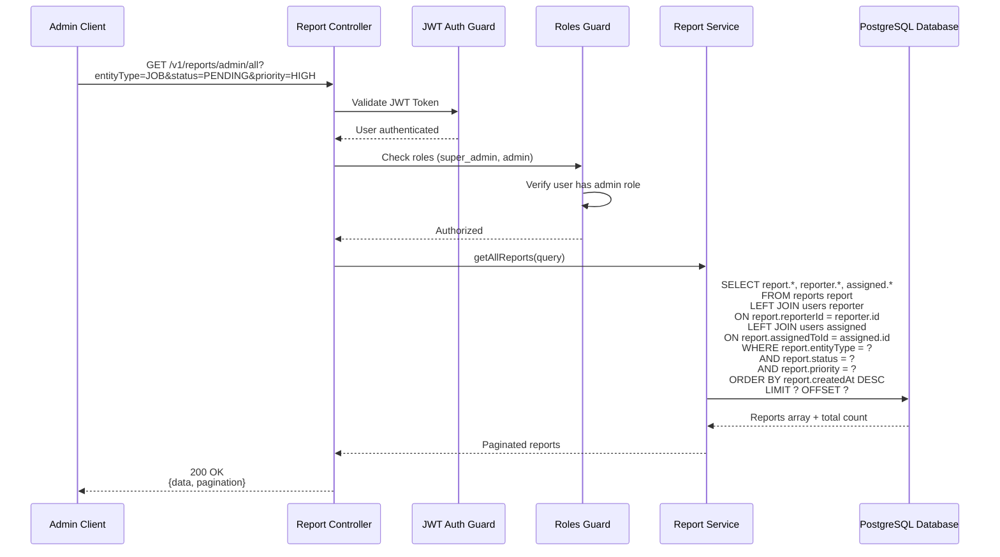

### 4. Admin Updates Report Status

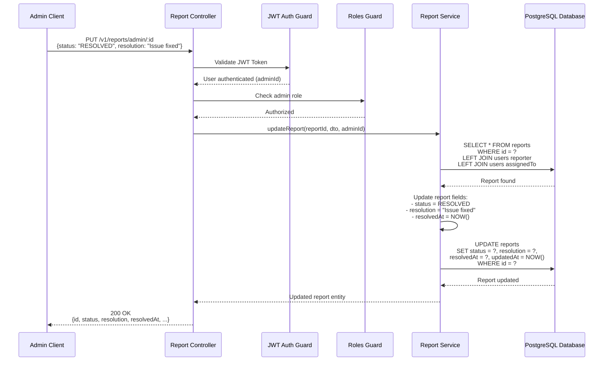

### 5. Get Report Reasons by Entity Type

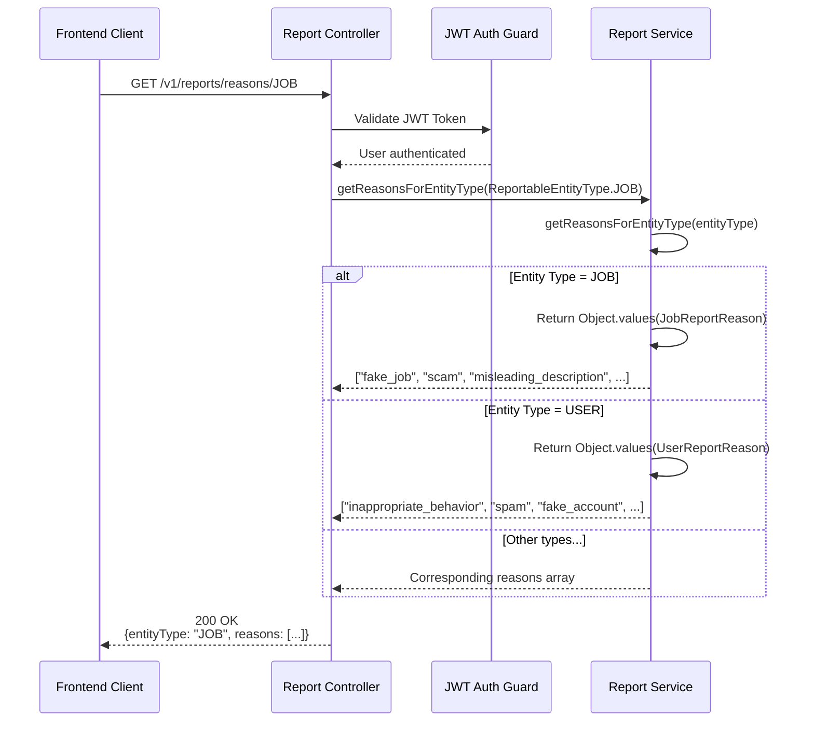

### 6. Complete Report Lifecycle - Admin Workflow

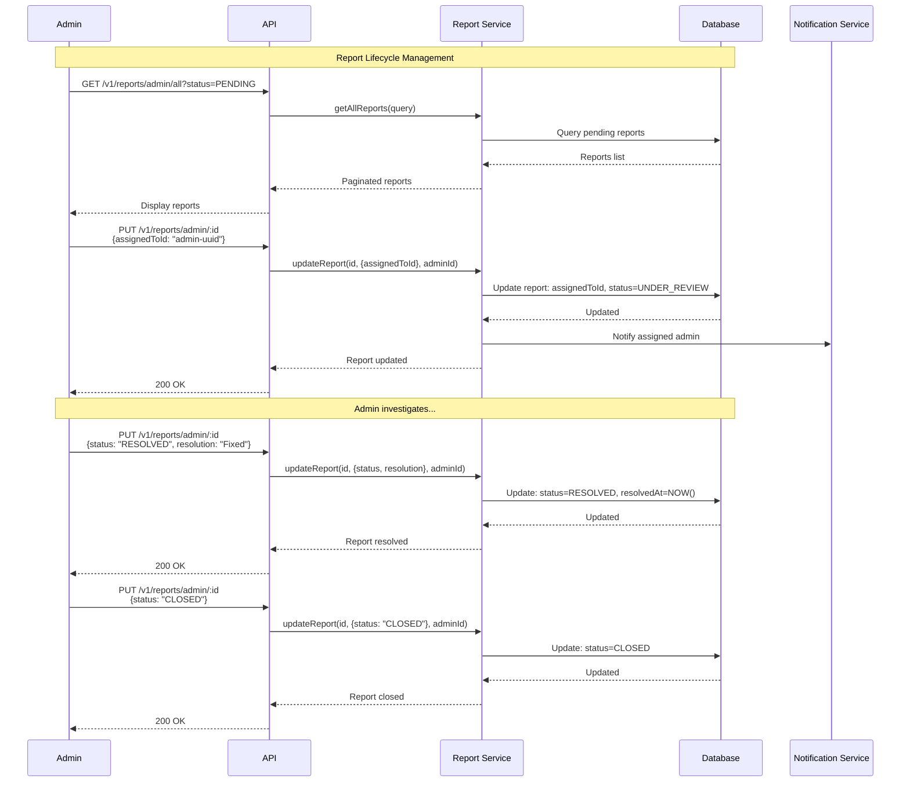

---

## Architecture Diagrams

### 1. System Architecture - High Level

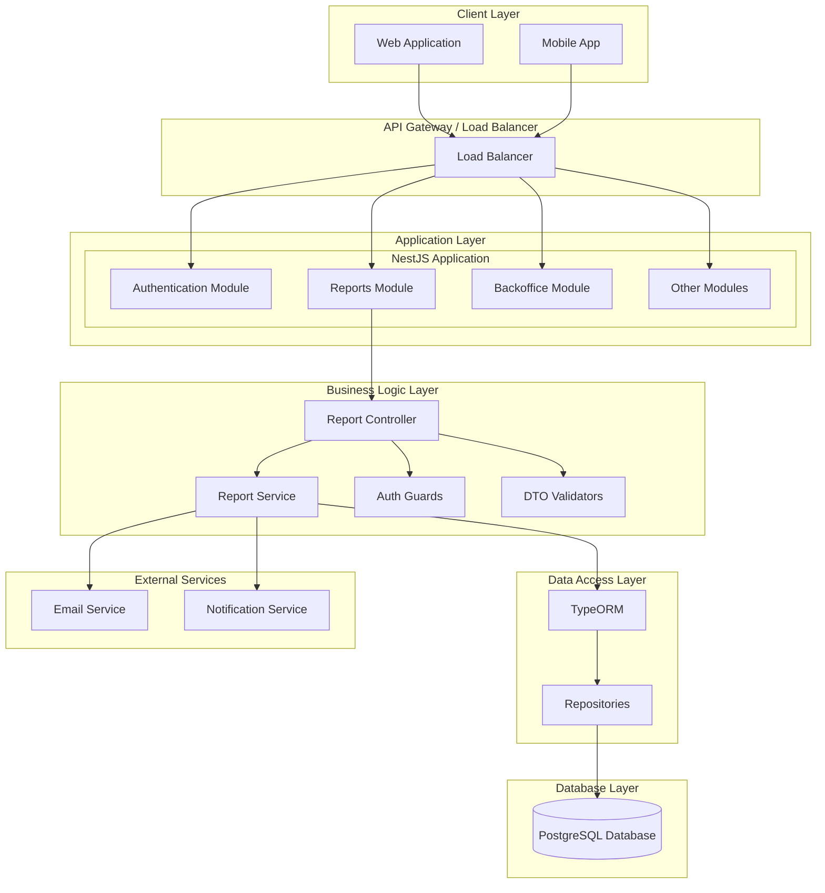

### 2. Module Architecture - Reports Module

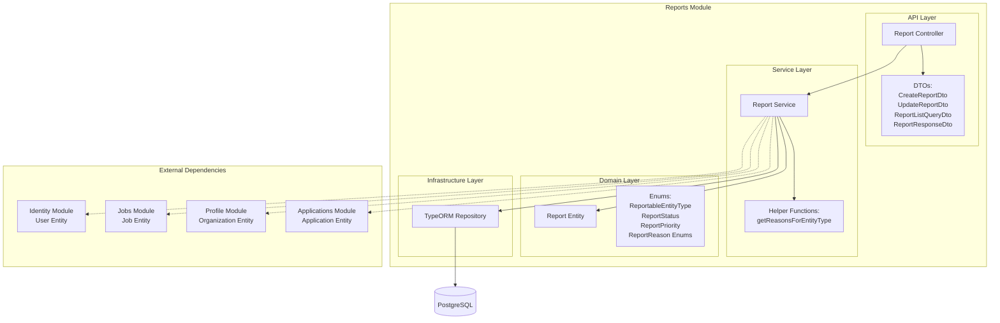

### 3. Component Diagram - Detailed

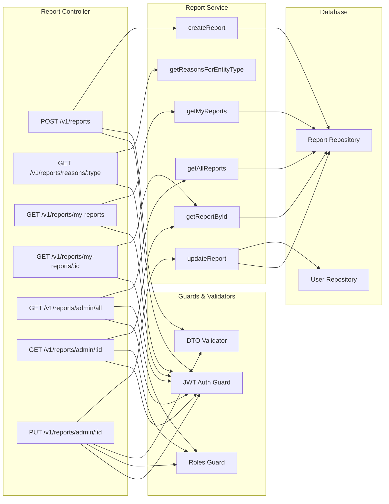

### 4. Data Flow Diagram

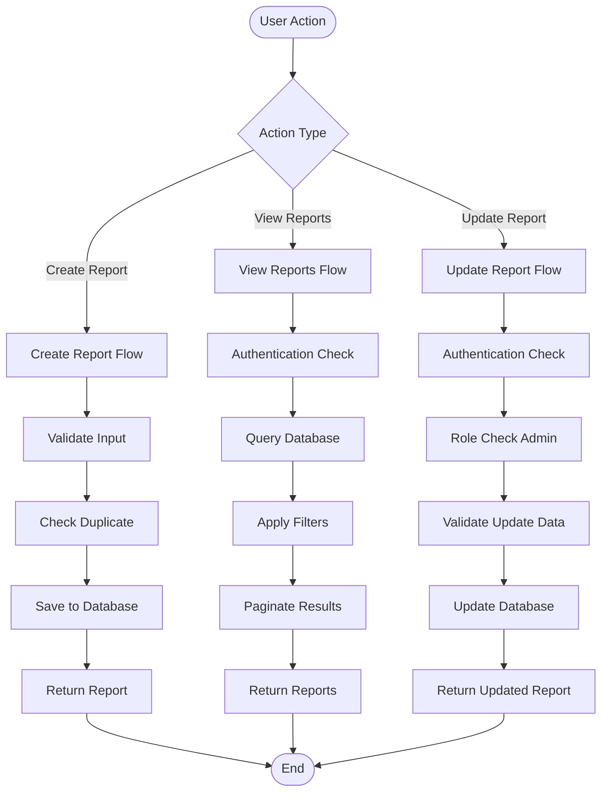

### 5. Deployment Architecture

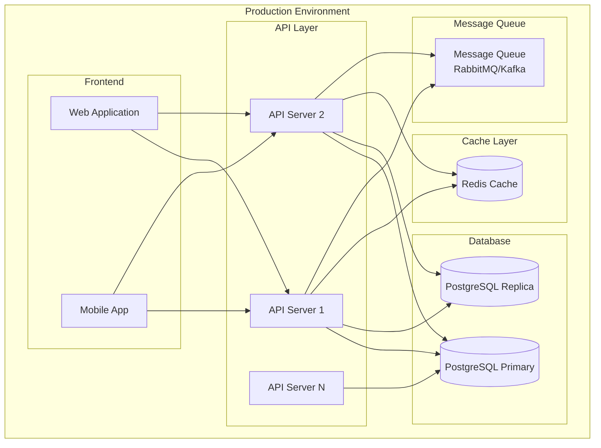

### 6. Security Architecture

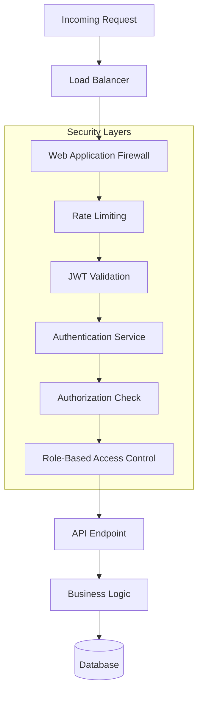

---

## Database Indexes Strategy

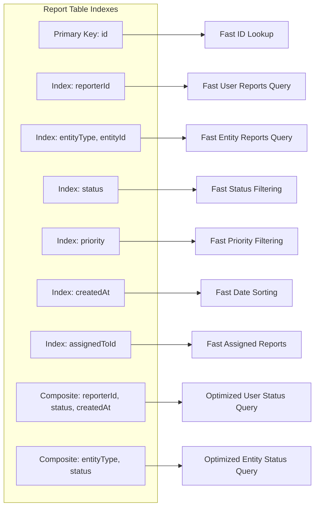

---

## API Endpoints Summary

### User Endpoints

- `POST /v1/reports` - Create report
- `GET /v1/reports/reasons/:entityType` - Get reasons
- `GET /v1/reports/my-reports` - List user's reports
- `GET /v1/reports/my-reports/:id` - Get user's report by ID

### Admin Endpoints

- `GET /v1/reports/admin/all` - List all reports (with filters)
- `GET /v1/reports/admin/:id` - Get report by ID
- `PUT /v1/reports/admin/:id` - Update report

---

## Summary

This documentation provides:

1. ✅ **ERD** - Complete database schema and relationships
2. ✅ **Sequence Diagrams** - Detailed interaction flows
3. ✅ **Architecture Diagrams** - System, module, component, and deployment views
4. ✅ **Data Flow** - How data moves through the system
5. ✅ **Security Architecture** - Security layers and controls
6. ✅ **Database Strategy** - Indexing for performance

All diagrams are in Mermaid format and can be rendered in Markdown viewers or documentation tools.

```

This documentation includes:
1. ERD — database relationships
2. Sequence diagrams — 6 detailed flows
3. Architecture diagrams — system, module, component, deployment, security
4. Data flow — request processing
5. Database strategy — indexing

All diagrams are in Mermaid format and ready to use. Should I add more specific diagrams or details?
```
