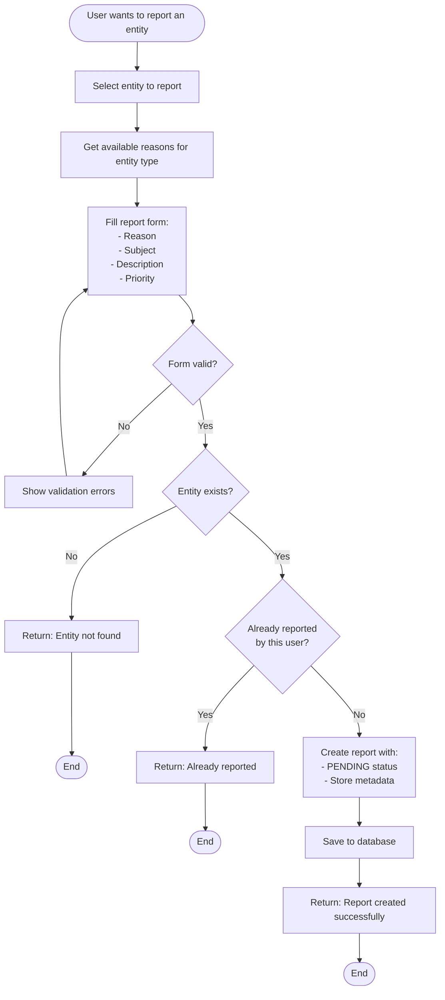
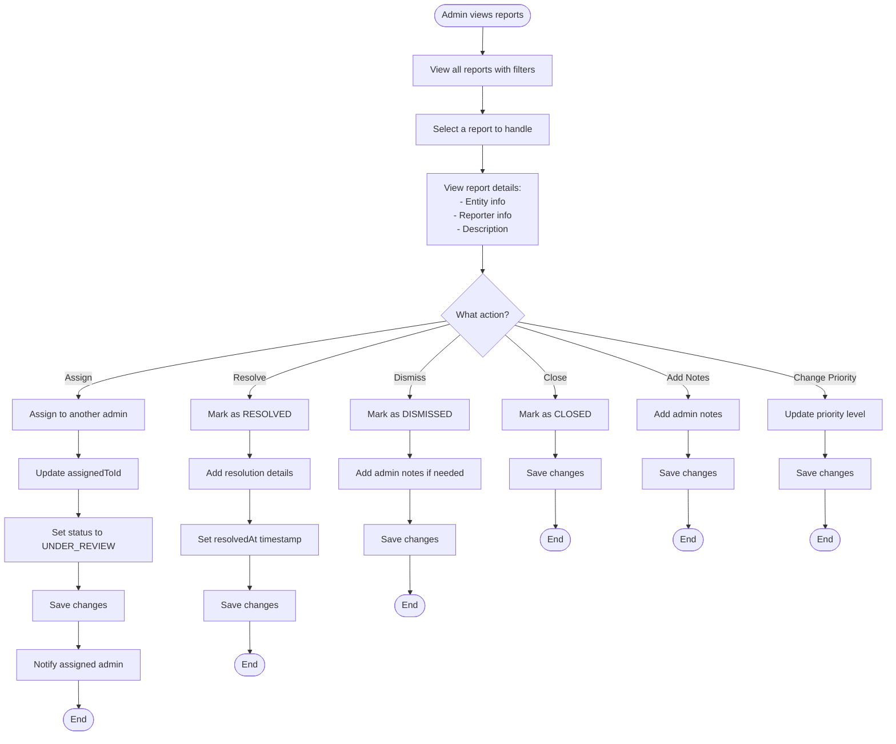
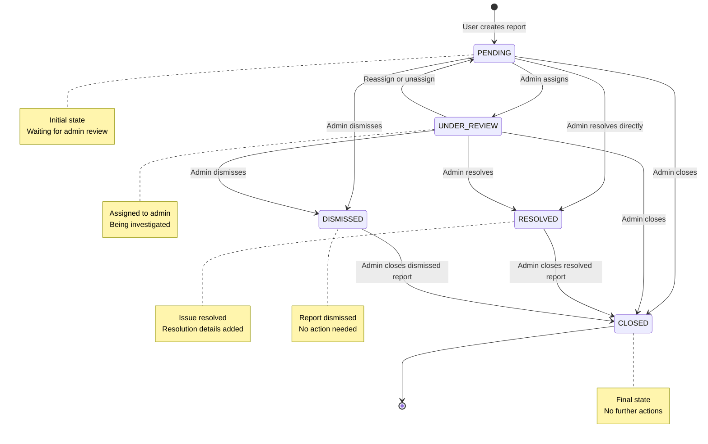
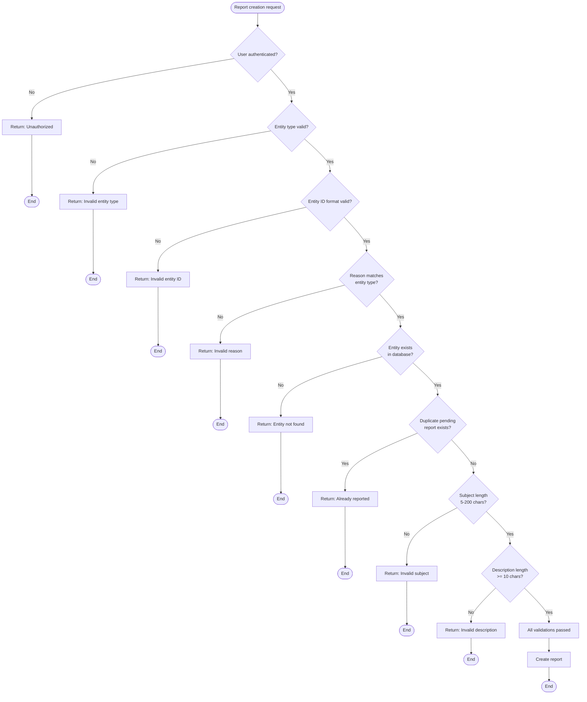
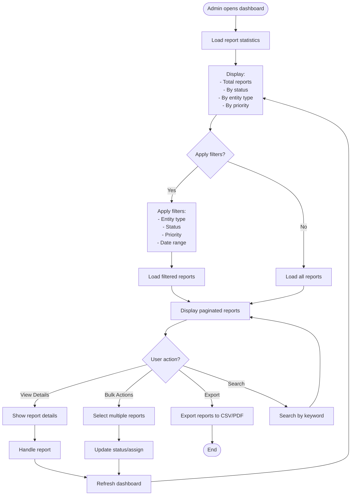
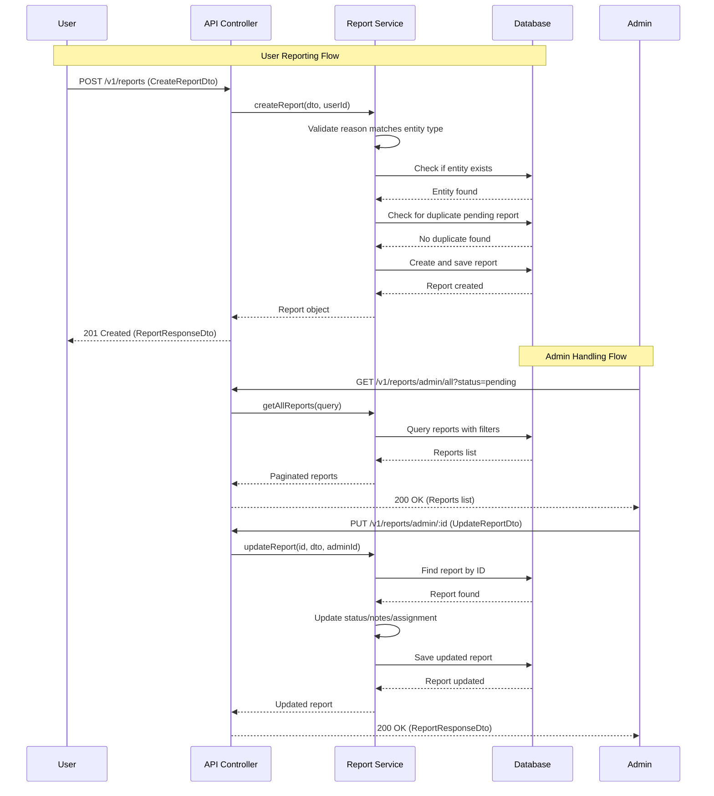
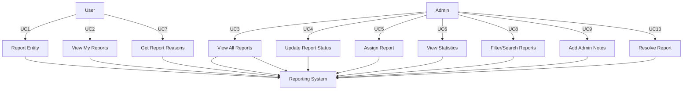

Use cases and activity diagrams for the reporting system:

## Use Cases

### UC1: User Reports an Entity

- Actor: User
- Precondition: User is authenticated
- Main flow:
  1. User selects entity to report
  2. System shows available report reasons for that entity type
  3. User selects reason and provides details
  4. System validates entity exists
  5. System checks for duplicate pending reports
  6. System creates report with PENDING status
  7. System returns confirmation

### UC2: User Views Their Reports

- Actor: User
- Precondition: User is authenticated
- Main flow:
  1. User requests their reports
  2. System filters reports by reporter ID
  3. System returns paginated list with status

### UC3: Admin Views All Reports

- Actor: Admin
- Precondition: Admin is authenticated and has admin role
- Main flow:
  1. Admin requests reports with optional filters
  2. System returns paginated list
  3. Admin can filter by entity type, status, priority, etc.

### UC4: Admin Updates Report Status

- Actor: Admin
- Precondition: Admin is authenticated and has admin role
- Main flow:
  1. Admin selects a report
  2. Admin updates status (UNDER_REVIEW, RESOLVED, DISMISSED, CLOSED)
  3. If RESOLVED, admin provides resolution details
  4. System updates report and timestamps

### UC5: Admin Assigns Report

- Actor: Admin
- Precondition: Admin is authenticated and has admin role
- Main flow:
  1. Admin selects a report
  2. Admin assigns to another admin
  3. System updates assignedToId and sets status to UNDER_REVIEW

## Activity Diagrams

### 1. User Reporting Flow



### 2. Admin Handling Report Flow



### 3. Complete Report Lifecycle



### 4. Report Validation Flow



### 5. Admin Dashboard Flow



### 6. Report Reasons Retrieval Flow

```mermaid
flowchart TD
    Start([User selects entity type]) --> RequestReasons[Request reasons for entity type]
    RequestReasons --> CheckType{Entity type valid?}

    CheckType -->|No| InvalidType[Return: Invalid entity type]
    InvalidType --> End1([End])

    CheckType -->|Yes| GetReasons[Get reasons from enum]
    GetReasons --> SwitchType{Entity type?}

    SwitchType -->|USER| UserReasons[Return UserReportReason enum]
    SwitchType -->|ORGANIZATION| OrgReasons[Return OrganizationReportReason enum]
    SwitchType -->|JOB| JobReasons[Return JobReportReason enum]
    SwitchType -->|ORGANIZATION_REVIEW| ReviewReasons[Return ReviewReportReason enum]
    SwitchType -->|RECRUITER_FEEDBACK| FeedbackReasons[Return FeedbackReportReason enum]
    SwitchType -->|APPLICATION| AppReasons[Return ApplicationReportReason enum]
    SwitchType -->|INTERVIEW| InterviewReasons[Return InterviewReportReason enum]
    SwitchType -->|OFFER| OfferReasons[Return OfferReportReason enum]
    SwitchType -->|CV| CVReasons[Return CVReportReason enum]
    SwitchType -->|PAYMENT| PaymentReasons[Return PaymentReportReason enum]
    SwitchType -->|SUBSCRIPTION| SubReasons[Return SubscriptionReportReason enum]
    SwitchType -->|TRANSACTION| TransReasons[Return TransactionReportReason enum]
    SwitchType -->|INVOICE| InvoiceReasons[Return InvoiceReportReason enum]
    SwitchType -->|OTHER| DefaultReasons[Return ['other']]

    UserReasons --> FormatResponse[Format as array of strings]
    OrgReasons --> FormatResponse
    JobReasons --> FormatResponse
    ReviewReasons --> FormatResponse
    FeedbackReasons --> FormatResponse
    AppReasons --> FormatResponse
    InterviewReasons --> FormatResponse
    OfferReasons --> FormatResponse
    CVReasons --> FormatResponse
    PaymentReasons --> FormatResponse
    SubReasons --> FormatResponse
    TransReasons --> FormatResponse
    InvoiceReasons --> FormatResponse
    DefaultReasons --> FormatResponse

    FormatResponse --> ReturnReasons[Return reasons to client]
    ReturnReasons --> End2([End])
```

## Sequence Diagram: Complete Report Flow



## Use Case Diagram



## Summary

The system includes:

1. User reporting with validation
2. Admin workflow with status transitions
3. Report lifecycle states
4. Validation checks
5. Admin dashboard with filtering
6. Dynamic reason retrieval by entity type

These diagrams cover the main flows. Should I adjust any part or add more detail?
