Use cases and implementation guidance for a subscription system:

## Subscription use cases

### For employers/recruiters

1. AI features
   - Free: No features
   - Standard: AI auto reject base on requirements, CV scoring, can use chatbot features
   - Premium: Full AI suite (matching, pipeline orchestration, interview assistance)

2. Team collaboration
   - Free: Single user
   - Standard: Up to 3 team members
   - Premium: Unlimited team members, role-based permissions

3. Application management
   - Free: Manual pipeline
   - Standard: Automated workflows
   - Premium: AI-powered pipeline orchestration, bulk actions

### For candidates

1. AI CV enhancement
   - Free: 1 CV enhancement/month
   - Standard: 5/month
   - Premium: Unlimited

2. Mock AI interviews
   - Free: 1 session/month
   - Standard: 5 sessions/month
   - Premium: Unlimited, advanced feedback

## Implementation architecture

### 1. Database schema

```typescript
// subscription-plan.entity.ts
@Entity('subscription_plans')
export class SubscriptionPlan {
  @PrimaryGeneratedColumn('uuid')
  id: string;

  @Column({ type: 'varchar', unique: true })
  name: string; // 'free', 'standard', 'premium'

  @Column({ type: 'varchar' })
  displayName: string; // 'Free', 'Standard', 'Premium'

  @Column({ type: 'text', nullable: true })
  description?: string;

  @Column({ type: 'decimal', precision: 10, scale: 2 })
  price: number;

  @Column({ type: 'varchar', length: 3 })
  currency: string; // 'USD', 'VND'

  @Column({ type: 'varchar' })
  billingPeriod: 'monthly' | 'yearly';

  @Column({ type: 'jsonb' })
  features: SubscriptionFeatures; // Feature limits

  @Column({ type: 'boolean', default: true })
  isActive: boolean;

  @Column({ type: 'int', nullable: true })
  sortOrder?: number;

  @CreateDateColumn()
  createdAt: Date;

  @UpdateDateColumn()
  updatedAt: Date;
}

// subscription.entity.ts
@Entity('subscriptions')
export class Subscription {
  @PrimaryGeneratedColumn('uuid')
  id: string;

  @ManyToOne(() => User)
  @JoinColumn({ name: 'userId' })
  user: User;

  @Column('uuid')
  userId: string;

  @ManyToOne(() => Organization, { nullable: true })
  @JoinColumn({ name: 'organizationId' })
  organization?: Organization;

  @Column('uuid', { nullable: true })
  organizationId?: string;

  @ManyToOne(() => SubscriptionPlan)
  @JoinColumn({ name: 'planId' })
  plan: SubscriptionPlan;

  @Column('uuid')
  planId: string;

  @Column({
    type: 'enum',
    enum: SubscriptionStatus,
    default: SubscriptionStatus.ACTIVE,
  })
  status: SubscriptionStatus; // ACTIVE, CANCELLED, EXPIRED, SUSPENDED

  @Column({ type: 'timestamp' })
  startDate: Date;

  @Column({ type: 'timestamp' })
  endDate: Date;

  @Column({ type: 'timestamp', nullable: true })
  cancelledAt?: Date;

  @Column({ type: 'boolean', default: false })
  autoRenew: boolean;

  @Column({ type: 'jsonb', nullable: true })
  paymentDetails?: {
    paymentMethodId?: string;
    lastPaymentDate?: Date;
    nextBillingDate?: Date;
  };

  @CreateDateColumn()
  createdAt: Date;

  @UpdateDateColumn()
  updatedAt: Date;

  isActive(): boolean {
    return (
      this.status === SubscriptionStatus.ACTIVE &&
      new Date() >= this.startDate &&
      new Date() <= this.endDate
    );
  }

  isExpired(): boolean {
    return new Date() > this.endDate;
  }
}

// subscription-usage.entity.ts
@Entity('subscription_usage')
export class SubscriptionUsage {
  @PrimaryGeneratedColumn('uuid')
  id: string;

  @Column('uuid')
  subscriptionId: string;

  @Column('uuid')
  userId: string;

  @Column({ type: 'varchar' })
  feature: string; 

  @Column({ type: 'int', default: 0 })
  used: number;

  @Column({ type: 'int' })
  limit: number;

  @Column({ type: 'varchar' })
  period: 'monthly' | 'yearly'; // Reset period

  @Column({ type: 'timestamp' })
  periodStart: Date;

  @Column({ type: 'timestamp' })
  periodEnd: Date;

  @CreateDateColumn()
  createdAt: Date;

  @UpdateDateColumn()
  updatedAt: Date;
}
```

### 2. Feature limits configuration

```typescript
// subscription-features.interface.ts
export interface SubscriptionFeatures {
  // Employer features
  jobPostings?: {
    limit: number; // -1 for unlimited
    featuredJobs?: number;
  };
  candidateSearches?: {
    monthlyLimit: number;
    advancedFilters: boolean;
    aiMatching: boolean;
  };
  teamMembers?: {
    limit: number;
  };
  hiringAnalytics?: {
    enabled: boolean;
    historyDays: number;
    customReports: boolean;
  };
  aiFeatures?: {
    cvScreening: boolean;
    candidateMatching: boolean;
    pipelineOrchestration: boolean;
  };

  // Candidate features
  jobApplications?: {
    monthlyLimit: number;
  };
  cvEnhancements?: {
    monthlyLimit: number;
  };
  mockInterviews?: {
    monthlyLimit: number;
    advancedFeedback: boolean;
  };
  profileVisibility?: {
    level: 'standard' | 'enhanced' | 'featured';
  };
  learningResources?: {
    accessLevel: 'basic' | 'all' | 'premium';
  };
}

// Default plans configuration
export const DEFAULT_PLANS: Partial<SubscriptionPlan>[] = [
  {
    name: 'free',
    displayName: 'Free',
    price: 0,
    currency: 'USD',
    billingPeriod: 'monthly',
    features: {
      jobPostings: { limit: 1, featuredJobs: 0 },
      candidateSearches: {
        monthlyLimit: 10,
        advancedFilters: false,
        aiMatching: false,
      },
      teamMembers: { limit: 1 },
      hiringAnalytics: { enabled: false, historyDays: 0, customReports: false },
      aiFeatures: {
        cvScreening: false,
        candidateMatching: false,
        pipelineOrchestration: false,
      },
      jobApplications: { monthlyLimit: 5 },
      cvEnhancements: { monthlyLimit: 1 },
      mockInterviews: { monthlyLimit: 1 },
      profileVisibility: { level: 'standard' },
      learningResources: { accessLevel: 'basic' },
    },
  },
  {
    name: 'standard',
    displayName: 'Standard',
    price: 29.99,
    currency: 'USD',
    billingPeriod: 'monthly',
    features: {
      jobPostings: { limit: 10, featuredJobs: 2 },
      candidateSearches: {
        monthlyLimit: 100,
        advancedFilters: true,
        aiMatching: true,
      },
      teamMembers: { limit: 3 },
      hiringAnalytics: { enabled: true, historyDays: 30, customReports: false },
      aiFeatures: {
        cvScreening: true,
        candidateMatching: true,
        pipelineOrchestration: false,
      },
      jobApplications: { monthlyLimit: 20 },
      cvEnhancements: { monthlyLimit: 5 },
      mockInterviews: { monthlyLimit: 5 },
      profileVisibility: { level: 'enhanced' },
      learningResources: { accessLevel: 'all' },
    },
  },
  {
    name: 'premium',
    displayName: 'Premium',
    price: 99.99,
    currency: 'USD',
    billingPeriod: 'monthly',
    features: {
      jobPostings: { limit: -1, featuredJobs: -1 }, // -1 = unlimited
      candidateSearches: {
        monthlyLimit: -1,
        advancedFilters: true,
        aiMatching: true,
      },
      teamMembers: { limit: -1 },
      hiringAnalytics: { enabled: true, historyDays: -1, customReports: true },
      aiFeatures: {
        cvScreening: true,
        candidateMatching: true,
        pipelineOrchestration: true,
      },
      jobApplications: { monthlyLimit: -1 },
      cvEnhancements: { monthlyLimit: -1 },
      mockInterviews: { monthlyLimit: -1 },
      profileVisibility: { level: 'featured' },
      learningResources: { accessLevel: 'premium' },
    },
  },
];
```

### 3. Service layer

```typescript
// subscription.service.ts
@Injectable()
export class SubscriptionService {
  constructor(
    @InjectRepository(Subscription)
    private subscriptionRepository: Repository<Subscription>,
    @InjectRepository(SubscriptionPlan)
    private planRepository: Repository<SubscriptionPlan>,
    @InjectRepository(SubscriptionUsage)
    private usageRepository: Repository<SubscriptionUsage>,
  ) {}

  async getActiveSubscription(
    userId: string,
    organizationId?: string,
  ): Promise<Subscription | null> {
    return this.subscriptionRepository.findOne({
      where: {
        userId,
        organizationId: organizationId || null,
        status: SubscriptionStatus.ACTIVE,
      },
      relations: ['plan'],
      order: { createdAt: 'DESC' },
    });
  }

  async checkFeatureAccess(
    userId: string,
    feature: string,
    organizationId?: string,
  ): Promise<{ allowed: boolean; remaining?: number; limit?: number }> {
    const subscription = await this.getActiveSubscription(
      userId,
      organizationId,
    );

    if (!subscription || !subscription.isActive()) {
      // Return free tier limits
      return this.getFreeTierLimits(feature);
    }

    const planFeatures = subscription.plan.features;
    const featureConfig = this.getFeatureConfig(planFeatures, feature);

    if (!featureConfig || featureConfig.limit === -1) {
      return { allowed: true, remaining: -1, limit: -1 };
    }

    // Check usage
    const usage = await this.getCurrentUsage(subscription.id, feature);
    const remaining = featureConfig.limit - usage.used;

    return {
      allowed: remaining > 0,
      remaining: Math.max(0, remaining),
      limit: featureConfig.limit,
    };
  }

  async incrementUsage(
    subscriptionId: string,
    feature: string,
    amount: number = 1,
  ): Promise<void> {
    const usage = await this.getCurrentUsage(subscriptionId, feature);

    await this.usageRepository.update(usage.id, {
      used: usage.used + amount,
    });
  }

  private async getCurrentUsage(
    subscriptionId: string,
    feature: string,
  ): Promise<SubscriptionUsage> {
    const now = new Date();
    const periodStart = new Date(now.getFullYear(), now.getMonth(), 1);
    const periodEnd = new Date(
      now.getFullYear(),
      now.getMonth() + 1,
      0,
      23,
      59,
      59,
    );

    let usage = await this.usageRepository.findOne({
      where: {
        subscriptionId,
        feature,
        periodStart: LessThanOrEqual(periodStart),
        periodEnd: MoreThanOrEqual(periodEnd),
      },
    });

    if (!usage) {
      const subscription = await this.subscriptionRepository.findOne({
        where: { id: subscriptionId },
        relations: ['plan'],
      });

      const featureConfig = this.getFeatureConfig(
        subscription.plan.features,
        feature,
      );

      usage = this.usageRepository.create({
        subscriptionId,
        userId: subscription.userId,
        feature,
        used: 0,
        limit: featureConfig?.limit || 0,
        period: 'monthly',
        periodStart,
        periodEnd,
      });

      await this.usageRepository.save(usage);
    }

    return usage;
  }
}
```

### 4. Guards and decorators

```typescript
// subscription-feature.guard.ts
@Injectable()
export class SubscriptionFeatureGuard implements CanActivate {
  constructor(
    private subscriptionService: SubscriptionService,
    private reflector: Reflector,
  ) {}

  async canActivate(context: ExecutionContext): Promise<boolean> {
    const feature = this.reflector.get<string>(
      'subscriptionFeature',
      context.getHandler(),
    );

    if (!feature) {
      return true; // No feature requirement
    }

    const request = context.switchToHttp().getRequest();
    const userId = request.user?.id;
    const organizationId = request.user?.organizationId;

    const access = await this.subscriptionService.checkFeatureAccess(
      userId,
      feature,
      organizationId,
    );

    if (!access.allowed) {
      throw new ForbiddenException(
        `Feature limit reached. ${access.remaining || 0} remaining of ${access.limit}`,
      );
    }

    // Attach usage info to request for later increment
    request.subscriptionUsage = access;
    return true;
  }
}

// subscription-feature.decorator.ts
export const RequireSubscriptionFeature = (feature: string) =>
  SetMetadata('subscriptionFeature', feature);
```

### 5. Usage in controllers

```typescript
// job.controller.ts
@Controller('jobs')
export class JobController {
  constructor(
    private jobService: JobService,
    private subscriptionService: SubscriptionService,
  ) {}

  @Post()
  @UseGuards(SubscriptionFeatureGuard)
  @RequireSubscriptionFeature('job_postings')
  async createJob(@Body() dto: CreateJobDto, @Request() req) {
    const job = await this.jobService.create(dto, req.user.id);

    // Increment usage after successful creation
    const subscription = await this.subscriptionService.getActiveSubscription(
      req.user.id,
      req.user.organizationId,
    );

    if (subscription) {
      await this.subscriptionService.incrementUsage(
        subscription.id,
        'job_postings',
      );
    }

    return job;
  }
}
```

### 6. Middleware for automatic checks

```typescript
// subscription-check.middleware.ts
@Injectable()
export class SubscriptionCheckMiddleware implements NestMiddleware {
  constructor(private subscriptionService: SubscriptionService) {}

  async use(req: Request, res: Response, next: NextFunction) {
    if (req.user) {
      const subscription = await this.subscriptionService.getActiveSubscription(
        req.user.id,
        req.user.organizationId,
      );

      // Attach subscription info to request
      req.user.subscription = subscription
        ? {
            plan: subscription.plan.name,
            features: subscription.plan.features,
            expiresAt: subscription.endDate,
          }
        : {
            plan: 'free',
            features: this.getFreeTierFeatures(),
          };
    }
    next();
  }
}
```

## Implementation steps

1. Create entities: `SubscriptionPlan`, `Subscription`, `SubscriptionUsage`
2. Create seeders for default plans
3. Implement `SubscriptionService` with feature checking
4. Create guards and decorators for feature protection
5. Integrate checks into existing controllers (jobs, applications, AI features)
6. Add usage tracking when features are used
7. Create subscription management endpoints (subscribe, cancel, upgrade)
8. Add payment integration (Stripe, PayPal, etc.)
9. Create admin endpoints for plan management
10. Add subscription status checks to frontend

Reviewing the subscription documentation, then outlining Back Office API use cases for refunds, plans, subscriptions, and billing.

[3 tools called]

Reviewing the backoffice structure to understand the existing patterns:

[3 tools called]

Back Office API use cases for subscription management. Add this to your `subscription.md`:

## Back Office API Use Cases

### 1. Subscription Plans Management

#### Use Cases

**UC1: Admin Views All Plans**

- Actor: Admin
- Precondition: Admin authenticated with `manage:subscription` permission
- Main flow:
  1. Admin requests list of subscription plans
  2. System returns all plans with status, pricing, features
  3. Admin can filter by status (active/inactive), billing period
  4. System returns paginated results

**UC2: Admin Creates New Plan**

- Actor: Admin
- Precondition: Admin authenticated
- Main flow:
  1. Admin provides plan details (name, price, features, billing period)
  2. System validates plan name is unique
  3. System validates feature configuration
  4. System creates plan with `isActive: false` (requires activation)
  5. System returns created plan

**UC3: Admin Updates Plan**

- Actor: Admin
- Precondition: Plan exists
- Main flow:
  1. Admin selects plan to update
  2. Admin modifies fields (price, features, description)
  3. System validates changes
  4. System checks if plan has active subscriptions (warn if yes)
  5. System updates plan
  6. System logs change history

**UC4: Admin Activates/Deactivates Plan**

- Actor: Admin
- Precondition: Plan exists
- Main flow:
  1. Admin toggles plan status
  2. If deactivating: System checks for active subscriptions
  3. If active subscriptions exist: System prevents deactivation or shows warning
  4. System updates `isActive` flag
  5. System prevents new subscriptions to deactivated plans

**UC5: Admin Views Plan Statistics**

- Actor: Admin
- Main flow:
  1. Admin requests plan statistics
  2. System calculates: total subscribers, revenue, churn rate, conversion rate
  3. System returns analytics per plan

---

### 2. Subscription Management

#### Use Cases

**UC6: Admin Views All Subscriptions**

- Actor: Admin
- Precondition: Admin authenticated
- Main flow:
  1. Admin requests subscriptions list
  2. System returns subscriptions with filters:
     - Status (ACTIVE, CANCELLED, EXPIRED, SUSPENDED)
     - Plan type
     - Date range (start/end date)
     - User/Organization
     - Payment status
  3. System returns paginated results with user/org details

**UC7: Admin Views Subscription Details**

- Actor: Admin
- Precondition: Subscription exists
- Main flow:
  1. Admin requests subscription by ID
  2. System returns:
     - Subscription details (plan, dates, status)
     - User/Organization info
     - Payment history
     - Usage statistics
     - Transaction history
     - Refund history (if any)

**UC8: Admin Manually Creates Subscription**

- Actor: Admin
- Precondition: User/Organization exists, Plan exists and active
- Main flow:
  1. Admin selects user/organization
  2. Admin selects plan
  3. Admin sets start/end dates
  4. Admin can mark as "complimentary" (no payment required)
  5. System creates subscription
  6. System grants access to features immediately
  7. System logs admin action

**UC9: Admin Updates Subscription**

- Actor: Admin
- Precondition: Subscription exists
- Main flow:
  1. Admin can update:
     - Plan (upgrade/downgrade with proration)
     - End date (extend/reduce)
     - Status (suspend/reactivate)
     - Auto-renew flag
  2. System validates changes
  3. System handles proration if plan changed
  4. System updates subscription
  5. System logs change with admin ID

**UC10: Admin Suspends Subscription**

- Actor: Admin
- Precondition: Subscription is ACTIVE
- Main flow:
  1. Admin selects subscription to suspend
  2. Admin provides reason (optional)
  3. System changes status to SUSPENDED
  4. System revokes feature access
  5. System notifies user
  6. System logs suspension

**UC11: Admin Reactivates Subscription**

- Actor: Admin
- Precondition: Subscription is SUSPENDED or EXPIRED
- Main flow:
  1. Admin selects subscription
  2. Admin can extend end date if expired
  3. System changes status to ACTIVE
  4. System restores feature access
  5. System notifies user
  6. System logs reactivation

**UC12: Admin Cancels Subscription**

- Actor: Admin
- Precondition: Subscription is ACTIVE
- Main flow:
  1. Admin selects subscription
  2. Admin provides cancellation reason
  3. Admin chooses: immediate or end of period
  4. System updates status to CANCELLED
  5. System sets `cancelledAt` timestamp
  6. System disables auto-renew
  7. If immediate: System revokes access
  8. System logs cancellation

**UC13: Admin Extends Subscription**

- Actor: Admin
- Precondition: Subscription exists
- Main flow:
  1. Admin selects subscription
  2. Admin specifies extension period (days/months)
  3. System calculates new end date
  4. System updates `endDate`
  5. System logs extension with reason

**UC14: Admin Views Subscription Usage**

- Actor: Admin
- Precondition: Subscription exists
- Main flow:
  1. Admin requests usage statistics
  2. System returns:
     - Feature usage (job postings, CV enhancements, etc.)
     - Usage vs limits
     - Historical usage trends
     - Peak usage periods

---

### 3. Refund Management

#### Use Cases

**UC15: Admin Views Refund Requests**

- Actor: Admin
- Precondition: Admin authenticated
- Main flow:
  1. Admin requests refund list
  2. System returns refunds with filters:
     - Status (PENDING, APPROVED, REJECTED, PROCESSED)
     - Subscription ID
     - Date range
     - Amount range
  3. System shows associated subscription and payment details

**UC16: Admin Processes Refund Request**

- Actor: Admin
- Precondition: Refund request exists
- Main flow:
  1. Admin reviews refund request
  2. Admin views:
     - Original payment details
     - Subscription usage
     - Refund reason
     - User history
  3. Admin approves or rejects
  4. If approved:
     - System calculates refund amount (full/partial/prorated)
     - System creates refund record
     - System processes payment refund (via payment gateway)
     - System updates subscription status if needed
     - System notifies user
  5. System logs refund action

**UC17: Admin Creates Manual Refund**

- Actor: Admin
- Precondition: Subscription with payment exists
- Main flow:
  1. Admin selects subscription
  2. Admin specifies:
     - Refund amount (full/partial)
     - Refund reason
     - Refund method (original payment method/credit)
  3. System validates refund amount ≤ paid amount
  4. System creates refund record
  5. System processes refund
  6. System updates subscription if needed
  7. System logs manual refund

**UC18: Admin Views Refund History**

- Actor: Admin
- Main flow:
  1. Admin requests refund history
  2. System returns:
     - All refunds with status
     - Refund statistics (total amount, count by status)
     - Refund trends over time
     - Top refund reasons

**UC19: Admin Reverses Refund**

- Actor: Admin
- Precondition: Refund is PROCESSED
- Main flow:
  1. Admin identifies refund to reverse
  2. System validates reversal is possible
  3. Admin provides reversal reason
  4. System creates reversal transaction
  5. System charges user again (if payment method available)
  6. System updates refund status
  7. System logs reversal

---

### 4. Billing Management

#### Use Cases

**UC20: Admin Views All Invoices**

- Actor: Admin
- Precondition: Admin authenticated
- Main flow:
  1. Admin requests invoices list
  2. System returns invoices with filters:
     - Payment status (PAID, PENDING, FAILED, REFUNDED)
     - Date range
     - User/Organization
     - Amount range
     - Subscription plan
  3. System returns paginated results

**UC21: Admin Views Invoice Details**

- Actor: Admin
- Precondition: Invoice exists
- Main flow:
  1. Admin requests invoice by ID
  2. System returns:
     - Invoice details (number, date, amount, tax)
     - Line items
     - Payment method
     - Payment status
     - Associated subscription
     - Downloadable PDF link

**UC22: Admin Manually Creates Invoice**

- Actor: Admin
- Precondition: Subscription exists
- Main flow:
  1. Admin selects subscription
  2. Admin specifies:
     - Invoice amount
     - Line items
     - Due date
     - Payment terms
  3. System generates invoice number
  4. System creates invoice record
  5. System notifies user
  6. System logs manual invoice creation

**UC23: Admin Marks Invoice as Paid**

- Actor: Admin
- Precondition: Invoice exists with PENDING status
- Main flow:
  1. Admin selects invoice
  2. Admin records payment:
     - Payment method
     - Payment date
     - Transaction ID (optional)
     - Payment amount
  3. System updates invoice status to PAID
  4. System updates subscription if needed
  5. System logs payment record

**UC24: Admin Views Billing Statistics**

- Actor: Admin
- Main flow:
  1. Admin requests billing dashboard
  2. System returns:
     - Revenue metrics (MRR, ARR, total revenue)
     - Payment success/failure rates
     - Outstanding invoices amount
     - Revenue by plan
     - Revenue trends (daily/weekly/monthly)
     - Churn rate
     - Average revenue per user (ARPU)

**UC25: Admin Exports Billing Reports**

- Actor: Admin
- Main flow:
  1. Admin requests billing report
  2. Admin specifies:
     - Report type (revenue, invoices, subscriptions)
     - Date range
     - Format (CSV, PDF, Excel)
  3. System generates report
  4. System returns download link or sends via email

**UC26: Admin Handles Failed Payments**

- Actor: Admin
- Precondition: Payment failure detected
- Main flow:
  1. System flags subscription with failed payment
  2. Admin views failed payment list
  3. Admin can:
     - Retry payment
     - Update payment method
     - Suspend subscription
     - Contact user
  4. System logs all actions

**UC27: Admin Views Payment History**

- Actor: Admin
- Precondition: User/Subscription exists
- Main flow:
  1. Admin requests payment history
  2. System returns:
     - All payments (successful/failed)
     - Refunds
     - Payment methods used
     - Transaction IDs
     - Timeline of all billing events

---

## API Endpoints Structure

```typescript
// subscription-backoffice.controller.ts
@ApiTags('BackOffice - Subscription Management')
@Controller('v1/backoffice/subscriptions')
@UseGuards(JwtAuthGuard, RolesGuard)
@ApiBearerAuth()
@decorators.Roles('super_admin', 'admin')
export class SubscriptionBackofficeController {
  // ========== PLANS MANAGEMENT ==========
  @Get('plans')
  @ApiOperation({ summary: 'Get all subscription plans' })
  async getPlans(@Query() query: PlanListQueryDto) {
    // UC1: View all plans
  }

  @Get('plans/:id')
  @ApiOperation({ summary: 'Get plan by ID' })
  async getPlanById(@Param('id') id: string) {
    // UC1: View plan details
  }

  @Post('plans')
  @ApiOperation({ summary: 'Create new subscription plan' })
  async createPlan(@Body() dto: CreatePlanDto) {
    // UC2: Create plan
  }

  @Put('plans/:id')
  @ApiOperation({ summary: 'Update subscription plan' })
  async updatePlan(@Param('id') id: string, @Body() dto: UpdatePlanDto) {
    // UC3: Update plan
  }

  @Put('plans/:id/status')
  @ApiOperation({ summary: 'Activate/Deactivate plan' })
  async togglePlanStatus(
    @Param('id') id: string,
    @Body() dto: UpdatePlanStatusDto,
  ) {
    // UC4: Toggle plan status
  }

  @Get('plans/:id/statistics')
  @ApiOperation({ summary: 'Get plan statistics' })
  async getPlanStatistics(@Param('id') id: string) {
    // UC5: Plan statistics
  }

  // ========== SUBSCRIPTION MANAGEMENT ==========
  @Get()
  @ApiOperation({ summary: 'Get all subscriptions' })
  async getSubscriptions(@Query() query: SubscriptionListQueryDto) {
    // UC6: View all subscriptions
  }

  @Get(':id')
  @ApiOperation({ summary: 'Get subscription details' })
  async getSubscriptionById(@Param('id') id: string) {
    // UC7: View subscription details
  }

  @Post()
  @ApiOperation({ summary: 'Manually create subscription' })
  async createSubscription(@Body() dto: CreateSubscriptionDto) {
    // UC8: Create subscription
  }

  @Put(':id')
  @ApiOperation({ summary: 'Update subscription' })
  async updateSubscription(
    @Param('id') id: string,
    @Body() dto: UpdateSubscriptionDto,
  ) {
    // UC9: Update subscription
  }

  @Put(':id/suspend')
  @ApiOperation({ summary: 'Suspend subscription' })
  async suspendSubscription(
    @Param('id') id: string,
    @Body() dto: SuspendSubscriptionDto,
  ) {
    // UC10: Suspend subscription
  }

  @Put(':id/reactivate')
  @ApiOperation({ summary: 'Reactivate subscription' })
  async reactivateSubscription(
    @Param('id') id: string,
    @Body() dto: ReactivateSubscriptionDto,
  ) {
    // UC11: Reactivate subscription
  }

  @Put(':id/cancel')
  @ApiOperation({ summary: 'Cancel subscription' })
  async cancelSubscription(
    @Param('id') id: string,
    @Body() dto: CancelSubscriptionDto,
  ) {
    // UC12: Cancel subscription
  }

  @Put(':id/extend')
  @ApiOperation({ summary: 'Extend subscription period' })
  async extendSubscription(
    @Param('id') id: string,
    @Body() dto: ExtendSubscriptionDto,
  ) {
    // UC13: Extend subscription
  }

  @Get(':id/usage')
  @ApiOperation({ summary: 'Get subscription usage statistics' })
  async getSubscriptionUsage(@Param('id') id: string) {
    // UC14: View usage
  }

  // ========== REFUND MANAGEMENT ==========
  @Get('refunds')
  @ApiOperation({ summary: 'Get all refund requests' })
  async getRefunds(@Query() query: RefundListQueryDto) {
    // UC15: View refunds
  }

  @Get('refunds/:id')
  @ApiOperation({ summary: 'Get refund details' })
  async getRefundById(@Param('id') id: string) {
    // UC15: View refund details
  }

  @Post('refunds')
  @ApiOperation({ summary: 'Create manual refund' })
  async createRefund(@Body() dto: CreateRefundDto) {
    // UC17: Create manual refund
  }

  @Put('refunds/:id/process')
  @ApiOperation({ summary: 'Process refund request' })
  async processRefund(@Param('id') id: string, @Body() dto: ProcessRefundDto) {
    // UC16: Process refund
  }

  @Get('refunds/statistics')
  @ApiOperation({ summary: 'Get refund statistics' })
  async getRefundStatistics(@Query() query: RefundStatsQueryDto) {
    // UC18: Refund statistics
  }

  @Put('refunds/:id/reverse')
  @ApiOperation({ summary: 'Reverse processed refund' })
  async reverseRefund(@Param('id') id: string, @Body() dto: ReverseRefundDto) {
    // UC19: Reverse refund
  }

  // ========== BILLING MANAGEMENT ==========
  @Get('invoices')
  @ApiOperation({ summary: 'Get all invoices' })
  async getInvoices(@Query() query: InvoiceListQueryDto) {
    // UC20: View invoices
  }

  @Get('invoices/:id')
  @ApiOperation({ summary: 'Get invoice details' })
  async getInvoiceById(@Param('id') id: string) {
    // UC21: View invoice details
  }

  @Post('invoices')
  @ApiOperation({ summary: 'Create manual invoice' })
  async createInvoice(@Body() dto: CreateInvoiceDto) {
    // UC22: Create invoice
  }

  @Put('invoices/:id/mark-paid')
  @ApiOperation({ summary: 'Mark invoice as paid' })
  async markInvoicePaid(
    @Param('id') id: string,
    @Body() dto: MarkInvoicePaidDto,
  ) {
    // UC23: Mark invoice paid
  }

  @Get('billing/statistics')
  @ApiOperation({ summary: 'Get billing statistics' })
  async getBillingStatistics(@Query() query: BillingStatsQueryDto) {
    // UC24: Billing statistics
  }

  @Post('billing/reports/export')
  @ApiOperation({ summary: 'Export billing report' })
  async exportBillingReport(@Body() dto: ExportBillingReportDto) {
    // UC25: Export reports
  }

  @Get('payments/failed')
  @ApiOperation({ summary: 'Get failed payments' })
  async getFailedPayments(@Query() query: FailedPaymentQueryDto) {
    // UC26: Failed payments
  }

  @Get('payments/history/:subscriptionId')
  @ApiOperation({ summary: 'Get payment history for subscription' })
  async getPaymentHistory(@Param('subscriptionId') subscriptionId: string) {
    // UC27: Payment history
  }
}
```

## Additional Entities Needed

```typescript
// refund.entity.ts
@Entity('refunds')
export class Refund {
  @PrimaryGeneratedColumn('uuid')
  id: string;

  @ManyToOne(() => Subscription)
  @JoinColumn({ name: 'subscriptionId' })
  subscription: Subscription;

  @Column('uuid')
  subscriptionId: string;

  @Column('uuid')
  invoiceId?: string;

  @Column({ type: 'decimal', precision: 10, scale: 2 })
  amount: number;

  @Column({ type: 'varchar', length: 3 })
  currency: string;

  @Column({
    type: 'enum',
    enum: RefundStatus,
    default: RefundStatus.PENDING,
  })
  status: RefundStatus; // PENDING, APPROVED, REJECTED, PROCESSED, REVERSED

  @Column({ type: 'text', nullable: true })
  reason?: string;

  @Column({ type: 'text', nullable: true })
  adminNotes?: string;

  @Column('uuid', { nullable: true })
  processedBy?: string; // Admin user ID

  @Column({ type: 'timestamp', nullable: true })
  processedAt?: Date;

  @Column({ type: 'varchar', nullable: true })
  paymentGatewayRefundId?: string;

  @Column({ type: 'jsonb', nullable: true })
  metadata?: Record<string, any>;

  @CreateDateColumn()
  createdAt: Date;

  @UpdateDateColumn()
  updatedAt: Date;
}

// invoice.entity.ts
@Entity('invoices')
export class Invoice {
  @PrimaryGeneratedColumn('uuid')
  id: string;

  @Column({ type: 'varchar', unique: true })
  invoiceNumber: string;

  @ManyToOne(() => Subscription)
  @JoinColumn({ name: 'subscriptionId' })
  subscription: Subscription;

  @Column('uuid')
  subscriptionId: string;

  @Column('uuid')
  userId: string;

  @Column({ type: 'decimal', precision: 10, scale: 2 })
  amount: number;

  @Column({ type: 'decimal', precision: 10, scale: 2, default: 0 })
  tax: number;

  @Column({ type: 'decimal', precision: 10, scale: 2 })
  totalAmount: number;

  @Column({ type: 'varchar', length: 3 })
  currency: string;

  @Column({
    type: 'enum',
    enum: InvoiceStatus,
    default: InvoiceStatus.PENDING,
  })
  status: InvoiceStatus; // PENDING, PAID, FAILED, REFUNDED, CANCELLED

  @Column({ type: 'timestamp' })
  issueDate: Date;

  @Column({ type: 'timestamp' })
  dueDate: Date;

  @Column({ type: 'timestamp', nullable: true })
  paidDate?: Date;

  @Column({ type: 'jsonb' })
  lineItems: InvoiceLineItem[];

  @Column({ type: 'jsonb', nullable: true })
  paymentDetails?: {
    paymentMethodId?: string;
    transactionId?: string;
    gatewayResponse?: any;
  };

  @Column({ type: 'text', nullable: true })
  pdfUrl?: string;

  @CreateDateColumn()
  createdAt: Date;

  @UpdateDateColumn()
  updatedAt: Date;
}
```

Creating activity diagrams for all candidate and recruiter subscription use cases. Reviewing the subscription documentation to ensure completeness:

[1 tool called]

Activity diagrams for all candidate and recruiter subscription use cases:

## Activity Diagrams for Candidate & Recruiter Subscription Use Cases

### CANDIDATE USE CASES

#### UC-C1: Candidate Views Subscription Plans

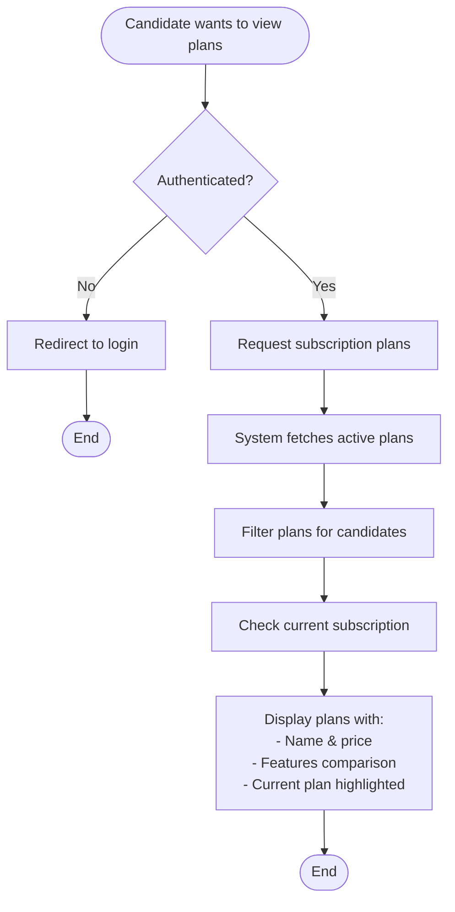

#### UC-C2: Candidate Subscribes to Plan

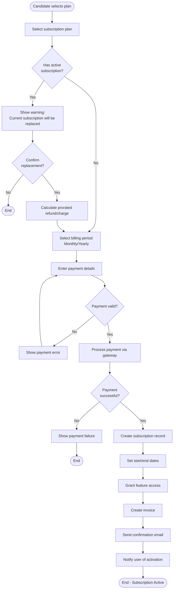

#### UC-C3: Candidate Upgrades Subscription

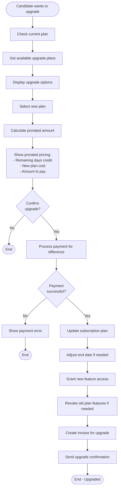

#### UC-C4: Candidate Cancels Subscription

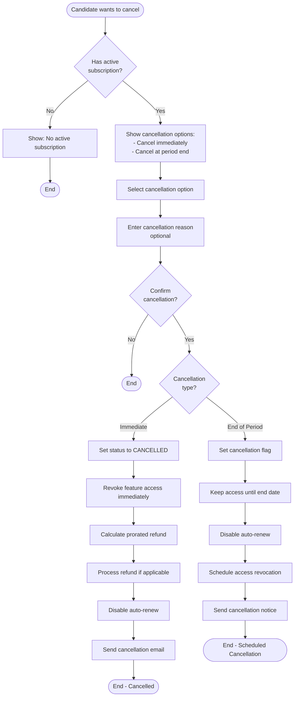

#### UC-C5: Candidate Views Subscription Details

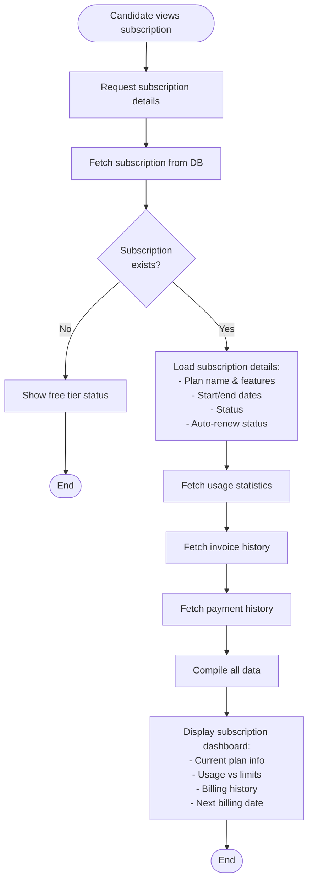

#### UC-C6: Candidate Applies for Job (with Subscription Check)

```mermaid
flowchart TD
    Start([Candidate applies for job]) --> CheckAuth{Authenticated?}
    CheckAuth -->|No| Login[Redirect to login]
    Login --> End1([End])

    CheckAuth -->|Yes| SelectJob[Select job to apply]
    SelectJob --> CheckFeature[Check subscription feature:<br/>job_applications]
    CheckFeature --> GetSubscription[Get active subscription]
    GetSubscription --> CheckLimit{Has remaining<br/>applications?}

    CheckLimit -->|No| ShowLimitReached[Show limit reached message:<br/>"You've used all applications this month.<br/>Upgrade to continue applying"]
    ShowLimitReached --> ShowUpgrade[Show upgrade options]
    ShowUpgrade --> End2([End])

    CheckLimit -->|Yes| ProceedApplication[Proceed with application]
    ProceedApplication --> CreateApplication[Create job application]
    CreateApplication --> IncrementUsage[Increment usage counter]
    IncrementUsage --> ShowRemaining[Show remaining applications]
    ShowRemaining --> Success[Application submitted successfully]
    Success --> End3([End])
```

#### UC-C7: Candidate Uses CV Enhancement (with Subscription Check)

```mermaid
flowchart TD
    Start([Candidate enhances CV]) --> SelectCV[Select CV to enhance]
    SelectCV --> CheckFeature[Check subscription feature:<br/>cv_enhancements]
    CheckFeature --> GetSubscription[Get active subscription]
    GetSubscription --> CheckLimit{Has remaining<br/>enhancements?}

    CheckLimit -->|No| ShowLimitReached[Show limit reached:<br/>"CV enhancement limit reached.<br/>Upgrade for more"]
    ShowLimitReached --> ShowUpgrade[Show upgrade options]
    ShowUpgrade --> End1([End])

    CheckLimit -->|Yes| UploadCV[Upload CV file]
    UploadCV --> ProcessEnhancement[Process AI enhancement]
    ProcessEnhancement --> GenerateSuggestions[Generate improvement suggestions]
    GenerateSuggestions --> IncrementUsage[Increment usage counter]
    IncrementUsage --> ShowResults[Show enhanced CV with suggestions]
    ShowResults --> ShowRemaining[Show remaining enhancements]
    ShowRemaining --> End2([End])
```

#### UC-C8: Candidate Uses Mock AI Interview (with Subscription Check)

```mermaid
flowchart TD
    Start([Candidate starts mock interview]) --> SelectType[Select interview type]
    SelectType --> CheckFeature[Check subscription feature:<br/>mock_interviews]
    CheckFeature --> GetSubscription[Get active subscription]
    GetSubscription --> CheckLimit{Has remaining<br/>sessions?}

    CheckLimit -->|No| ShowLimitReached[Show limit reached:<br/>"Interview limit reached.<br/>Upgrade for unlimited sessions"]
    ShowLimitReached --> ShowUpgrade[Show upgrade options]
    ShowUpgrade --> End1([End])

    CheckLimit -->|Yes| CheckAdvanced{Premium plan?}
    CheckAdvanced -->|No| BasicInterview[Start basic interview]
    CheckAdvanced -->|Yes| AdvancedInterview[Start advanced interview<br/>with detailed feedback]

    BasicInterview --> ConductInterview[Conduct AI interview]
    AdvancedInterview --> ConductInterview
    ConductInterview --> GenerateFeedback[Generate feedback]
    GenerateFeedback --> CheckFeedbackLevel{Advanced<br/>feedback?}

    CheckFeedbackLevel -->|Yes| DetailedFeedback[Provide detailed analysis:<br/>- Per-question scores<br/>- Improvement areas<br/>- Personalized tips]
    CheckFeedbackLevel -->|No| BasicFeedback[Provide basic feedback]

    DetailedFeedback --> IncrementUsage
    BasicFeedback --> IncrementUsage
    IncrementUsage[Increment usage counter]
    IncrementUsage --> ShowResults[Show interview results]
    ShowResults --> ShowRemaining[Show remaining sessions]
    ShowRemaining --> End2([End])
```

#### UC-C9: Candidate Views Usage Statistics

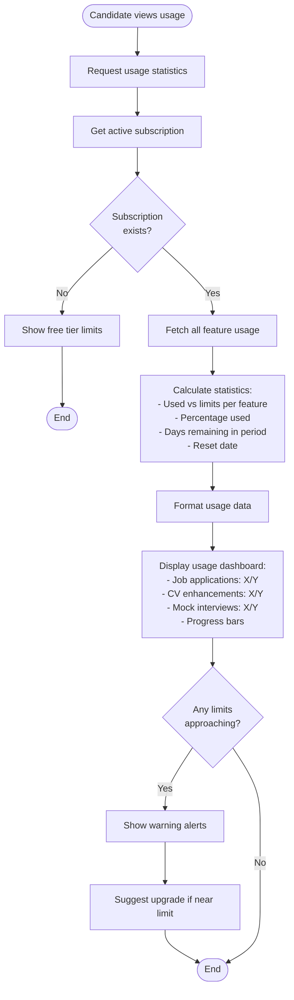

---

### RECRUITER/EMPLOYER USE CASES

#### UC-R1: Recruiter Views Subscription Plans

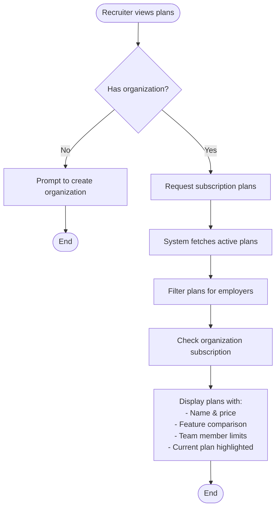

#### UC-R2: Recruiter Subscribes Organization to Plan

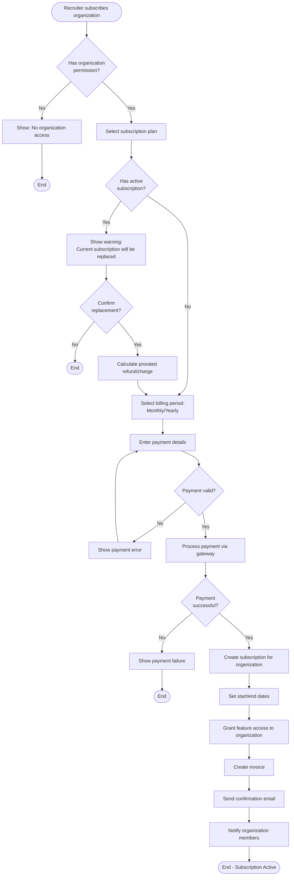

#### UC-R3: Recruiter Posts Job (with Subscription Check)

```mermaid
flowchart TD
    Start([Recruiter posts job]) --> CheckOrg{Has organization?}
    CheckOrg -->|No| CreateOrg[Prompt to create organization]
    CreateOrg --> End1([End])

    CheckOrg -->|Yes| FillJobForm[Fill job posting form]
    FillJobForm --> CheckFeature[Check subscription feature:<br/>job_postings]
    CheckFeature --> GetSubscription[Get organization subscription]
    GetSubscription --> CheckLimit{Has remaining<br/>job slots?}

    CheckLimit -->|No| ShowLimitReached[Show limit reached:<br/>"Job posting limit reached.<br/>Upgrade to post more jobs"]
    ShowLimitReached --> ShowUpgrade[Show upgrade options]
    ShowUpgrade --> End2([End])

    CheckLimit -->|Yes| ValidateJob{Job data<br/>valid?}
    ValidateJob -->|No| ShowErrors[Show validation errors]
    ShowErrors --> FillJobForm

    ValidateJob -->|Yes| CreateJob[Create job posting]
    CreateJob --> IncrementUsage[Increment usage counter]
    IncrementUsage --> ShowRemaining[Show remaining job slots]
    ShowRemaining --> Success[Job posted successfully]
    Success --> End3([End])
```

#### UC-R4: Recruiter Searches Candidates (with Subscription Check)

```mermaid
flowchart TD
    Start([Recruiter searches candidates]) --> EnterSearch[Enter search criteria]
    EnterSearch --> CheckFeature[Check subscription feature:<br/>candidate_searches]
    CheckFeature --> GetSubscription[Get organization subscription]
    GetSubscription --> CheckLimit{Has remaining<br/>searches?}

    CheckLimit -->|No| ShowLimitReached[Show limit reached:<br/>"Search limit reached this month.<br/>Upgrade for more searches"]
    ShowLimitReached --> ShowUpgrade[Show upgrade options]
    ShowUpgrade --> End1([End])

    CheckLimit -->|Yes| CheckAdvanced{Has advanced<br/>filters?}
    CheckAdvanced -->|No| BasicSearch[Perform basic search]
    CheckAdvanced -->|Yes| CheckAIFeature{Has AI<br/>matching?}

    CheckAIFeature -->|Yes| AISearch[Perform AI-powered search<br/>with semantic matching]
    CheckAIFeature -->|No| AdvancedSearch[Perform advanced filtered search]

    BasicSearch --> ExecuteSearch[Execute candidate search]
    AdvancedSearch --> ExecuteSearch
    AISearch --> ExecuteSearch

    ExecuteSearch --> GetResults[Get search results]
    GetResults --> IncrementUsage[Increment usage counter]
    IncrementUsage --> ShowResults[Display candidate results]
    ShowResults --> ShowRemaining[Show remaining searches]
    ShowRemaining --> End2([End])
```

#### UC-R5: Recruiter Accesses Hiring Analytics (with Subscription Check)

```mermaid
flowchart TD
    Start([Recruiter views analytics]) --> CheckFeature[Check subscription feature:<br/>hiring_analytics]
    CheckFeature --> GetSubscription[Get organization subscription]
    CheckSubscription --> CheckEnabled{Analytics<br/>enabled?}

    CheckEnabled -->|No| ShowUpgrade[Show upgrade message:<br/>"Upgrade to access hiring analytics"]
    ShowUpgrade --> End1([End])

    CheckEnabled -->|Yes| RequestAnalytics[Request analytics data]
    RequestAnalytics --> CheckHistoryDays{Check history<br/>days limit}
    CheckHistoryDays --> GetData[Get analytics data within limit]
    GetData --> CheckCustomReports{Custom reports<br/>enabled?}

    CheckCustomReports -->|Yes| AllowCustom[Allow custom report creation]
    CheckCustomReports -->|No| BasicReports[Show basic reports only]

    AllowCustom --> GenerateAnalytics[Generate analytics dashboard]
    BasicReports --> GenerateAnalytics
    GenerateAnalytics --> DisplayAnalytics[Display analytics:<br/>- Conversion rates<br/>- Time to hire<br/>- Source effectiveness<br/>- Pipeline metrics]
    DisplayAnalytics --> End2([End])
```

#### UC-R6: Recruiter Uses AI Candidate Matching (with Subscription Check)

```mermaid
flowchart TD
    Start([Recruiter uses AI matching]) --> SelectJob[Select job posting]
    SelectJob --> CheckFeature[Check subscription feature:<br/>ai_candidate_matching]
    CheckFeature --> GetSubscription[Get organization subscription]
    GetSubscription --> CheckAIFeature{AI matching<br/>enabled?}

    CheckAIFeature -->|No| ShowUpgrade[Show upgrade message:<br/>"Upgrade to access AI candidate matching"]
    ShowUpgrade --> End1([End])

    CheckAIFeature -->|Yes| RequestMatching[Request AI matching]
    RequestMatching --> AnalyzeJob[Analyze job requirements]
    AnalyzeJob --> SearchCandidates[Search candidate database]
    SearchCandidates --> AIAnalysis[AI analyzes candidate profiles]
    AIAnalysis --> CalculateScores[Calculate match scores]
    CalculateScores --> GenerateExplanations[Generate match explanations]
    GenerateExplanations --> DisplayMatches[Display matched candidates:<br/>- Match score<br/>- Explanation why they fit<br/>- Skills alignment<br/>- Experience match]
    DisplayMatches --> End2([End])
```

#### UC-R7: Recruiter Adds Team Member (with Subscription Check)

```mermaid
flowchart TD
    Start([Recruiter adds team member]) --> CheckPermission{Has admin<br/>permission?}
    CheckPermission -->|No| NoPermission[Show: Admin permission required]
    NoPermission --> End1([End])

    CheckPermission -->|Yes| InviteMember[Invite team member]
    InviteMember --> CheckFeature[Check subscription feature:<br/>team_members]
    CheckFeature --> GetSubscription[Get organization subscription]
    GetSubscription --> GetCurrentCount[Get current team member count]
    GetCurrentCount --> CheckLimit{Under team<br/>member limit?}

    CheckLimit -->|No| ShowLimitReached[Show limit reached:<br/>"Team member limit reached.<br/>Upgrade to add more members"]
    ShowLimitReached --> ShowUpgrade[Show upgrade options]
    ShowUpgrade --> End2([End])

    CheckLimit -->|Yes| SendInvite[Send invitation email]
    SendInvite --> WaitAcceptance{User accepts<br/>invitation?}

    WaitAcceptance -->|No| InviteExpired[Invitation expires]
    InviteExpired --> End3([End])

    WaitAcceptance -->|Yes| AddMember[Add member to organization]
    AddMember --> GrantAccess[Grant access based on role]
    GrantAccess --> UpdateCount[Update team member count]
    UpdateCount --> NotifyTeam[Notify organization members]
    NotifyTeam --> End4([End])
```

#### UC-R8: Recruiter Upgrades Subscription

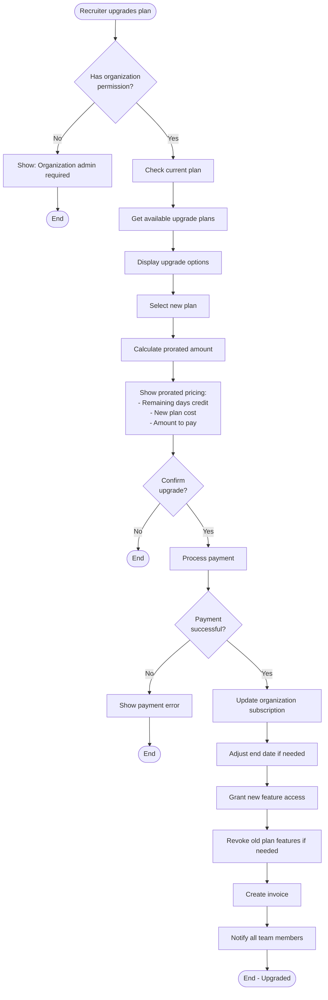

#### UC-R9: Recruiter Views Subscription Usage

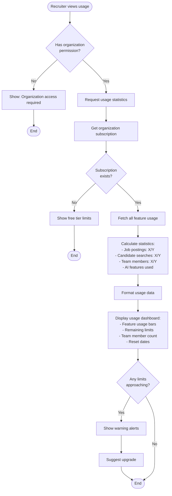

#### UC-R10: Recruiter Cancels Organization Subscription

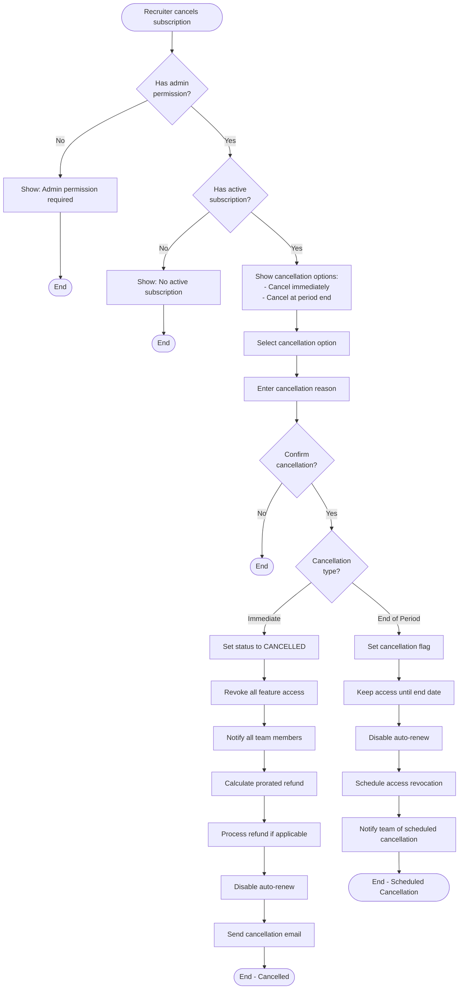

---

## Summary

These diagrams cover:

**Candidate Use Cases (9):**

1. View plans
2. Subscribe
3. Upgrade
4. Cancel
5. View details
6. Apply for job (with check)
7. Use CV enhancement (with check)
8. Use mock AI interview (with check)
9. View usage statistics

**Recruiter/Employer Use Cases (10):**

1. View plans
2. Subscribe organization
3. Post job (with check)
4. Search candidates (with check)
5. Access hiring analytics (with check)
6. Use AI candidate matching (with check)
7. Add team member (with check)
8. Upgrade subscription
9. View usage statistics
10. Cancel subscription

Each diagram shows:

- Decision points
- Feature access checks
- Usage tracking
- Error handling
- User notifications
- Payment processing (where applicable)

Add these to your `subscription.md` file. Should I create sequence diagrams for any specific use case?
