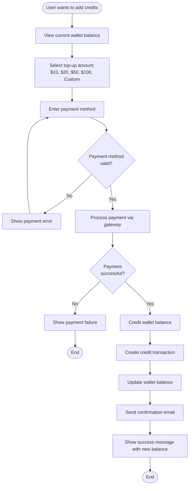
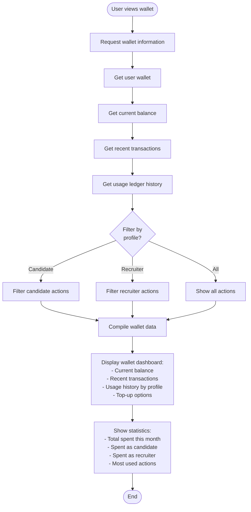
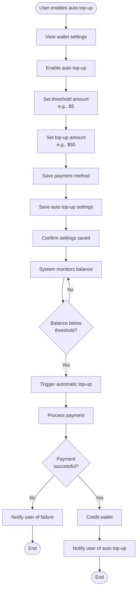
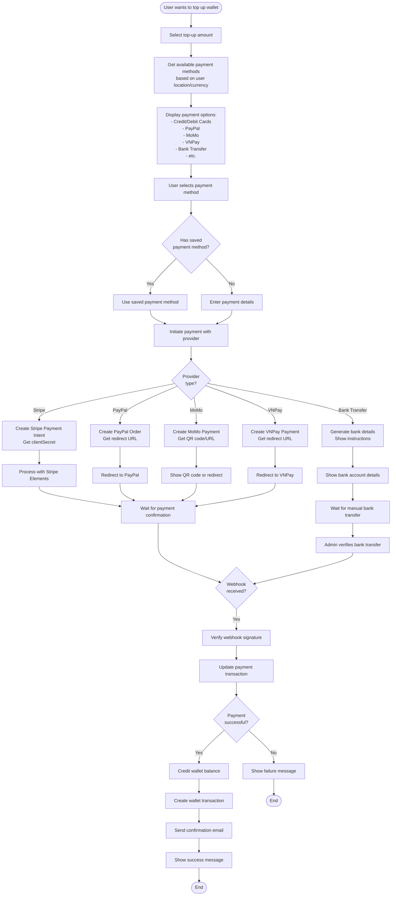
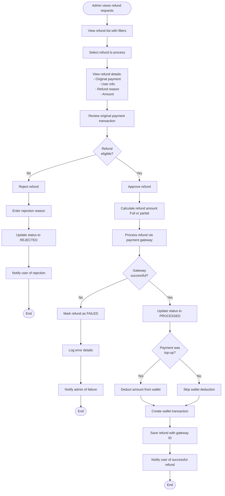
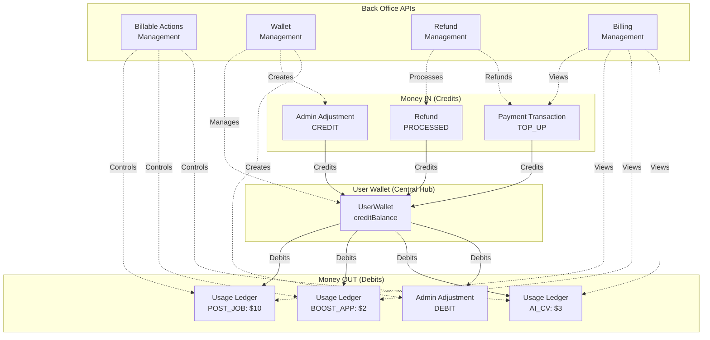
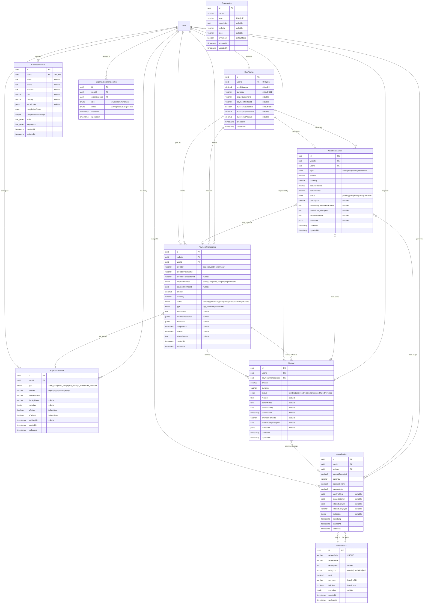
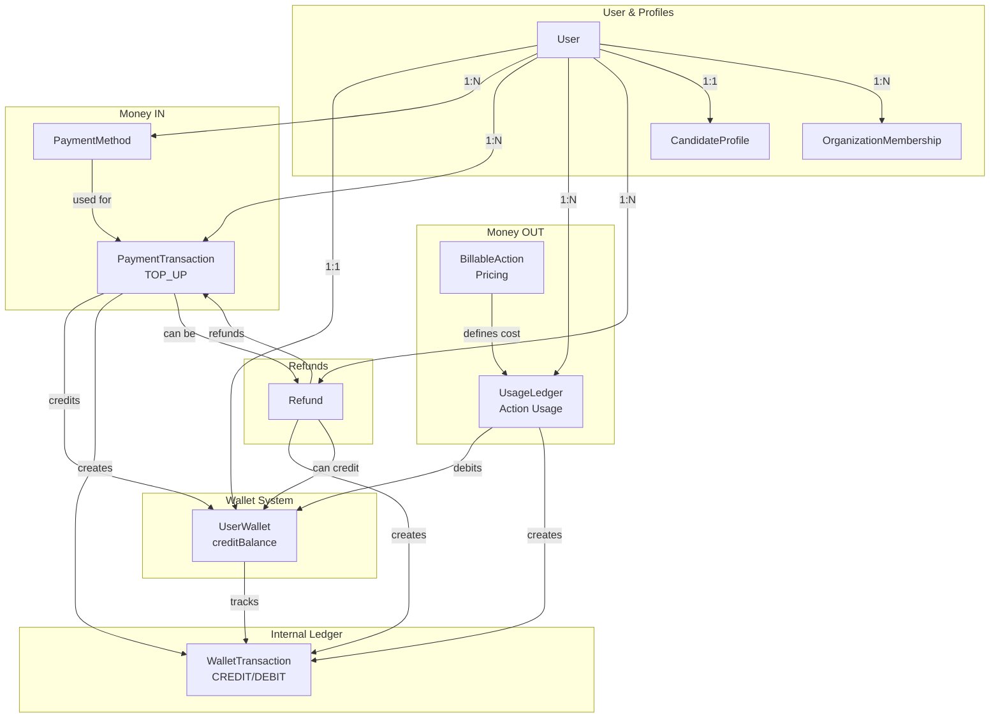

Reviewing the current subscription structure, then redesigning it as a Pay-As-You-Go wallet system.

[3 tools called]

Redesigning the system as a Pay-As-You-Go wallet model. Proposed design:

## Pay-As-You-Go Wallet System Design

### 1. Database Schema

```typescript
// user-wallet.entity.ts
@Entity('user_wallets')
export class UserWallet {
  @PrimaryGeneratedColumn('uuid')
  id: string;

  @OneToOne(() => User, { nullable: false })
  @JoinColumn({ name: 'userId' })
  user: User;

  @Column('uuid', { unique: true })
  userId: string;

  @Column({ type: 'decimal', precision: 10, scale: 2, default: 0 })
  creditBalance: number; // The wallet balance

  @Column({ type: 'varchar', length: 3, default: 'USD' })
  currency: string;

  @Column({ type: 'varchar', nullable: true })
  stripeCustomerId?: string; // For payment processing

  @Column({ type: 'varchar', nullable: true })
  paymentMethodId?: string; // Default payment method

  @Column({ type: 'boolean', default: false })
  autoTopUpEnabled: boolean;

  @Column({ type: 'decimal', precision: 10, scale: 2, nullable: true })
  autoTopUpThreshold?: number; // Auto top-up when balance falls below this

  @Column({ type: 'decimal', precision: 10, scale: 2, nullable: true })
  autoTopUpAmount?: number; // Amount to top-up automatically

  @CreateDateColumn()
  createdAt: Date;

  @UpdateDateColumn()
  updatedAt: Date;

  hasSufficientBalance(amount: number): boolean {
    return this.creditBalance >= amount;
  }
}

// billable-action.entity.ts
@Entity('billable_actions')
export class BillableAction {
  @PrimaryGeneratedColumn('uuid')
  id: string;

  @Column({ type: 'varchar', unique: true })
  actionCode: string; // e.g., 'POST_JOB', 'BOOST_APPLICATION'

  @Column({ type: 'varchar' })
  actionName: string; // Display name

  @Column({ type: 'text', nullable: true })
  description?: string;

  @Column({ type: 'varchar' })
  category: 'recruiter' | 'candidate' | 'both';

  @Column({ type: 'decimal', precision: 10, scale: 2 })
  cost: number; // Cost in default currency

  @Column({ type: 'varchar', length: 3, default: 'USD' })
  currency: string;

  @Column({ type: 'boolean', default: true })
  isActive: boolean;

  @Column({ type: 'jsonb', nullable: true })
  metadata?: {
    requiresProfile?: 'candidate' | 'recruiter';
    maxPerPeriod?: number; // Optional limit per day/month
    period?: 'daily' | 'monthly';
  };

  @CreateDateColumn()
  createdAt: Date;

  @UpdateDateColumn()
  updatedAt: Date;
}

// usage-ledger.entity.ts
@Entity('usage_ledger')
export class UsageLedger {
  @PrimaryGeneratedColumn('uuid')
  id: string;

  @ManyToOne(() => User, { nullable: false })
  @JoinColumn({ name: 'userId' })
  user: User;

  @Column('uuid')
  userId: string; // Who paid (always the User)

  @ManyToOne(() => BillableAction, { nullable: false })
  @JoinColumn({ name: 'actionId' })
  action: BillableAction;

  @Column('uuid')
  actionId: string;

  @Column({ type: 'decimal', precision: 10, scale: 2 })
  amountDeducted: number;

  @Column({ type: 'varchar', length: 3 })
  currency: string;

  @Column({ type: 'decimal', precision: 10, scale: 2 })
  balanceBefore: number; // Wallet balance before deduction

  @Column({ type: 'decimal', precision: 10, scale: 2 })
  balanceAfter: number; // Wallet balance after deduction

  // Optional: Link to the profile that performed the action
  @Column('uuid', { nullable: true })
  candidateProfileId?: string;

  @Column('uuid', { nullable: true })
  recruiterProfileId?: string; // Or organizationMembershipId

  @Column('uuid', { nullable: true })
  organizationId?: string;

  // Link to the entity that was created/modified
  @Column('uuid', { nullable: true })
  relatedEntityId?: string; // e.g., Job ID, Application ID

  @Column({ type: 'varchar', nullable: true })
  relatedEntityType?: string; // e.g., 'job', 'application', 'cv_enhancement'

  @Column({ type: 'jsonb', nullable: true })
  metadata?: Record<string, any>; // Additional context

  @Column({ type: 'timestamp', default: () => 'CURRENT_TIMESTAMP' })
  timestamp: Date;

  @CreateDateColumn()
  createdAt: Date;
}

// wallet-transaction.entity.ts
@Entity('wallet_transactions')
export class WalletTransaction {
  @PrimaryGeneratedColumn('uuid')
  id: string;

  @ManyToOne(() => UserWallet, { nullable: false })
  @JoinColumn({ name: 'walletId' })
  wallet: UserWallet;

  @Column('uuid')
  walletId: string;

  @Column('uuid')
  userId: string;

  @Column({
    type: 'enum',
    enum: TransactionType,
  })
  type: TransactionType; // CREDIT, DEBIT, REFUND, ADJUSTMENT

  @Column({ type: 'decimal', precision: 10, scale: 2 })
  amount: number;

  @Column({ type: 'varchar', length: 3 })
  currency: string;

  @Column({ type: 'decimal', precision: 10, scale: 2 })
  balanceBefore: number;

  @Column({ type: 'decimal', precision: 10, scale: 2 })
  balanceAfter: number;

  @Column({
    type: 'enum',
    enum: TransactionStatus,
    default: TransactionStatus.COMPLETED,
  })
  status: TransactionStatus; // PENDING, COMPLETED, FAILED, CANCELLED

  @Column({ type: 'varchar', nullable: true })
  description?: string;

  @Column({ type: 'varchar', nullable: true })
  paymentMethodId?: string;

  @Column({ type: 'varchar', nullable: true })
  paymentGatewayTransactionId?: string; // Stripe payment intent ID

  @Column('uuid', { nullable: true })
  relatedUsageLedgerId?: string; // If this is a refund for a usage

  @Column({ type: 'jsonb', nullable: true })
  metadata?: Record<string, any>;

  @CreateDateColumn()
  createdAt: Date;

  @UpdateDateColumn()
  updatedAt: Date;
}

enum TransactionType {
  CREDIT = 'credit', // Top-up, refund
  DEBIT = 'debit', // Usage deduction
  REFUND = 'refund', // Refund for usage
  ADJUSTMENT = 'adjustment', // Admin adjustment
}

enum TransactionStatus {
  PENDING = 'pending',
  COMPLETED = 'completed',
  FAILED = 'failed',
  CANCELLED = 'cancelled',
}
```

### 2. Billable Actions Configuration

```typescript
// billable-actions.config.ts
export const DEFAULT_BILLABLE_ACTIONS = [
  // Recruiter Actions
  {
    actionCode: 'POST_JOB',
    actionName: 'Post Job',
    description: 'Post a new job listing',
    category: 'recruiter',
    cost: 10.0,
    currency: 'USD',
    metadata: {
      requiresProfile: 'recruiter',
    },
  },
  {
    actionCode: 'FEATURE_JOB',
    actionName: 'Feature Job',
    description: 'Feature a job post for better visibility',
    category: 'recruiter',
    cost: 5.0,
    currency: 'USD',
    metadata: {
      requiresProfile: 'recruiter',
      maxPerPeriod: 1,
      period: 'daily',
    },
  },
  {
    actionCode: 'VIEW_CANDIDATE_CONTACT',
    actionName: 'View Candidate Contact',
    description: 'View candidate contact information',
    category: 'recruiter',
    cost: 1.0,
    currency: 'USD',
    metadata: {
      requiresProfile: 'recruiter',
    },
  },
  {
    actionCode: 'SEND_INMAIL',
    actionName: 'Send InMail',
    description: 'Send InMail message to candidate',
    category: 'recruiter',
    cost: 0.1,
    currency: 'USD',
    metadata: {
      requiresProfile: 'recruiter',
    },
  },
  {
    actionCode: 'AI_CANDIDATE_MATCHING',
    actionName: 'AI Candidate Matching',
    description: 'Use AI to find matching candidates',
    category: 'recruiter',
    cost: 2.0,
    currency: 'USD',
    metadata: {
      requiresProfile: 'recruiter',
    },
  },
  {
    actionCode: 'ADVANCED_SEARCH',
    actionName: 'Advanced Candidate Search',
    description: 'Use advanced filters for candidate search',
    category: 'recruiter',
    cost: 0.5,
    currency: 'USD',
    metadata: {
      requiresProfile: 'recruiter',
    },
  },
  {
    actionCode: 'EXPORT_CANDIDATES',
    actionName: 'Export Candidate List',
    description: 'Export candidate list to CSV/Excel',
    category: 'recruiter',
    cost: 1.0,
    currency: 'USD',
    metadata: {
      requiresProfile: 'recruiter',
    },
  },

  // Candidate Actions
  {
    actionCode: 'BOOST_APPLICATION',
    actionName: 'Boost Application',
    description: 'Boost application to top of recruiter list for 24h',
    category: 'candidate',
    cost: 2.0,
    currency: 'USD',
    metadata: {
      requiresProfile: 'candidate',
    },
  },
  {
    actionCode: 'AI_CV_ENHANCEMENT',
    actionName: 'AI CV Enhancement',
    description: 'Get AI-powered CV improvement suggestions',
    category: 'candidate',
    cost: 3.0,
    currency: 'USD',
    metadata: {
      requiresProfile: 'candidate',
    },
  },
  {
    actionCode: 'VERIFIED_BADGE',
    actionName: 'Get Verified Badge',
    description: 'Get verified badge on profile',
    category: 'candidate',
    cost: 5.0,
    currency: 'USD',
    metadata: {
      requiresProfile: 'candidate',
    },
  },
  {
    actionCode: 'MOCK_AI_INTERVIEW',
    actionName: 'Mock AI Interview',
    description: 'Practice interview with AI',
    category: 'candidate',
    cost: 2.0,
    currency: 'USD',
    metadata: {
      requiresProfile: 'candidate',
    },
  },
  {
    actionCode: 'ADVANCED_INTERVIEW_FEEDBACK',
    actionName: 'Advanced Interview Feedback',
    description: 'Get detailed AI feedback on interview performance',
    category: 'candidate',
    cost: 5.0,
    currency: 'USD',
    metadata: {
      requiresProfile: 'candidate',
    },
  },
  {
    actionCode: 'JOB_APPLICATION_INSIGHTS',
    actionName: 'Application Insights',
    description: 'Get insights on why application was viewed/rejected',
    category: 'candidate',
    cost: 1.0,
    currency: 'USD',
    metadata: {
      requiresProfile: 'candidate',
    },
  },
  {
    actionCode: 'PREMIUM_LEARNING_COURSE',
    actionName: 'Premium Learning Course',
    description: 'Access premium learning course',
    category: 'candidate',
    cost: 10.0,
    currency: 'USD',
    metadata: {
      requiresProfile: 'candidate',
    },
  },
];
```

### 3. Updated User Entity

```typescript
// Add to User entity
@Entity('users')
export class User {
  // ... existing fields ...

  @OneToOne(() => UserWallet, (wallet) => wallet.user, { cascade: true })
  wallet?: UserWallet;

  // Helper method
  async getWallet(): Promise<UserWallet> {
    // Lazy load or ensure wallet exists
    if (!this.wallet) {
      // Create wallet if doesn't exist
    }
    return this.wallet;
  }
}
```

### 4. Service Layer

```typescript
// wallet.service.ts
@Injectable()
export class WalletService {
  constructor(
    @InjectRepository(UserWallet)
    private walletRepository: Repository<UserWallet>,
    @InjectRepository(UsageLedger)
    private usageLedgerRepository: Repository<UsageLedger>,
    @InjectRepository(WalletTransaction)
    private transactionRepository: Repository<WalletTransaction>,
    @InjectRepository(BillableAction)
    private billableActionRepository: Repository<BillableAction>,
  ) {}

  async getWalletBalance(userId: string): Promise<number> {
    const wallet = await this.getOrCreateWallet(userId);
    return wallet.creditBalance;
  }

  async checkBalance(userId: string, amount: number): Promise<boolean> {
    const wallet = await this.getOrCreateWallet(userId);
    return wallet.hasSufficientBalance(amount);
  }

  async deductForAction(
    userId: string,
    actionCode: string,
    context: {
      candidateProfileId?: string;
      recruiterProfileId?: string;
      organizationId?: string;
      relatedEntityId?: string;
      relatedEntityType?: string;
      metadata?: Record<string, any>;
    },
  ): Promise<{ success: boolean; newBalance: number; error?: string }> {
    // Get action cost
    const action = await this.billableActionRepository.findOne({
      where: { actionCode, isActive: true },
    });

    if (!action) {
      return { success: false, newBalance: 0, error: 'Action not found' };
    }

    // Check balance
    const wallet = await this.getOrCreateWallet(userId);
    if (!wallet.hasSufficientBalance(action.cost)) {
      return {
        success: false,
        newBalance: wallet.creditBalance,
        error: 'Insufficient balance',
      };
    }

    // Deduct from wallet
    const balanceBefore = wallet.creditBalance;
    wallet.creditBalance -= action.cost;
    const balanceAfter = wallet.creditBalance;

    await this.walletRepository.save(wallet);

    // Create usage ledger entry
    const usage = this.usageLedgerRepository.create({
      userId,
      actionId: action.id,
      amountDeducted: action.cost,
      currency: action.currency,
      balanceBefore,
      balanceAfter,
      candidateProfileId: context.candidateProfileId,
      recruiterProfileId: context.recruiterProfileId,
      organizationId: context.organizationId,
      relatedEntityId: context.relatedEntityId,
      relatedEntityType: context.relatedEntityType,
      metadata: context.metadata,
    });

    await this.usageLedgerRepository.save(usage);

    // Create transaction record
    const transaction = this.transactionRepository.create({
      walletId: wallet.id,
      userId,
      type: TransactionType.DEBIT,
      amount: action.cost,
      currency: action.currency,
      balanceBefore,
      balanceAfter,
      status: TransactionStatus.COMPLETED,
      description: `Charged for ${action.actionName}`,
      relatedUsageLedgerId: usage.id,
    });

    await this.transactionRepository.save(transaction);

    // Check auto top-up
    if (
      wallet.autoTopUpEnabled &&
      wallet.creditBalance < (wallet.autoTopUpThreshold || 0)
    ) {
      await this.triggerAutoTopUp(userId);
    }

    return { success: true, newBalance: balanceAfter };
  }

  async topUpWallet(
    userId: string,
    amount: number,
    paymentMethodId: string,
  ): Promise<{ success: boolean; transactionId?: string; error?: string }> {
    // Process payment via Stripe
    // ... payment processing logic ...

    const wallet = await this.getOrCreateWallet(userId);
    const balanceBefore = wallet.creditBalance;
    wallet.creditBalance += amount;
    const balanceAfter = wallet.creditBalance;

    await this.walletRepository.save(wallet);

    // Create transaction
    const transaction = this.transactionRepository.create({
      walletId: wallet.id,
      userId,
      type: TransactionType.CREDIT,
      amount,
      currency: wallet.currency,
      balanceBefore,
      balanceAfter,
      status: TransactionStatus.COMPLETED,
      description: `Wallet top-up`,
      paymentMethodId,
    });

    await this.transactionRepository.save(transaction);

    return { success: true, transactionId: transaction.id };
  }

  private async getOrCreateWallet(userId: string): Promise<UserWallet> {
    let wallet = await this.walletRepository.findOne({ where: { userId } });

    if (!wallet) {
      wallet = this.walletRepository.create({
        userId,
        creditBalance: 0,
        currency: 'USD',
      });
      await this.walletRepository.save(wallet);
    }

    return wallet;
  }
}
```

### 5. Guard for Billable Actions

```typescript
// wallet-balance.guard.ts
@Injectable()
export class WalletBalanceGuard implements CanActivate {
  constructor(
    private walletService: WalletService,
    private reflector: Reflector,
  ) {}

  async canActivate(context: ExecutionContext): Promise<boolean> {
    const actionCode = this.reflector.get<string>(
      'billableAction',
      context.getHandler(),
    );

    if (!actionCode) {
      return true; // No billing required
    }

    const request = context.switchToHttp().getRequest();
    const userId = request.user?.id;

    if (!userId) {
      throw new UnauthorizedException('User not authenticated');
    }

    const hasBalance = await this.walletService.checkBalanceForAction(
      userId,
      actionCode,
    );

    if (!hasBalance) {
      const balance = await this.walletService.getWalletBalance(userId);
      const action = await this.walletService.getActionCost(actionCode);

      throw new PaymentRequiredException({
        message: 'Insufficient wallet balance',
        requiredAmount: action.cost,
        currentBalance: balance,
        actionCode,
      });
    }

    return true;
  }
}

// Decorator
export const RequireWalletBalance = (actionCode: string) =>
  SetMetadata('billableAction', actionCode);
```

### 6. Activity Diagrams

#### UC-W1: User Tops Up Wallet



#### UC-W2: Recruiter Posts Job (PAYG)

```mermaid
flowchart TD
    Start([Recruiter posts job]) --> FillJobForm[Fill job posting form]
    FillJobForm --> ValidateForm{Form valid?}

    ValidateForm -->|No| ShowErrors[Show validation errors]
    ShowErrors --> FillJobForm

    ValidateForm -->|Yes| CheckAction[Check billable action:<br/>POST_JOB]
    CheckAction --> GetCost[Get action cost: $10]
    GetCost --> CheckBalance[Check wallet balance]
    CheckBalance --> HasBalance{Sufficient<br/>balance?}

    HasBalance -->|No| ShowInsufficient[Show insufficient balance:<br/>"Need $10. You have $X.<br/>Top up wallet to continue"]
    ShowInsufficient --> ShowTopUp[Show top-up options]
    ShowTopUp --> End1([End])

    HasBalance -->|Yes| CreateJob[Create job posting]
    CreateJob --> DeductBalance[Deduct $10 from wallet]
    DeductBalance --> CreateUsageLedger[Create usage ledger entry]
    CreateUsageLedger --> CreateTransaction[Create debit transaction]
    CreateTransaction --> ShowNewBalance[Show new wallet balance]
    ShowNewBalance --> Success[Job posted successfully]
    Success --> CheckAutoTopUp{Auto top-up<br/>enabled?}

    CheckAutoTopUp -->|Yes| CheckThreshold{Balance below<br/>threshold?}
    CheckThreshold -->|Yes| TriggerAutoTopUp[Trigger auto top-up]
    TriggerAutoTopUp --> End2([End])

    CheckThreshold -->|No| End2
    CheckAutoTopUp -->|No| End2
```

#### UC-W3: Candidate Boosts Application (PAYG)

```mermaid
flowchart TD
    Start([Candidate wants to boost application]) --> SelectApplication[Select application to boost]
    SelectApplication --> CheckAction[Check billable action:<br/>BOOST_APPLICATION]
    CheckAction --> GetCost[Get action cost: $2]
    GetCost --> CheckBalance[Check wallet balance]
    CheckBalance --> HasBalance{Sufficient<br/>balance?}

    HasBalance -->|No| ShowInsufficient[Show insufficient balance:<br/>"Need $2. You have $X.<br/>Top up wallet to boost"]
    ShowInsufficient --> ShowTopUp[Show top-up options]
    ShowTopUp --> End1([End])

    HasBalance -->|Yes| ConfirmBoost{Confirm boost?}
    ConfirmBoost -->|No| End2([End])

    ConfirmBoost -->|Yes| BoostApplication[Boost application to top]
    BoostApplication --> SetBoostExpiry[Set 24h boost expiry]
    SetBoostExpiry --> DeductBalance[Deduct $2 from wallet]
    DeductBalance --> CreateUsageLedger[Create usage ledger entry]
    CreateUsageLedger --> CreateTransaction[Create debit transaction]
    CreateTransaction --> ShowNewBalance[Show new balance]
    ShowNewBalance --> Success[Application boosted successfully]
    Success --> End3([End])
```

#### UC-W4: User Views Wallet & Usage History



#### UC-W5: User Enables Auto Top-Up



#### UC-W6: Recruiter Views Candidate Contact (PAYG)

```mermaid
flowchart TD
    Start([Recruiter views candidate contact]) --> SelectCandidate[Select candidate profile]
    SelectCandidate --> CheckAction[Check billable action:<br/>VIEW_CANDIDATE_CONTACT]
    CheckAction --> GetCost[Get action cost: $1]
    GetCost --> CheckBalance[Check wallet balance]
    CheckBalance --> HasBalance{Sufficient<br/>balance?}

    HasBalance -->|No| ShowInsufficient[Show insufficient balance]
    ShowInsufficient --> ShowTopUp[Show top-up options]
    ShowTopUp --> End1([End])

    HasBalance -->|Yes| ShowPreview[Show contact preview:<br/>"Viewing contact costs $1"]
    ShowPreview --> ConfirmView{Confirm view?}

    ConfirmView -->|No| End2([End])
    ConfirmView -->|Yes| DeductBalance[Deduct $1 from wallet]
    DeductBalance --> CreateUsageLedger[Create usage ledger entry]
    CreateUsageLedger --> ShowContact[Show full contact information]
    ShowContact --> LogView[Log contact view]
    LogView --> End3([End])
```

#### UC-W7: Candidate Uses AI CV Enhancement (PAYG)

```mermaid
flowchart TD
    Start([Candidate enhances CV]) --> SelectCV[Select CV to enhance]
    SelectCV --> CheckAction[Check billable action:<br/>AI_CV_ENHANCEMENT]
    CheckAction --> GetCost[Get action cost: $3]
    GetCost --> CheckBalance[Check wallet balance]
    CheckBalance --> HasBalance{Sufficient<br/>balance?}

    HasBalance -->|No| ShowInsufficient[Show insufficient balance:<br/>"CV enhancement costs $3"]
    ShowInsufficient --> ShowTopUp[Show top-up options]
    ShowTopUp --> End1([End])

    HasBalance -->|Yes| UploadCV[Upload CV file]
    UploadCV --> ProcessEnhancement[Process AI enhancement]
    ProcessEnhancement --> GenerateSuggestions[Generate improvement suggestions]
    GenerateSuggestions --> DeductBalance[Deduct $3 from wallet]
    DeductBalance --> CreateUsageLedger[Create usage ledger entry]
    CreateUsageLedger --> ShowResults[Show enhanced CV with suggestions]
    ShowResults --> ShowNewBalance[Show new wallet balance]
    ShowNewBalance --> End2([End])
```

### 7. Integration with Existing Controllers

```typescript
// job.controller.ts (Updated)
@Controller('jobs')
export class JobController {
  constructor(
    private jobService: JobService,
    private walletService: WalletService,
  ) {}

  @Post()
  @UseGuards(WalletBalanceGuard)
  @RequireWalletBalance('POST_JOB')
  async createJob(@Body() dto: CreateJobDto, @Request() req) {
    // Create job
    const job = await this.jobService.create(dto, req.user.id);

    // Deduct from wallet
    await this.walletService.deductForAction(req.user.id, 'POST_JOB', {
      recruiterProfileId: req.user.recruiterProfileId,
      organizationId: req.user.organizationId,
      relatedEntityId: job.id,
      relatedEntityType: 'job',
    });

    return job;
  }
}

// application.controller.ts (Updated)
@Controller('applications')
export class ApplicationController {
  @Post(':applicationId/boost')
  @UseGuards(WalletBalanceGuard)
  @RequireWalletBalance('BOOST_APPLICATION')
  async boostApplication(
    @Param('applicationId') applicationId: string,
    @Request() req,
  ) {
    // Boost application
    const application = await this.applicationService.boost(applicationId);

    // Deduct from wallet
    await this.walletService.deductForAction(req.user.id, 'BOOST_APPLICATION', {
      candidateProfileId: req.user.candidateProfileId,
      relatedEntityId: applicationId,
      relatedEntityType: 'application',
    });

    return application;
  }
}
```

This design:

- User-centric: billing tied to the User, not organizations
- Pay-as-you-go: pay only for actions used
- Single wallet: one balance for all actions
- Profile-agnostic billing: actions tracked by profile, but User pays
- Flexible: easy to add new billable actions
- Transparent: usage ledger shows all spending

Designing a multi-payment gateway system for wallet top-ups. Recommended payment methods:

## Recommended Payment Methods

### 1. International payment gateways

- Stripe — cards, Apple Pay, Google Pay, SEPA, iDEAL, etc.
- PayPal — PayPal balance, cards, bank accounts
- Square — cards, digital wallets

### 2. Regional payment methods (Asia/Vietnam)

- MoMo (Vietnam)
- ZaloPay (Vietnam)
- VNPay (Vietnam)
- GrabPay (Southeast Asia)
- Alipay (China/Asia)
- WeChat Pay (China/Asia)

### 3. Bank transfers

- Direct bank transfer
- ACH (US)
- SEPA (Europe)
- Local bank networks

### 4. Cryptocurrency (optional)

- USDT/USDC
- Bitcoin

## Implementation Design

### 1. Payment Gateway Abstraction Layer

```typescript
// payment-provider.interface.ts
export interface IPaymentProvider {
  name: string;
  providerCode: string;
  supportedMethods: PaymentMethod[];
  supportedCurrencies: string[];
  supportedRegions?: string[];

  // Create payment intent/order
  createPaymentIntent(
    amount: number,
    currency: string,
    metadata: PaymentMetadata,
  ): Promise<PaymentIntentResult>;

  // Confirm payment
  confirmPayment(
    paymentId: string,
    confirmationData?: any,
  ): Promise<PaymentResult>;

  // Refund payment
  refundPayment(
    paymentId: string,
    amount?: number,
    reason?: string,
  ): Promise<RefundResult>;

  // Get payment status
  getPaymentStatus(paymentId: string): Promise<PaymentStatus>;

  // Webhook handler
  handleWebhook(payload: any, signature: string): Promise<WebhookEvent>;
}

export interface PaymentMetadata {
  userId: string;
  walletId: string;
  description?: string;
  returnUrl?: string;
  cancelUrl?: string;
  [key: string]: any;
}

export interface PaymentIntentResult {
  paymentId: string;
  clientSecret?: string; // For Stripe
  redirectUrl?: string; // For redirect-based payments
  qrCode?: string; // For QR code payments
  paymentUrl?: string; // For payment links
  expiresAt?: Date;
}

export interface PaymentResult {
  success: boolean;
  paymentId: string;
  transactionId: string;
  amount: number;
  currency: string;
  status: PaymentStatus;
  gatewayResponse?: any;
}

export enum PaymentMethod {
  // Cards
  CREDIT_CARD = 'credit_card',
  DEBIT_CARD = 'debit_card',

  // Digital Wallets
  APPLE_PAY = 'apple_pay',
  GOOGLE_PAY = 'google_pay',
  PAYPAL = 'paypal',

  // E-Wallets (Vietnam/Asia)
  MOMO = 'momo',
  ZALOPAY = 'zalopay',
  VNPAY = 'vnpay',
  GRABPAY = 'grabpay',

  // Bank Transfer
  BANK_TRANSFER = 'bank_transfer',
  ACH = 'ach',
  SEPA = 'sepa',

  // Cryptocurrency
  CRYPTO = 'crypto',

  // Others
  CASH = 'cash', // For manual top-up
}
```

### 2. Payment Method Entity

```typescript
// payment-method.entity.ts
@Entity('payment_methods')
export class PaymentMethod {
  @PrimaryGeneratedColumn('uuid')
  id: string;

  @ManyToOne(() => User, { nullable: false })
  @JoinColumn({ name: 'userId' })
  user: User;

  @Column('uuid')
  userId: string;

  @Column({
    type: 'enum',
    enum: PaymentMethodType,
  })
  type: PaymentMethodType;

  @Column({ type: 'varchar' })
  provider: string; // 'stripe', 'paypal', 'momo', etc.

  @Column({ type: 'varchar' })
  providerCode: string; // Provider-specific code

  @Column({ type: 'varchar', nullable: true })
  displayName?: string; // e.g., "Visa •••• 4242"

  @Column({ type: 'jsonb', nullable: true })
  metadata?: {
    last4?: string;
    brand?: string;
    expiryMonth?: number;
    expiryYear?: number;
    bankName?: string;
    accountNumber?: string;
    [key: string]: any;
  };

  @Column({ type: 'boolean', default: true })
  isActive: boolean;

  @Column({ type: 'boolean', default: false })
  isDefault: boolean;

  @Column({ type: 'timestamp', nullable: true })
  lastUsedAt?: Date;

  @CreateDateColumn()
  createdAt: Date;

  @UpdateDateColumn()
  updatedAt: Date;
}

enum PaymentMethodType {
  CREDIT_CARD = 'credit_card',
  DEBIT_CARD = 'debit_card',
  DIGITAL_WALLET = 'digital_wallet',
  E_WALLET = 'e_wallet',
  BANK_ACCOUNT = 'bank_account',
  CRYPTO = 'crypto',
}
```

### 3. Payment Transaction Entity

```typescript
// payment-transaction.entity.ts
@Entity('payment_transactions')
export class PaymentTransaction {
  @PrimaryGeneratedColumn('uuid')
  id: string;

  @ManyToOne(() => UserWallet, { nullable: false })
  @JoinColumn({ name: 'walletId' })
  wallet: UserWallet;

  @Column('uuid')
  walletId: string;

  @Column('uuid')
  userId: string;

  @Column({ type: 'varchar' })
  provider: string; // 'stripe', 'paypal', 'momo', etc.

  @Column({ type: 'varchar' })
  providerPaymentId: string; // Payment ID from provider

  @Column({ type: 'varchar', nullable: true })
  providerTransactionId?: string;

  @Column({
    type: 'enum',
    enum: PaymentMethod,
  })
  paymentMethod: PaymentMethod;

  @Column('uuid', { nullable: true })
  paymentMethodId?: string; // Link to saved payment method

  @Column({ type: 'decimal', precision: 10, scale: 2 })
  amount: number;

  @Column({ type: 'varchar', length: 3 })
  currency: string;

  @Column({
    type: 'enum',
    enum: PaymentStatus,
    default: PaymentStatus.PENDING,
  })
  status: PaymentStatus;

  @Column({
    type: 'enum',
    enum: PaymentType,
  })
  type: PaymentType; // TOP_UP, REFUND, ADJUSTMENT

  @Column({ type: 'text', nullable: true })
  description?: string;

  @Column({ type: 'jsonb', nullable: true })
  providerResponse?: any; // Full response from provider

  @Column({ type: 'jsonb', nullable: true })
  metadata?: Record<string, any>;

  @Column({ type: 'timestamp', nullable: true })
  completedAt?: Date;

  @Column({ type: 'timestamp', nullable: true })
  failedAt?: Date;

  @Column({ type: 'text', nullable: true })
  failureReason?: string;

  @CreateDateColumn()
  createdAt: Date;

  @UpdateDateColumn()
  updatedAt: Date;
}

enum PaymentStatus {
  PENDING = 'pending',
  PROCESSING = 'processing',
  COMPLETED = 'completed',
  FAILED = 'failed',
  CANCELLED = 'cancelled',
  REFUNDED = 'refunded',
}

enum PaymentType {
  TOP_UP = 'top_up',
  REFUND = 'refund',
  ADJUSTMENT = 'adjustment',
}
```

### 4. Payment Service with Multiple Providers

```typescript
// payment.service.ts
@Injectable()
export class PaymentService {
  private providers: Map<string, IPaymentProvider> = new Map();

  constructor(
    @InjectRepository(PaymentTransaction)
    private paymentTransactionRepository: Repository<PaymentTransaction>,
    @InjectRepository(PaymentMethod)
    private paymentMethodRepository: Repository<PaymentMethod>,
    @InjectRepository(UserWallet)
    private walletRepository: Repository<UserWallet>,
    private stripeProvider: StripeProvider,
    private paypalProvider: PayPalProvider,
    private momoProvider: MoMoProvider,
    private vnpayProvider: VNPayProvider,
    // ... other providers
  ) {
    // Register all providers
    this.providers.set('stripe', this.stripeProvider);
    this.providers.set('paypal', this.paypalProvider);
    this.providers.set('momo', this.momoProvider);
    this.providers.set('vnpay', this.vnpayProvider);
  }

  async initiateTopUp(
    userId: string,
    amount: number,
    currency: string,
    paymentMethod: PaymentMethod,
    provider: string,
  ): Promise<PaymentIntentResult> {
    // Get or create wallet
    const wallet = await this.getOrCreateWallet(userId);

    // Get provider
    const paymentProvider = this.providers.get(provider);
    if (!paymentProvider) {
      throw new BadRequestException(
        `Payment provider ${provider} not supported`,
      );
    }

    // Create payment transaction
    const transaction = this.paymentTransactionRepository.create({
      walletId: wallet.id,
      userId,
      provider,
      paymentMethod: paymentMethod.type,
      paymentMethodId: paymentMethod.id,
      amount,
      currency,
      status: PaymentStatus.PENDING,
      type: PaymentType.TOP_UP,
      description: `Wallet top-up of ${amount} ${currency}`,
    });

    await this.paymentTransactionRepository.save(transaction);

    // Create payment intent with provider
    const intentResult = await paymentProvider.createPaymentIntent(
      amount,
      currency,
      {
        userId,
        walletId: wallet.id,
        paymentTransactionId: transaction.id,
        description: `Wallet top-up`,
        returnUrl: `${process.env.FRONTEND_URL}/wallet/top-up/success`,
        cancelUrl: `${process.env.FRONTEND_URL}/wallet/top-up/cancel`,
      },
    );

    // Update transaction with provider payment ID
    transaction.providerPaymentId = intentResult.paymentId;
    await this.paymentTransactionRepository.save(transaction);

    return intentResult;
  }

  async confirmPayment(
    provider: string,
    paymentId: string,
    confirmationData?: any,
  ): Promise<PaymentResult> {
    const paymentProvider = this.providers.get(provider);
    if (!paymentProvider) {
      throw new BadRequestException(
        `Payment provider ${provider} not supported`,
      );
    }

    // Confirm with provider
    const result = await paymentProvider.confirmPayment(
      paymentId,
      confirmationData,
    );

    // Update transaction
    const transaction = await this.paymentTransactionRepository.findOne({
      where: { providerPaymentId: paymentId, provider },
    });

    if (transaction) {
      transaction.status = result.status;
      transaction.providerTransactionId = result.transactionId;
      transaction.providerResponse = result.gatewayResponse;

      if (result.status === PaymentStatus.COMPLETED) {
        transaction.completedAt = new Date();
        // Credit wallet
        await this.creditWallet(transaction.walletId, transaction.amount);
      } else if (result.status === PaymentStatus.FAILED) {
        transaction.failedAt = new Date();
        transaction.failureReason = result.gatewayResponse?.error?.message;
      }

      await this.paymentTransactionRepository.save(transaction);
    }

    return result;
  }

  async getAvailablePaymentMethods(
    userId: string,
    amount: number,
    currency: string,
  ): Promise<AvailablePaymentMethod[]> {
    const userCountry = await this.getUserCountry(userId);
    const methods: AvailablePaymentMethod[] = [];

    // Check each provider
    for (const [providerCode, provider] of this.providers.entries()) {
      // Check if provider supports currency and region
      if (
        provider.supportedCurrencies.includes(currency) &&
        (!provider.supportedRegions ||
          provider.supportedRegions.includes(userCountry))
      ) {
        for (const method of provider.supportedMethods) {
          methods.push({
            provider: providerCode,
            method,
            name: this.getMethodDisplayName(method, providerCode),
            icon: this.getMethodIcon(method, providerCode),
            fees: this.calculateFees(providerCode, method, amount),
            estimatedProcessingTime: this.getProcessingTime(
              method,
              providerCode,
            ),
          });
        }
      }
    }

    return methods;
  }

  private async creditWallet(walletId: string, amount: number): Promise<void> {
    const wallet = await this.walletRepository.findOne({
      where: { id: walletId },
    });
    if (wallet) {
      wallet.creditBalance += amount;
      await this.walletRepository.save(wallet);
    }
  }
}
```

### 5. Provider Implementations

```typescript
// providers/stripe.provider.ts
@Injectable()
export class StripeProvider implements IPaymentProvider {
  name = 'Stripe';
  providerCode = 'stripe';
  supportedMethods = [
    PaymentMethod.CREDIT_CARD,
    PaymentMethod.DEBIT_CARD,
    PaymentMethod.APPLE_PAY,
    PaymentMethod.GOOGLE_PAY,
  ];
  supportedCurrencies = ['USD', 'EUR', 'GBP', 'VND', 'SGD', 'JPY', 'AUD'];
  supportedRegions = ['US', 'EU', 'VN', 'SG', 'JP', 'AU'];

  private stripe: Stripe;

  constructor() {
    this.stripe = new Stripe(process.env.STRIPE_SECRET_KEY);
  }

  async createPaymentIntent(
    amount: number,
    currency: string,
    metadata: PaymentMetadata,
  ): Promise<PaymentIntentResult> {
    const paymentIntent = await this.stripe.paymentIntents.create({
      amount: Math.round(amount * 100), // Convert to cents
      currency: currency.toLowerCase(),
      metadata,
      payment_method_types: ['card'],
    });

    return {
      paymentId: paymentIntent.id,
      clientSecret: paymentIntent.client_secret,
      expiresAt: new Date(Date.now() + 24 * 60 * 60 * 1000), // 24 hours
    };
  }

  async confirmPayment(
    paymentId: string,
    confirmationData?: any,
  ): Promise<PaymentResult> {
    const paymentIntent = await this.stripe.paymentIntents.retrieve(paymentId);

    return {
      success: paymentIntent.status === 'succeeded',
      paymentId: paymentIntent.id,
      transactionId: paymentIntent.latest_charge as string,
      amount: paymentIntent.amount / 100,
      currency: paymentIntent.currency.toUpperCase(),
      status: this.mapStripeStatus(paymentIntent.status),
      gatewayResponse: paymentIntent,
    };
  }

  async handleWebhook(payload: any, signature: string): Promise<WebhookEvent> {
    const event = this.stripe.webhooks.constructEvent(
      payload,
      signature,
      process.env.STRIPE_WEBHOOK_SECRET,
    );

    return {
      type: event.type,
      data: event.data.object,
      paymentId: event.data.object.id,
    };
  }

  // ... other methods
}

// providers/momo.provider.ts
@Injectable()
export class MoMoProvider implements IPaymentProvider {
  name = 'MoMo';
  providerCode = 'momo';
  supportedMethods = [PaymentMethod.E_WALLET];
  supportedCurrencies = ['VND'];
  supportedRegions = ['VN'];

  async createPaymentIntent(
    amount: number,
    currency: string,
    metadata: PaymentMetadata,
  ): Promise<PaymentIntentResult> {
    // MoMo API integration
    const momoResponse = await this.callMoMoAPI({
      amount,
      orderId: metadata.paymentTransactionId,
      orderInfo: metadata.description,
      returnUrl: metadata.returnUrl,
      notifyUrl: `${process.env.API_URL}/webhooks/momo`,
    });

    return {
      paymentId: momoResponse.orderId,
      paymentUrl: momoResponse.payUrl,
      qrCode: momoResponse.qrCode,
    };
  }

  // ... other methods
}

// providers/vnpay.provider.ts
@Injectable()
export class VNPayProvider implements IPaymentProvider {
  name = 'VNPay';
  providerCode = 'vnpay';
  supportedMethods = [
    PaymentMethod.CREDIT_CARD,
    PaymentMethod.DEBIT_CARD,
    PaymentMethod.BANK_TRANSFER,
  ];
  supportedCurrencies = ['VND'];
  supportedRegions = ['VN'];

  // ... implementation
}
```

### 6. Controller for Payment

```typescript
// payment.controller.ts
@Controller('v1/payments')
export class PaymentController {
  constructor(private paymentService: PaymentService) {}

  @Get('methods')
  @ApiOperation({ summary: 'Get available payment methods' })
  async getAvailableMethods(
    @Query('amount') amount: number,
    @Query('currency') currency: string = 'USD',
    @CurrentUser() user: any,
  ) {
    return this.paymentService.getAvailablePaymentMethods(
      user.id,
      amount,
      currency,
    );
  }

  @Post('top-up/initiate')
  @ApiOperation({ summary: 'Initiate wallet top-up' })
  async initiateTopUp(@Body() dto: InitiateTopUpDto, @CurrentUser() user: any) {
    return this.paymentService.initiateTopUp(
      user.id,
      dto.amount,
      dto.currency,
      dto.paymentMethod,
      dto.provider,
    );
  }

  @Post('confirm/:provider')
  @ApiOperation({ summary: 'Confirm payment' })
  async confirmPayment(
    @Param('provider') provider: string,
    @Body() dto: ConfirmPaymentDto,
  ) {
    return this.paymentService.confirmPayment(
      provider,
      dto.paymentId,
      dto.confirmationData,
    );
  }

  @Post('webhooks/:provider')
  @ApiOperation({ summary: 'Handle payment webhooks' })
  async handleWebhook(
    @Param('provider') provider: string,
    @Body() payload: any,
    @Headers('x-signature') signature: string,
  ) {
    return this.paymentService.handleWebhook(provider, payload, signature);
  }
}
```

### 7. Activity Diagram: Multi-Payment Top-Up



## Recommended Payment Providers by Region

### Global

- Stripe — cards, digital wallets, 40+ countries
- PayPal — PayPal balance, cards, bank accounts

### Vietnam

- MoMo — e-wallet
- ZaloPay — e-wallet
- VNPay — cards, bank transfer
- VietQR — bank transfer via QR

### Southeast Asia

- GrabPay
- TrueMoney
- DANA (Indonesia)

### China

- Alipay
- WeChat Pay

## Implementation Priority

1. Phase 1: Stripe (global coverage)
2. Phase 2: VNPay + MoMo (Vietnam)
3. Phase 3: PayPal (global)
4. Phase 4: Bank transfer (manual verification)
5. Phase 5: Additional regional providers

This design supports multiple payment methods with a unified interface. Should I implement a specific provider first?
Designing Back Office APIs for the wallet-based system, covering refunds, plans (billable actions), subscriptions (if needed), and billing. Reviewing the current structure:

[3 tools called]

Designing Back Office APIs for the wallet-based system. Complete implementation:

## Back Office API Design for Wallet System

### 1. Billable Actions Management (Plans/Pricing)

```typescript
// backoffice-billable-actions.controller.ts
@ApiTags('BackOffice - Billable Actions Management')
@Controller('v1/backoffice/billable-actions')
@UseGuards(JwtAuthGuard, RolesGuard)
@ApiBearerAuth()
@decorators.Roles('super_admin', 'admin')
export class BillableActionsBackofficeController {
  constructor(
    private readonly billableActionsService: BillableActionsBackofficeService,
  ) {}

  // ========== BILLABLE ACTIONS (PRICING PLANS) ==========
  @Get()
  @ApiOperation({ summary: 'Get all billable actions with filtering' })
  async getBillableActions(@Query() query: BillableActionsListQueryDto) {
    return this.billableActionsService.getBillableActions(query);
  }

  @Get(':id')
  @ApiOperation({ summary: 'Get billable action by ID' })
  async getBillableActionById(@Param('id') id: string) {
    return this.billableActionsService.getBillableActionById(id);
  }

  @Post()
  @ApiOperation({ summary: 'Create new billable action' })
  async createBillableAction(@Body() dto: CreateBillableActionDto) {
    return this.billableActionsService.createBillableAction(dto);
  }

  @Put(':id')
  @ApiOperation({ summary: 'Update billable action' })
  async updateBillableAction(
    @Param('id') id: string,
    @Body() dto: UpdateBillableActionDto,
  ) {
    return this.billableActionsService.updateBillableAction(id, dto);
  }

  @Put(':id/status')
  @ApiOperation({ summary: 'Activate/Deactivate billable action' })
  async toggleBillableActionStatus(
    @Param('id') id: string,
    @Body() dto: UpdateBillableActionStatusDto,
  ) {
    return this.billableActionsService.toggleStatus(id, dto);
  }

  @Get(':id/statistics')
  @ApiOperation({ summary: 'Get billable action usage statistics' })
  async getBillableActionStatistics(@Param('id') id: string) {
    return this.billableActionsService.getStatistics(id);
  }

  @Delete(':id')
  @HttpCode(HttpStatus.NO_CONTENT)
  @ApiOperation({ summary: 'Delete billable action' })
  async deleteBillableAction(@Param('id') id: string) {
    return this.billableActionsService.deleteBillableAction(id);
  }
}
```

### 2. Wallet Management

```typescript
// backoffice-wallet.controller.ts
@ApiTags('BackOffice - Wallet Management')
@Controller('v1/backoffice/wallets')
@UseGuards(JwtAuthGuard, RolesGuard)
@ApiBearerAuth()
@decorators.Roles('super_admin', 'admin')
export class WalletBackofficeController {
  constructor(
    private readonly walletBackofficeService: WalletBackofficeService,
  ) {}

  // ========== WALLET MANAGEMENT ==========
  @Get()
  @ApiOperation({ summary: 'Get all user wallets with filtering' })
  async getWallets(@Query() query: WalletListQueryDto) {
    return this.walletBackofficeService.getWallets(query);
  }

  @Get(':userId')
  @ApiOperation({ summary: 'Get wallet by user ID' })
  async getWalletByUserId(@Param('userId') userId: string) {
    return this.walletBackofficeService.getWalletByUserId(userId);
  }

  @Post(':userId/adjust')
  @ApiOperation({ summary: 'Manually adjust wallet balance' })
  async adjustWalletBalance(
    @Param('userId') userId: string,
    @Body() dto: AdjustWalletBalanceDto,
    @CurrentUser() admin: any,
  ) {
    return this.walletBackofficeService.adjustBalance(userId, dto, admin.sub);
  }

  @Get(':userId/transactions')
  @ApiOperation({ summary: 'Get wallet transactions for user' })
  async getWalletTransactions(
    @Param('userId') userId: string,
    @Query() query: WalletTransactionsQueryDto,
  ) {
    return this.walletBackofficeService.getWalletTransactions(userId, query);
  }

  @Get(':userId/usage-history')
  @ApiOperation({ summary: 'Get usage ledger history for user' })
  async getUsageHistory(
    @Param('userId') userId: string,
    @Query() query: UsageHistoryQueryDto,
  ) {
    return this.walletBackofficeService.getUsageHistory(userId, query);
  }
}
```

### 3. Refund Management

```typescript
// backoffice-refund.controller.ts
@ApiTags('BackOffice - Refund Management')
@Controller('v1/backoffice/refunds')
@UseGuards(JwtAuthGuard, RolesGuard)
@ApiBearerAuth()
@decorators.Roles('super_admin', 'admin')
export class RefundBackofficeController {
  constructor(
    private readonly refundBackofficeService: RefundBackofficeService,
  ) {}

  // ========== REFUND MANAGEMENT ==========
  @Get()
  @ApiOperation({ summary: 'Get all refund requests' })
  async getRefunds(@Query() query: RefundListQueryDto) {
    return this.refundBackofficeService.getRefunds(query);
  }

  @Get(':id')
  @ApiOperation({ summary: 'Get refund details' })
  async getRefundById(@Param('id') id: string) {
    return this.refundBackofficeService.getRefundById(id);
  }

  @Post()
  @ApiOperation({ summary: 'Create manual refund' })
  async createRefund(@Body() dto: CreateRefundDto, @CurrentUser() admin: any) {
    return this.refundBackofficeService.createRefund(dto, admin.sub);
  }

  @Put(':id/process')
  @ApiOperation({ summary: 'Process refund request' })
  async processRefund(
    @Param('id') id: string,
    @Body() dto: ProcessRefundDto,
    @CurrentUser() admin: any,
  ) {
    return this.refundBackofficeService.processRefund(id, dto, admin.sub);
  }

  @Put(':id/reject')
  @ApiOperation({ summary: 'Reject refund request' })
  async rejectRefund(
    @Param('id') id: string,
    @Body() dto: RejectRefundDto,
    @CurrentUser() admin: any,
  ) {
    return this.refundBackofficeService.rejectRefund(id, dto, admin.sub);
  }

  @Put(':id/reverse')
  @ApiOperation({ summary: 'Reverse processed refund' })
  async reverseRefund(
    @Param('id') id: string,
    @Body() dto: ReverseRefundDto,
    @CurrentUser() admin: any,
  ) {
    return this.refundBackofficeService.reverseRefund(id, dto, admin.sub);
  }

  @Get('statistics')
  @ApiOperation({ summary: 'Get refund statistics' })
  async getRefundStatistics(@Query() query: RefundStatsQueryDto) {
    return this.refundBackofficeService.getStatistics(query);
  }
}
```

### 4. Payment & Billing Management

```typescript
// backoffice-billing.controller.ts
@ApiTags('BackOffice - Billing Management')
@Controller('v1/backoffice/billing')
@UseGuards(JwtAuthGuard, RolesGuard)
@ApiBearerAuth()
@decorators.Roles('super_admin', 'admin')
export class BillingBackofficeController {
  constructor(
    private readonly billingBackofficeService: BillingBackofficeService,
  ) {}

  // ========== PAYMENT TRANSACTIONS ==========
  @Get('transactions')
  @ApiOperation({ summary: 'Get all payment transactions' })
  async getPaymentTransactions(@Query() query: PaymentTransactionsQueryDto) {
    return this.billingBackofficeService.getPaymentTransactions(query);
  }

  @Get('transactions/:id')
  @ApiOperation({ summary: 'Get payment transaction details' })
  async getPaymentTransactionById(@Param('id') id: string) {
    return this.billingBackofficeService.getPaymentTransactionById(id);
  }

  @Put('transactions/:id/status')
  @ApiOperation({ summary: 'Update payment transaction status' })
  async updateTransactionStatus(
    @Param('id') id: string,
    @Body() dto: UpdateTransactionStatusDto,
    @CurrentUser() admin: any,
  ) {
    return this.billingBackofficeService.updateTransactionStatus(
      id,
      dto,
      admin.sub,
    );
  }

  @Post('transactions/:id/refund')
  @ApiOperation({ summary: 'Refund payment transaction' })
  async refundTransaction(
    @Param('id') id: string,
    @Body() dto: RefundTransactionDto,
    @CurrentUser() admin: any,
  ) {
    return this.billingBackofficeService.refundTransaction(id, dto, admin.sub);
  }

  // ========== USAGE LEDGER ==========
  @Get('usage')
  @ApiOperation({ summary: 'Get all usage ledger entries' })
  async getUsageLedger(@Query() query: UsageLedgerQueryDto) {
    return this.billingBackofficeService.getUsageLedger(query);
  }

  @Get('usage/:id')
  @ApiOperation({ summary: 'Get usage ledger entry details' })
  async getUsageLedgerById(@Param('id') id: string) {
    return this.billingBackofficeService.getUsageLedgerById(id);
  }

  @Post('usage/:id/refund')
  @ApiOperation({ summary: 'Refund usage (reverse charge)' })
  async refundUsage(
    @Param('id') id: string,
    @Body() dto: RefundUsageDto,
    @CurrentUser() admin: any,
  ) {
    return this.billingBackofficeService.refundUsage(id, dto, admin.sub);
  }

  // ========== BILLING STATISTICS ==========
  @Get('statistics')
  @ApiOperation({ summary: 'Get billing statistics and analytics' })
  async getBillingStatistics(@Query() query: BillingStatsQueryDto) {
    return this.billingBackofficeService.getStatistics(query);
  }

  @Get('revenue')
  @ApiOperation({ summary: 'Get revenue analytics' })
  async getRevenueAnalytics(@Query() query: RevenueAnalyticsQueryDto) {
    return this.billingBackofficeService.getRevenueAnalytics(query);
  }

  @Post('reports/export')
  @ApiOperation({ summary: 'Export billing report' })
  async exportBillingReport(@Body() dto: ExportBillingReportDto) {
    return this.billingBackofficeService.exportReport(dto);
  }

  // ========== FAILED PAYMENTS ==========
  @Get('payments/failed')
  @ApiOperation({ summary: 'Get failed payment transactions' })
  async getFailedPayments(@Query() query: FailedPaymentsQueryDto) {
    return this.billingBackofficeService.getFailedPayments(query);
  }

  @Post('payments/:id/retry')
  @ApiOperation({ summary: 'Retry failed payment' })
  async retryPayment(@Param('id') id: string, @Body() dto: RetryPaymentDto) {
    return this.billingBackofficeService.retryPayment(id, dto);
  }
}
```

### 5. Complete Service Implementation

```typescript
// refund-backoffice.service.ts
@Injectable()
export class RefundBackofficeService {
  constructor(
    @InjectRepository(Refund)
    private refundRepository: Repository<Refund>,
    @InjectRepository(PaymentTransaction)
    private paymentTransactionRepository: Repository<PaymentTransaction>,
    @InjectRepository(UsageLedger)
    private usageLedgerRepository: Repository<UsageLedger>,
    @InjectRepository(UserWallet)
    private walletRepository: Repository<UserWallet>,
    private paymentService: PaymentService,
  ) {}

  async getRefunds(query: RefundListQueryDto) {
    const queryBuilder = this.refundRepository
      .createQueryBuilder('refund')
      .leftJoinAndSelect('refund.user', 'user')
      .leftJoinAndSelect('refund.paymentTransaction', 'paymentTransaction');

    if (query.status) {
      queryBuilder.andWhere('refund.status = :status', {
        status: query.status,
      });
    }

    if (query.userId) {
      queryBuilder.andWhere('refund.userId = :userId', {
        userId: query.userId,
      });
    }

    if (query.dateFrom) {
      queryBuilder.andWhere('refund.createdAt >= :dateFrom', {
        dateFrom: query.dateFrom,
      });
    }

    if (query.dateTo) {
      queryBuilder.andWhere('refund.createdAt <= :dateTo', {
        dateTo: query.dateTo,
      });
    }

    if (query.minAmount) {
      queryBuilder.andWhere('refund.amount >= :minAmount', {
        minAmount: query.minAmount,
      });
    }

    if (query.maxAmount) {
      queryBuilder.andWhere('refund.amount <= :maxAmount', {
        maxAmount: query.maxAmount,
      });
    }

    queryBuilder.orderBy('refund.createdAt', 'DESC');

    const [data, total] = await queryBuilder
      .skip((query.page - 1) * query.limit)
      .take(query.limit)
      .getManyAndCount();

    return {
      data,
      total,
      page: query.page,
      limit: query.limit,
      totalPages: Math.ceil(total / query.limit),
    };
  }

  async createRefund(dto: CreateRefundDto, adminId: string): Promise<Refund> {
    // Validate refund amount
    const paymentTransaction = await this.paymentTransactionRepository.findOne({
      where: { id: dto.paymentTransactionId },
      relations: ['wallet'],
    });

    if (!paymentTransaction) {
      throw new NotFoundException('Payment transaction not found');
    }

    if (dto.amount > paymentTransaction.amount) {
      throw new BadRequestException(
        'Refund amount cannot exceed payment amount',
      );
    }

    // Check if already refunded
    const existingRefund = await this.refundRepository.findOne({
      where: {
        paymentTransactionId: dto.paymentTransactionId,
        status: In([
          RefundStatus.PENDING,
          RefundStatus.APPROVED,
          RefundStatus.PROCESSED,
        ]),
      },
    });

    if (existingRefund) {
      throw new BadRequestException('Refund already exists for this payment');
    }

    // Create refund
    const refund = this.refundRepository.create({
      userId: paymentTransaction.userId,
      paymentTransactionId: dto.paymentTransactionId,
      amount: dto.amount,
      currency: paymentTransaction.currency,
      reason: dto.reason,
      adminNotes: dto.adminNotes,
      status: RefundStatus.APPROVED, // Auto-approve manual refunds
      processedBy: adminId,
      processedAt: new Date(),
    });

    await this.refundRepository.save(refund);

    // Process refund
    await this.processRefund(refund.id, { autoProcess: true }, adminId);

    return refund;
  }

  async processRefund(
    refundId: string,
    dto: ProcessRefundDto,
    adminId: string,
  ): Promise<Refund> {
    const refund = await this.refundRepository.findOne({
      where: { id: refundId },
      relations: ['paymentTransaction', 'paymentTransaction.wallet'],
    });

    if (!refund) {
      throw new NotFoundException('Refund not found');
    }

    if (refund.status !== RefundStatus.PENDING && !dto.autoProcess) {
      throw new BadRequestException('Refund is not in pending status');
    }

    // Update refund status
    refund.status = RefundStatus.APPROVED;
    refund.processedBy = adminId;
    refund.processedAt = new Date();
    refund.adminNotes = dto.adminNotes || refund.adminNotes;

    await this.refundRepository.save(refund);

    // Process refund via payment gateway
    try {
      const refundResult = await this.paymentService.refundPayment(
        refund.paymentTransaction.provider,
        refund.paymentTransaction.providerTransactionId,
        refund.amount,
        refund.reason,
      );

      // Update refund with gateway response
      refund.status = RefundStatus.PROCESSED;
      refund.providerRefundId = refundResult.refundId;
      refund.metadata = { gatewayResponse: refundResult };

      // Credit wallet if payment was for top-up
      if (refund.paymentTransaction.type === PaymentType.TOP_UP) {
        const wallet = refund.paymentTransaction.wallet;
        wallet.creditBalance -= refund.amount; // Deduct from wallet
        await this.walletRepository.save(wallet);

        // Create wallet transaction
        await this.createWalletTransaction({
          walletId: wallet.id,
          userId: wallet.userId,
          type: TransactionType.REFUND,
          amount: -refund.amount, // Negative for refund
          currency: refund.currency,
          description: `Refund for payment ${refund.paymentTransactionId}`,
          relatedRefundId: refund.id,
        });
      }

      await this.refundRepository.save(refund);

      // Notify user
      await this.notificationService.sendRefundProcessedNotification(
        refund.userId,
        refund,
      );

      return refund;
    } catch (error) {
      refund.status = RefundStatus.FAILED;
      refund.metadata = {
        ...refund.metadata,
        error: error.message,
      };
      await this.refundRepository.save(refund);
      throw error;
    }
  }

  async rejectRefund(
    refundId: string,
    dto: RejectRefundDto,
    adminId: string,
  ): Promise<Refund> {
    const refund = await this.refundRepository.findOne({
      where: { id: refundId },
    });

    if (!refund) {
      throw new NotFoundException('Refund not found');
    }

    if (refund.status !== RefundStatus.PENDING) {
      throw new BadRequestException('Only pending refunds can be rejected');
    }

    refund.status = RefundStatus.REJECTED;
    refund.processedBy = adminId;
    refund.processedAt = new Date();
    refund.adminNotes = dto.reason;

    await this.refundRepository.save(refund);

    // Notify user
    await this.notificationService.sendRefundRejectedNotification(
      refund.userId,
      refund,
    );

    return refund;
  }

  async getStatistics(query: RefundStatsQueryDto) {
    const queryBuilder = this.refundRepository.createQueryBuilder('refund');

    if (query.dateFrom) {
      queryBuilder.andWhere('refund.createdAt >= :dateFrom', {
        dateFrom: query.dateFrom,
      });
    }

    if (query.dateTo) {
      queryBuilder.andWhere('refund.createdAt <= :dateTo', {
        dateTo: query.dateTo,
      });
    }

    const [totalRefunds, totalAmount, byStatus, byReason] = await Promise.all([
      queryBuilder.getCount(),
      queryBuilder.select('SUM(refund.amount)', 'total').getRawOne(),
      queryBuilder
        .select('refund.status', 'status')
        .addSelect('COUNT(*)', 'count')
        .groupBy('refund.status')
        .getRawMany(),
      queryBuilder
        .select('refund.reason', 'reason')
        .addSelect('COUNT(*)', 'count')
        .where('refund.reason IS NOT NULL')
        .groupBy('refund.reason')
        .orderBy('count', 'DESC')
        .limit(10)
        .getRawMany(),
    ]);

    return {
      totalRefunds,
      totalAmount: parseFloat(totalAmount?.total || '0'),
      byStatus,
      topReasons: byReason,
    };
  }
}
```

### 6. DTOs

```typescript
// refund-backoffice.dto.ts
export class RefundListQueryDto extends PaginationDto {
  @IsOptional()
  @IsEnum(RefundStatus)
  status?: RefundStatus;

  @IsOptional()
  @IsUUID()
  userId?: string;

  @IsOptional()
  @IsDateString()
  dateFrom?: string;

  @IsOptional()
  @IsDateString()
  dateTo?: string;

  @IsOptional()
  @IsNumber()
  minAmount?: number;

  @IsOptional()
  @IsNumber()
  maxAmount?: number;
}

export class CreateRefundDto {
  @IsUUID()
  @ApiProperty()
  paymentTransactionId: string;

  @IsNumber()
  @Min(0.01)
  @ApiProperty()
  amount: number;

  @IsString()
  @IsOptional()
  @ApiProperty({ required: false })
  reason?: string;

  @IsString()
  @IsOptional()
  @ApiProperty({ required: false })
  adminNotes?: string;
}

export class ProcessRefundDto {
  @IsString()
  @IsOptional()
  @ApiProperty({ required: false })
  adminNotes?: string;

  @IsBoolean()
  @IsOptional()
  @ApiProperty({ required: false })
  autoProcess?: boolean;
}

export class RejectRefundDto {
  @IsString()
  @MinLength(10)
  @ApiProperty()
  reason: string;
}

export class AdjustWalletBalanceDto {
  @IsNumber()
  @ApiProperty()
  amount: number; // Can be positive (credit) or negative (debit)

  @IsString()
  @IsOptional()
  @ApiProperty({ required: false })
  reason?: string;

  @IsString()
  @IsOptional()
  @ApiProperty({ required: false })
  notes?: string;
}
```

### 7. Refund Entity

```typescript
// refund.entity.ts
@Entity('refunds')
export class Refund {
  @PrimaryGeneratedColumn('uuid')
  id: string;

  @ManyToOne(() => User, { nullable: false })
  @JoinColumn({ name: 'userId' })
  user: User;

  @Column('uuid')
  userId: string;

  @ManyToOne(() => PaymentTransaction, { nullable: false })
  @JoinColumn({ name: 'paymentTransactionId' })
  paymentTransaction: PaymentTransaction;

  @Column('uuid')
  paymentTransactionId: string;

  @Column({ type: 'decimal', precision: 10, scale: 2 })
  amount: number;

  @Column({ type: 'varchar', length: 3 })
  currency: string;

  @Column({
    type: 'enum',
    enum: RefundStatus,
    default: RefundStatus.PENDING,
  })
  status: RefundStatus;

  @Column({ type: 'text', nullable: true })
  reason?: string;

  @Column({ type: 'text', nullable: true })
  adminNotes?: string;

  @Column('uuid', { nullable: true })
  processedBy?: string; // Admin user ID

  @Column({ type: 'timestamp', nullable: true })
  processedAt?: Date;

  @Column({ type: 'varchar', nullable: true })
  providerRefundId?: string; // Gateway refund ID

  @Column({ type: 'jsonb', nullable: true })
  metadata?: Record<string, any>;

  @CreateDateColumn()
  createdAt: Date;

  @UpdateDateColumn()
  updatedAt: Date;
}

enum RefundStatus {
  PENDING = 'pending',
  APPROVED = 'approved',
  REJECTED = 'rejected',
  PROCESSED = 'processed',
  FAILED = 'failed',
  REVERSED = 'reversed',
}
```

### 8. Activity Diagram: Admin Processes Refund



This design provides Back Office APIs for:

- Billable Actions Management (pricing/plans)
- Wallet Management (balance adjustments, transactions)
- Refund Management (create, process, reject, reverse)
- Billing Management (transactions, usage ledger, statistics, reports)

All APIs follow the existing backoffice pattern with proper authentication, authorization, and error handling. Should I create the complete service implementations or specific DTOs?All Back Office APIs are connected to the wallet system. Here’s how they integrate:

## Wallet-Centric Back Office System Architecture

### Complete Flow Diagram



### How Each Back Office API Connects to Wallet

#### 1. Billable Actions Management → Wallet

```typescript
// When admin updates pricing, it affects future wallet deductions
BillableAction (POST_JOB: $10)
  → User performs action
  → System checks wallet balance
  → Deducts $10 from wallet
  → Creates UsageLedger entry
```

Connection:

- Admin sets action prices → affects wallet deductions
- No direct wallet modification, but controls how much is deducted

#### 2. Wallet Management → Wallet (direct)

```typescript
// Admin directly manages wallet balances
Admin adjusts wallet
  → Creates WalletTransaction (ADJUSTMENT)
  → Updates UserWallet.creditBalance
  → Logs in WalletTransaction
```

Connection:

- Direct wallet balance adjustments
- View wallet transactions
- View usage history per wallet

#### 3. Refund Management → Wallet

```typescript
// Refunds flow back to wallet
User top-ups wallet ($100)
  → PaymentTransaction created
  → Wallet credited $100

User requests refund
  → Admin processes refund
  → Refund payment via gateway
  → Deduct $100 from wallet (if top-up refund)
  → Create WalletTransaction (REFUND)
```

Connection:

- Refunds for top-up payments deduct from wallet
- Refunds for usage actions credit wallet back

#### 4. Billing Management → Wallet

```typescript
// All billing flows through wallet
PaymentTransaction (TOP_UP)
  → Credits wallet

UsageLedger (POST_JOB)
  → Debits wallet

Admin views all transactions
  → Shows wallet impact
```

Connection:

- View all transactions that affect wallet
- Track revenue (money in) and usage (money out)
- Analytics on wallet activity

### Updated Service Implementation Showing Wallet Connections

```typescript
// wallet-backoffice.service.ts
@Injectable()
export class WalletBackofficeService {
  constructor(
    @InjectRepository(UserWallet)
    private walletRepository: Repository<UserWallet>,
    @InjectRepository(WalletTransaction)
    private walletTransactionRepository: Repository<WalletTransaction>,
    @InjectRepository(UsageLedger)
    private usageLedgerRepository: Repository<UsageLedger>,
    @InjectRepository(PaymentTransaction)
    private paymentTransactionRepository: Repository<PaymentTransaction>,
  ) {}

  async adjustBalance(
    userId: string,
    dto: AdjustWalletBalanceDto,
    adminId: string,
  ): Promise<{ wallet: UserWallet; transaction: WalletTransaction }> {
    // Get wallet
    const wallet = await this.getOrCreateWallet(userId);

    const balanceBefore = wallet.creditBalance;

    // Adjust wallet balance
    wallet.creditBalance += dto.amount; // Can be positive or negative
    const balanceAfter = wallet.creditBalance;

    // Validate balance doesn't go negative (unless admin override)
    if (balanceAfter < 0 && !dto.allowNegative) {
      throw new BadRequestException('Balance cannot be negative');
    }

    await this.walletRepository.save(wallet);

    // Create wallet transaction
    const transaction = this.walletTransactionRepository.create({
      walletId: wallet.id,
      userId,
      type: dto.amount > 0 ? TransactionType.CREDIT : TransactionType.DEBIT,
      amount: Math.abs(dto.amount),
      currency: wallet.currency,
      balanceBefore,
      balanceAfter,
      status: TransactionStatus.COMPLETED,
      description: dto.reason || 'Admin adjustment',
      metadata: {
        adjustedBy: adminId,
        notes: dto.notes,
        reason: dto.reason,
      },
    });

    await this.walletTransactionRepository.save(transaction);

    return { wallet, transaction };
  }

  async getWalletTransactions(
    userId: string,
    query: WalletTransactionsQueryDto,
  ) {
    const wallet = await this.walletRepository.findOne({ where: { userId } });

    if (!wallet) {
      return { data: [], total: 0, page: 1, limit: query.limit, totalPages: 0 };
    }

    const queryBuilder = this.walletTransactionRepository
      .createQueryBuilder('transaction')
      .where('transaction.walletId = :walletId', { walletId: wallet.id });

    if (query.type) {
      queryBuilder.andWhere('transaction.type = :type', { type: query.type });
    }

    if (query.status) {
      queryBuilder.andWhere('transaction.status = :status', {
        status: query.status,
      });
    }

    if (query.dateFrom) {
      queryBuilder.andWhere('transaction.createdAt >= :dateFrom', {
        dateFrom: query.dateFrom,
      });
    }

    if (query.dateTo) {
      queryBuilder.andWhere('transaction.createdAt <= :dateTo', {
        dateTo: query.dateTo,
      });
    }

    queryBuilder.orderBy('transaction.createdAt', 'DESC');

    const [data, total] = await queryBuilder
      .skip((query.page - 1) * query.limit)
      .take(query.limit)
      .getManyAndCount();

    return {
      data,
      total,
      page: query.page,
      limit: query.limit,
      totalPages: Math.ceil(total / query.limit),
      currentBalance: wallet.creditBalance,
    };
  }

  async getUsageHistory(userId: string, query: UsageHistoryQueryDto) {
    const wallet = await this.walletRepository.findOne({ where: { userId } });

    if (!wallet) {
      return { data: [], total: 0, page: 1, limit: query.limit, totalPages: 0 };
    }

    const queryBuilder = this.usageLedgerRepository
      .createQueryBuilder('usage')
      .leftJoinAndSelect('usage.action', 'action')
      .where('usage.userId = :userId', { userId });

    if (query.actionCode) {
      queryBuilder.andWhere('action.actionCode = :actionCode', {
        actionCode: query.actionCode,
      });
    }

    if (query.dateFrom) {
      queryBuilder.andWhere('usage.timestamp >= :dateFrom', {
        dateFrom: query.dateFrom,
      });
    }

    if (query.dateTo) {
      queryBuilder.andWhere('usage.timestamp <= :dateTo', {
        dateTo: query.dateTo,
      });
    }

    queryBuilder.orderBy('usage.timestamp', 'DESC');

    const [data, total] = await queryBuilder
      .skip((query.page - 1) * query.limit)
      .take(query.limit)
      .getManyAndCount();

    // Calculate total spent
    const totalSpent = await this.usageLedgerRepository
      .createQueryBuilder('usage')
      .select('SUM(usage.amountDeducted)', 'total')
      .where('usage.userId = :userId', { userId })
      .getRawOne();

    return {
      data,
      total,
      page: query.page,
      limit: query.limit,
      totalPages: Math.ceil(total / query.limit),
      totalSpent: parseFloat(totalSpent?.total || '0'),
      currentBalance: wallet.creditBalance,
    };
  }
}
```

### Refund Service with Wallet Integration

```typescript
// refund-backoffice.service.ts (Wallet-connected version)
async processRefund(
  refundId: string,
  dto: ProcessRefundDto,
  adminId: string,
): Promise<Refund> {
  const refund = await this.refundRepository.findOne({
    where: { id: refundId },
    relations: ['paymentTransaction', 'paymentTransaction.wallet'],
  });

  // ... validation ...

  // Process refund via gateway
  const refundResult = await this.paymentService.refundPayment(
    refund.paymentTransaction.provider,
    refund.paymentTransaction.providerTransactionId,
    refund.amount,
  );

  refund.status = RefundStatus.PROCESSED;
  refund.providerRefundId = refundResult.refundId;

  // WALLET CONNECTION: If refunding a top-up, deduct from wallet
  if (refund.paymentTransaction.type === PaymentType.TOP_UP) {
    const wallet = refund.paymentTransaction.wallet;
    const balanceBefore = wallet.creditBalance;

    // Deduct refunded amount from wallet
    wallet.creditBalance -= refund.amount;
    const balanceAfter = wallet.creditBalance;

    await this.walletRepository.save(wallet);

    // Create wallet transaction for refund
    await this.walletTransactionRepository.save({
      walletId: wallet.id,
      userId: wallet.userId,
      type: TransactionType.DEBIT,
      amount: refund.amount,
      currency: refund.currency,
      balanceBefore,
      balanceAfter,
      status: TransactionStatus.COMPLETED,
      description: `Refund for payment ${refund.paymentTransactionId}`,
      relatedRefundId: refund.id,
      relatedPaymentTransactionId: refund.paymentTransactionId,
    });
  }

  // WALLET CONNECTION: If refunding a usage action, credit wallet back
  if (refund.paymentTransaction.type === PaymentType.USAGE) {
    const usageLedger = await this.usageLedgerRepository.findOne({
      where: { id: refund.relatedUsageId },
      relations: ['user'],
    });

    if (usageLedger) {
      const wallet = await this.getOrCreateWallet(usageLedger.userId);
      const balanceBefore = wallet.creditBalance;

      // Credit wallet back
      wallet.creditBalance += refund.amount;
      const balanceAfter = wallet.creditBalance;

      await this.walletRepository.save(wallet);

      // Create wallet transaction
      await this.walletTransactionRepository.save({
        walletId: wallet.id,
        userId: wallet.userId,
        type: TransactionType.CREDIT,
        amount: refund.amount,
        currency: refund.currency,
        balanceBefore,
        balanceAfter,
        status: TransactionStatus.COMPLETED,
        description: `Refund for ${usageLedger.action.actionName}`,
        relatedRefundId: refund.id,
        relatedUsageLedgerId: usageLedger.id,
      });
    }
  }

  await this.refundRepository.save(refund);
  return refund;
}
```

### Billing Statistics with Wallet Context

```typescript
// billing-backoffice.service.ts
async getStatistics(query: BillingStatsQueryDto) {
  // Wallet-related statistics
  const [
    totalWallets,
    totalBalance,
    totalTopUps,
    totalUsage,
    walletDistribution,
  ] = await Promise.all([
    // Total wallets
    this.walletRepository.count(),

    // Total balance across all wallets
    this.walletRepository
      .createQueryBuilder('wallet')
      .select('SUM(wallet.creditBalance)', 'total')
      .getRawOne(),

    // Total money in (top-ups)
    this.paymentTransactionRepository
      .createQueryBuilder('payment')
      .select('SUM(payment.amount)', 'total')
      .where('payment.type = :type', { type: PaymentType.TOP_UP })
      .andWhere('payment.status = :status', { status: PaymentStatus.COMPLETED })
      .getRawOne(),

    // Total money out (usage)
    this.usageLedgerRepository
      .createQueryBuilder('usage')
      .select('SUM(usage.amountDeducted)', 'total')
      .getRawOne(),

    // Wallet balance distribution
    this.walletRepository
      .createQueryBuilder('wallet')
      .select('CASE')
      .addSelect('WHEN wallet.creditBalance = 0 THEN \'zero\'')
      .addSelect('WHEN wallet.creditBalance < 10 THEN \'low\'')
      .addSelect('WHEN wallet.creditBalance < 50 THEN \'medium\'')
      .addSelect('ELSE \'high\' END', 'range')
      .addSelect('COUNT(*)', 'count')
      .groupBy('range')
      .getRawMany(),
  ]);

  return {
    wallets: {
      total: totalWallets,
      totalBalance: parseFloat(totalBalance?.total || '0'),
      distribution: walletDistribution,
    },
    revenue: {
      totalTopUps: parseFloat(totalTopUps?.total || '0'),
      totalUsage: parseFloat(totalUsage?.total || '0'),
      netRevenue: parseFloat(totalTopUps?.total || '0') - parseFloat(totalUsage?.total || '0'),
    },
    // ... other stats
  };
}
```

## Summary: All Back Office APIs Connect to Wallet

| Back Office API        | Wallet Connection | How It Works                                                            |
| ---------------------- | ----------------- | ----------------------------------------------------------------------- |
| **Billable Actions**   | Indirect          | Sets prices → Controls how much is deducted from wallet                 |
| **Wallet Management**  | Direct            | Adjusts `creditBalance`, views transactions, usage history              |
| **Refund Management**  | Direct            | Refunds top-ups → Deducts from wallet<br>Refunds usage → Credits wallet |
| **Billing Management** | Direct            | Views all transactions that affect wallet (top-ups, usage, adjustments) |

Everything flows through the wallet:

- Money IN: Payment transactions → Wallet
- Money OUT: Usage ledger → Wallet
- Admin control: Adjustments → Wallet
- Refunds: Reverse transactions → Wallet

The wallet is the single source of truth for user credits. All Back Office operations either read from or modify the wallet.

Creating an ERD for the wallet-based subscription system:

[4 tools called]

ERD for the wallet-based subscription system:

## Entity Relationship Diagram (ERD)



## Detailed ERD with Relationships

### Relationship Summary

| Relationship                               | Type        | Description                                  |
| ------------------------------------------ | ----------- | -------------------------------------------- |
| **User → UserWallet**                      | One-to-One  | Each user has exactly one wallet             |
| **User → PaymentMethod**                   | One-to-Many | User can have multiple saved payment methods |
| **User → UsageLedger**                     | One-to-Many | User performs many billable actions          |
| **User → PaymentTransaction**              | One-to-Many | User makes multiple payments                 |
| **User → Refund**                          | One-to-Many | User can request multiple refunds            |
| **UserWallet → WalletTransaction**         | One-to-Many | Wallet has many transaction records          |
| **UserWallet → PaymentTransaction**        | One-to-Many | Wallet receives multiple payments            |
| **BillableAction → UsageLedger**           | One-to-Many | Action can be used many times                |
| **PaymentTransaction → Refund**            | One-to-Many | Payment can have multiple refunds            |
| **PaymentTransaction → WalletTransaction** | One-to-One  | Payment creates one wallet transaction       |
| **UsageLedger → WalletTransaction**        | One-to-One  | Usage creates one wallet transaction         |
| **Refund → WalletTransaction**             | One-to-One  | Refund creates one wallet transaction        |

## Visual Flow Diagram



## Key Design Points

1. User-centric: All billing flows through the User → UserWallet relationship.
2. Audit trail: WalletTransaction records all balance changes.
3. Flexible billing: BillableAction defines pricing; UsageLedger records usage.
4. Multi-provider payments: PaymentTransaction supports multiple gateways.
5. Refund support: Refund can reverse payments and usage.
6. Profile tracking: UsageLedger can link to CandidateProfile or Organization.

## Database Indexes Recommended

```sql
-- Performance indexes
CREATE INDEX idx_user_wallet_user_id ON user_wallets(user_id);
CREATE INDEX idx_usage_ledger_user_id ON usage_ledger(user_id);
CREATE INDEX idx_usage_ledger_action_id ON usage_ledger(action_id);
CREATE INDEX idx_usage_ledger_timestamp ON usage_ledger(timestamp);
CREATE INDEX idx_wallet_transaction_wallet_id ON wallet_transactions(wallet_id);
CREATE INDEX idx_wallet_transaction_user_id ON wallet_transactions(user_id);
CREATE INDEX idx_payment_transaction_user_id ON payment_transactions(user_id);
CREATE INDEX idx_payment_transaction_wallet_id ON payment_transactions(wallet_id);
CREATE INDEX idx_payment_transaction_status ON payment_transactions(status);
CREATE INDEX idx_refund_user_id ON refunds(user_id);
CREATE INDEX idx_refund_status ON refunds(status);
CREATE INDEX idx_billable_action_code ON billable_actions(action_code);
CREATE INDEX idx_billable_action_active ON billable_actions(is_active);
```

This ERD shows the wallet-based subscription system structure and relationships.
