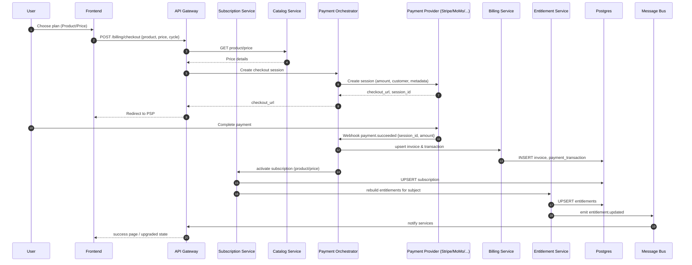
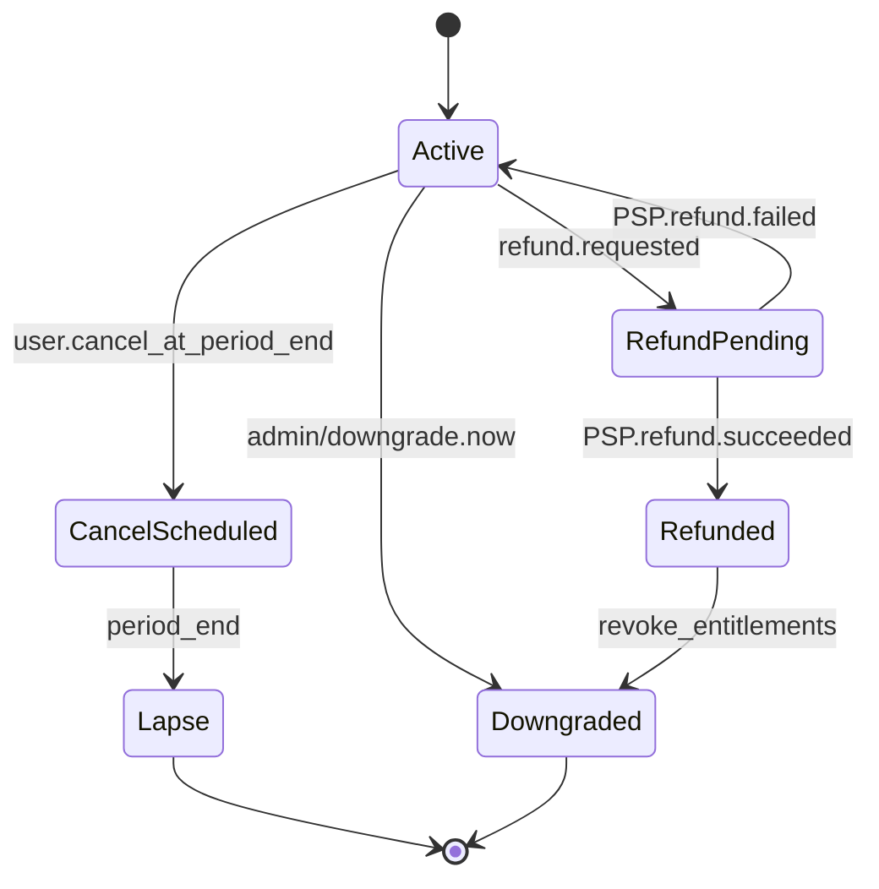
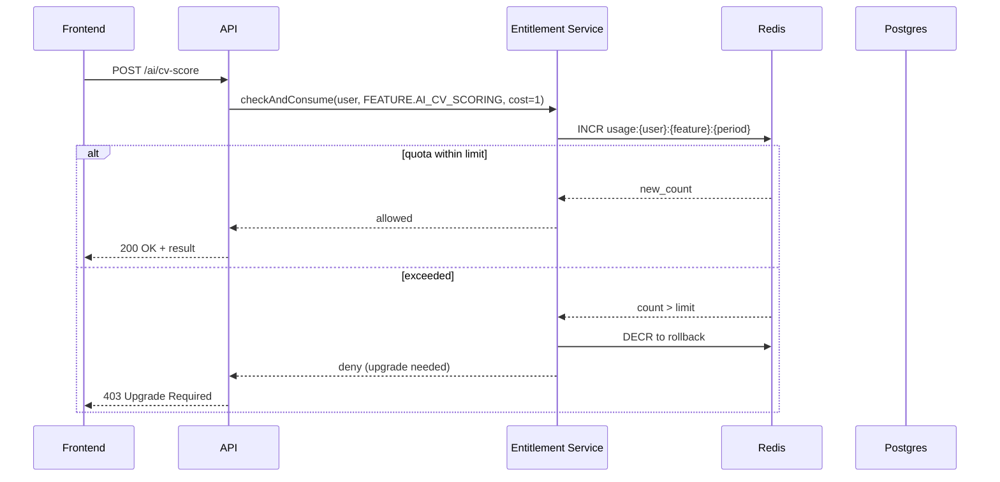

## 1) High‑Level Architecture — Components (Mermaid)

```mermaid
flowchart LR
  subgraph Client
    Web[Web App]
    Mobile[Mobile App]
  end

  subgraph Edge
    API[API Gateway / Ingress]
    Auth[Auth (Cognito/Keycloak)]
  end

  subgraph Core[Core Services]
    UA[User & Org Service]
    Sub[Subscription Service]
    Bill[Billing Service]
    Ent[Entitlement & Usage Service]
    Pay[Payment Orchestrator]
    Noti[Notification Service]
    Cat[Catalog Service (Products/Prices)]
    Job[Job Service]
    Cand[Candidate Service]
    Msg[Messaging Service]
    Search[Search (Elasticsearch)]
    AI[AI Worker Pool]
  end

  subgraph Data
    PG[(Postgres Cluster)]
    Redis[(Redis)]
    ES[(Elasticsearch)]
    S3[(Object Storage: S3/MinIO)]
    MQ[(Message Bus: Kafka/Redpanda)]
  end

  subgraph Providers
    Stripe[Stripe]
    MoMo[MoMo]
    Zalo[ZaloPay]
    VietQR[VietQR]
    Email[Email/SMS/Push]
  end

  Web --> API
  Mobile --> API
  API --> Auth
  API --> UA
  API --> Sub
  API --> Ent
  API --> Job
  API --> Cand
  API --> Msg
  API --> Search
  API --> AI

  Sub --> Cat
  Sub --> Ent
  Ent --> Redis
  Ent --> PG

  Bill --> PG
  Bill <---> Pay
  Pay --- MQ
  Pay --> Stripe
  Pay --> MoMo
  Pay --> Zalo
  Pay --> VietQR

  Sub --> MQ
  Pay --> MQ
  MQ --> Noti
  Noti --> Email

  UA --> PG
  Sub --> PG
  Cat --> PG
  Msg --> PG
  Msg --> Redis
  Job --> ES
  Cand --> S3
  AI --> S3
  AI --> ES
```

---

## 2) Purchase & Entitlement Flow — Sequence (Mermaid)



---

## 3) Refund & Downgrade — Workflow (Mermaid)



---

## 4) Entitlement Check — Request Guard (Mermaid)



---

## 5) Database Low‑Level Design (Postgres)

### 5.1 Core Billing & Subscription Tables

```sql
CREATE TYPE plan_subject AS ENUM ('user', 'org');
CREATE TYPE sub_status AS ENUM ('trialing','active','past_due','canceled','incomplete');
CREATE TYPE txn_status AS ENUM ('succeeded','failed','pending','refunded','partial_refunded');
CREATE TYPE provider AS ENUM ('stripe','momo','zalopay','vietqr');

CREATE TABLE product (
  id UUID PRIMARY KEY DEFAULT gen_random_uuid(),
  code TEXT UNIQUE NOT NULL,                 -- e.g. candidate_pro, employer_growth
  display_name TEXT NOT NULL,
  subject plan_subject NOT NULL,             -- user/org
  active BOOLEAN NOT NULL DEFAULT TRUE,
  metadata JSONB NOT NULL DEFAULT '{}',
  created_at TIMESTAMPTZ NOT NULL DEFAULT now()
);

CREATE TABLE price (
  id UUID PRIMARY KEY DEFAULT gen_random_uuid(),
  product_id UUID NOT NULL REFERENCES product(id) ON DELETE CASCADE,
  currency TEXT NOT NULL DEFAULT 'VND',
  unit_amount BIGINT NOT NULL,               -- in minor units
  interval TEXT NOT NULL CHECK (interval IN ('month','year')),
  provider provider NOT NULL,                -- owning PSP for price id mapping
  provider_price_id TEXT,                    -- Stripe price id / MoMo code
  active BOOLEAN NOT NULL DEFAULT TRUE,
  metadata JSONB NOT NULL DEFAULT '{}'
);

CREATE TABLE plan_feature (
  id UUID PRIMARY KEY DEFAULT gen_random_uuid(),
  product_id UUID NOT NULL REFERENCES product(id) ON DELETE CASCADE,
  feature_key TEXT NOT NULL,                 -- e.g. AI_CV_SCORE, CONTACT_UNLOCK
  limit_month INTEGER,                       -- NULL = unlimited
  UNIQUE(product_id, feature_key)
);

CREATE TABLE subscription (
  id UUID PRIMARY KEY DEFAULT gen_random_uuid(),
  subject_type plan_subject NOT NULL,
  subject_id UUID NOT NULL,                  -- user_id or org_id
  product_id UUID NOT NULL REFERENCES product(id),
  price_id UUID NOT NULL REFERENCES price(id),
  status sub_status NOT NULL,
  start_at TIMESTAMPTZ NOT NULL DEFAULT now(),
  current_period_start TIMESTAMPTZ NOT NULL DEFAULT now(),
  current_period_end TIMESTAMPTZ NOT NULL,
  cancel_at_period_end BOOLEAN NOT NULL DEFAULT FALSE,
  provider provider NOT NULL,
  provider_subscription_id TEXT,
  UNIQUE(subject_type, subject_id)
);

CREATE TABLE invoice (
  id UUID PRIMARY KEY DEFAULT gen_random_uuid(),
  subscription_id UUID REFERENCES subscription(id) ON DELETE SET NULL,
  provider provider NOT NULL,
  provider_invoice_id TEXT,
  currency TEXT NOT NULL DEFAULT 'VND',
  amount_due BIGINT NOT NULL,
  amount_paid BIGINT NOT NULL DEFAULT 0,
  status TEXT NOT NULL CHECK (status IN ('draft','open','paid','void','uncollectible','refunded')),
  issued_at TIMESTAMPTZ NOT NULL DEFAULT now(),
  metadata JSONB NOT NULL DEFAULT '{}'
);

CREATE TABLE payment_transaction (
  id UUID PRIMARY KEY DEFAULT gen_random_uuid(),
  invoice_id UUID REFERENCES invoice(id) ON DELETE SET NULL,
  provider provider NOT NULL,
  provider_payment_id TEXT,
  status txn_status NOT NULL,
  amount BIGINT NOT NULL,
  currency TEXT NOT NULL DEFAULT 'VND',
  raw_payload JSONB NOT NULL DEFAULT '{}',
  created_at TIMESTAMPTZ NOT NULL DEFAULT now()
);

CREATE TABLE refund (
  id UUID PRIMARY KEY DEFAULT gen_random_uuid(),
  payment_txn_id UUID NOT NULL REFERENCES payment_transaction(id) ON DELETE CASCADE,
  provider_refund_id TEXT,
  amount BIGINT NOT NULL,
  status TEXT NOT NULL CHECK (status IN ('pending','succeeded','failed')),
  created_at TIMESTAMPTZ NOT NULL DEFAULT now()
);
```

### 5.2 Entitlements & Usage

```sql
CREATE TABLE entitlement (
  id UUID PRIMARY KEY DEFAULT gen_random_uuid(),
  subject_type plan_subject NOT NULL,
  subject_id UUID NOT NULL,
  feature_key TEXT NOT NULL,
  limit_month INTEGER,                       -- NULL = unlimited
  source_subscription_id UUID REFERENCES subscription(id) ON DELETE CASCADE,
  UNIQUE(subject_type, subject_id, feature_key)
);

-- period key suggestion: yyyymm (e.g., 2025-10 => '202510')
CREATE TABLE usage_counter (
  id UUID PRIMARY KEY DEFAULT gen_random_uuid(),
  subject_type plan_subject NOT NULL,
  subject_id UUID NOT NULL,
  feature_key TEXT NOT NULL,
  period TEXT NOT NULL,
  used INTEGER NOT NULL DEFAULT 0,
  updated_at TIMESTAMPTZ NOT NULL DEFAULT now(),
  UNIQUE(subject_type, subject_id, feature_key, period)
);

-- For real-time throttling use Redis; periodically flush to Postgres for reporting.
```

### 5.3 Catalog & Mapping to Providers

```sql
CREATE TABLE provider_mapping (
  id UUID PRIMARY KEY DEFAULT gen_random_uuid(),
  provider provider NOT NULL,
  local_type TEXT NOT NULL,                  -- 'product' | 'price' | 'customer' | 'subscription'
  local_id UUID,                             -- reference to local table
  provider_id TEXT NOT NULL,                 -- id at PSP
  UNIQUE(provider, local_type, provider_id)
);
```

### 5.4 Users, Orgs & Addresses (minimal)

```sql
CREATE TABLE app_user (
  id UUID PRIMARY KEY,
  email CITEXT UNIQUE NOT NULL,
  full_name TEXT,
  created_at TIMESTAMPTZ NOT NULL DEFAULT now()
);

CREATE TABLE org (
  id UUID PRIMARY KEY,
  name TEXT NOT NULL,
  created_at TIMESTAMPTZ NOT NULL DEFAULT now()
);

CREATE TABLE address (
  id UUID PRIMARY KEY DEFAULT gen_random_uuid(),
  subject_type plan_subject NOT NULL,        -- user/org
  subject_id UUID NOT NULL,
  line1 TEXT, line2 TEXT, city TEXT, region TEXT, postal_code TEXT, country TEXT,
  vat_number TEXT,
  UNIQUE(subject_type, subject_id)
);
```

### 5.5 Webhooks & Outbox/Inbox

```sql
CREATE TYPE webhook_status AS ENUM ('received','processed','failed');

CREATE TABLE webhook_event (
  id UUID PRIMARY KEY DEFAULT gen_random_uuid(),
  provider provider NOT NULL,
  event_type TEXT NOT NULL,                  -- e.g. payment.succeeded
  external_id TEXT NOT NULL,                 -- unique id from PSP
  payload JSONB NOT NULL,
  status webhook_status NOT NULL DEFAULT 'received',
  received_at TIMESTAMPTZ NOT NULL DEFAULT now(),
  UNIQUE(provider, external_id)
);

CREATE TABLE outbox_event (
  id UUID PRIMARY KEY DEFAULT gen_random_uuid(),
  topic TEXT NOT NULL,                       -- e.g. subscription.activated
  payload JSONB NOT NULL,
  created_at TIMESTAMPTZ NOT NULL DEFAULT now(),
  published_at TIMESTAMPTZ
);
```

### 5.6 Operational Indexes & Partitions

```sql
-- Hot paths
CREATE INDEX ix_sub_subject ON subscription(subject_type, subject_id);
CREATE INDEX ix_ent_subject ON entitlement(subject_type, subject_id);
CREATE INDEX ix_usage_subject_period ON usage_counter(subject_type, subject_id, period);
CREATE INDEX ix_txn_invoice ON payment_transaction(invoice_id);
CREATE INDEX ix_invoice_sub ON invoice(subscription_id);
CREATE INDEX ix_webhook_status ON webhook_event(status);

-- Optional: monthly partitioning for usage_counter & invoice
-- Example (usage_counter):
-- CREATE TABLE usage_counter_202510 PARTITION OF usage_counter
--   FOR VALUES IN ('202510');
```

### 5.7 Referential Integrity & Cleanup

- `subscription` has a single active row per subject. Enforce with **UNIQUE(subject_type, subject_id) + status check** in app layer.
- Cascade delete: when `subscription` removed → `entitlement` deleted; **do not** cascade invoices/transactions.
- Webhook idempotency via `UNIQUE(provider, external_id)`.

---

## 6) Provider Collaboration Pattern

- **Payment Orchestrator** abstracts PSP specifics; maps local entities to provider IDs via `provider_mapping`.
- **Idempotent** webhook handlers (store → process → mark processed). Retry with backoff.
- **Signature verification** per provider; clock‑skew tolerant time windows.
- **Currency rounding** and minor‑unit normalization at the edge.
- **Metadata**: always include `subject_type`, `subject_id`, `product_id`, `price_id`, and desired `current_period_end` in PSP sessions.

---

## 7) Reporting Views (BI‑friendly)

```sql
CREATE VIEW v_mrr AS
SELECT date_trunc('month', current_period_start) AS month,
       SUM(p.unit_amount) FILTER (WHERE s.status = 'active') / 100.0 AS mrr
FROM subscription s
JOIN price p ON p.id = s.price_id
GROUP BY 1;

CREATE VIEW v_feature_consumption AS
SELECT subject_type, subject_id, feature_key,
       SUM(used) AS used, MIN(period) AS first_period, MAX(period) AS last_period
FROM usage_counter
GROUP BY 1,2,3;
```

---

## 8) Entitlement Rebuild Algorithm (Pseudo)

```pseudo
on subscription.activated | price.changed:
  features = select * from plan_feature where product_id = price.product_id
  upsert entitlement(subject, feature_key, limit_month)
  emit entitlement.updated
```

---

## 9) Data Privacy & Compliance Notes

- Store minimal PII for billing (address/VAT). Encrypt at rest (pgcrypto/KMS).
- Right‑to‑erasure for candidates: invoices/transactions retained for tax law; detach PII.
- Access control: row‑level policies for `subject_id` where applicable.

---

## 10) Appendix — Feature Keys (suggested)

- `AI_CV_SCORING`, `AI_CV_IMPROVE`, `AI_MOCK_INTERVIEW_MINUTES`, `JOB_SAVE_LIMIT`, `CHAT_THREAD_LIMIT`, `CONTACT_UNLOCK`, `JD_GENERATION`, `CANDIDATE_SEARCH_VIEWS`, `PIPELINE_PRO`, `DASHBOARD_PRO`.
